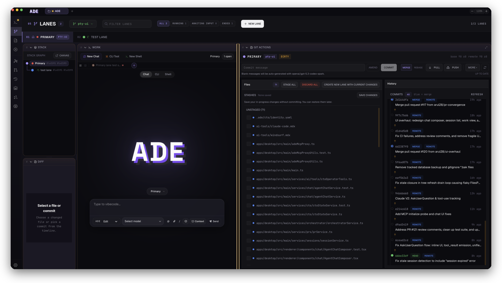
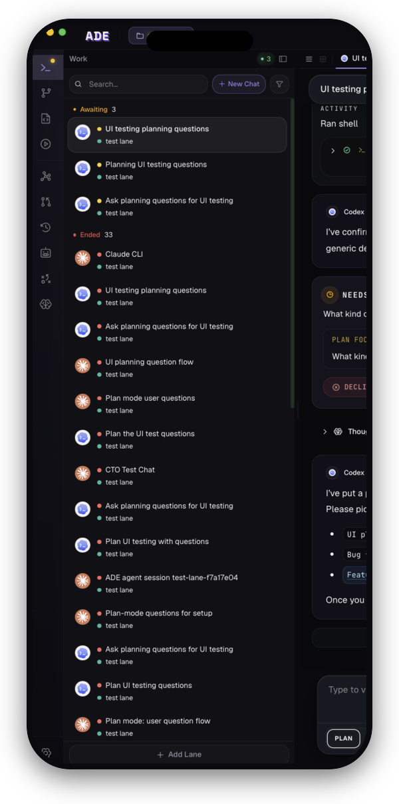
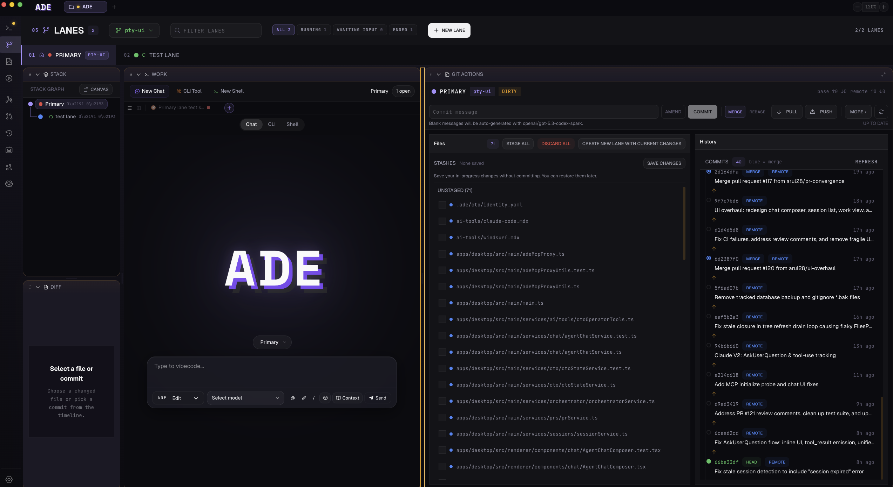
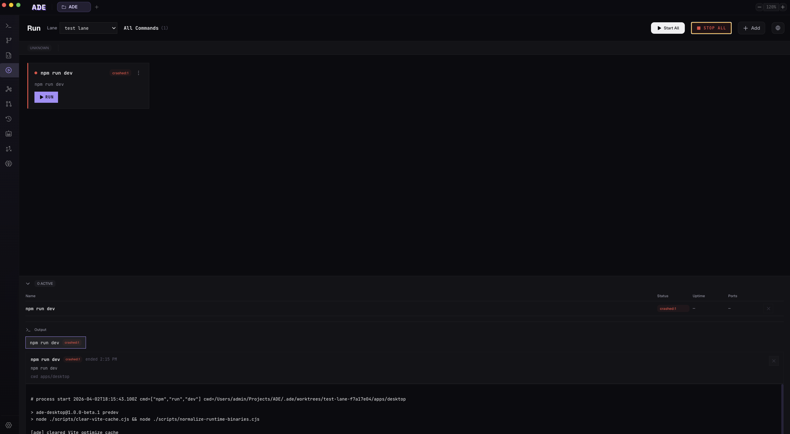
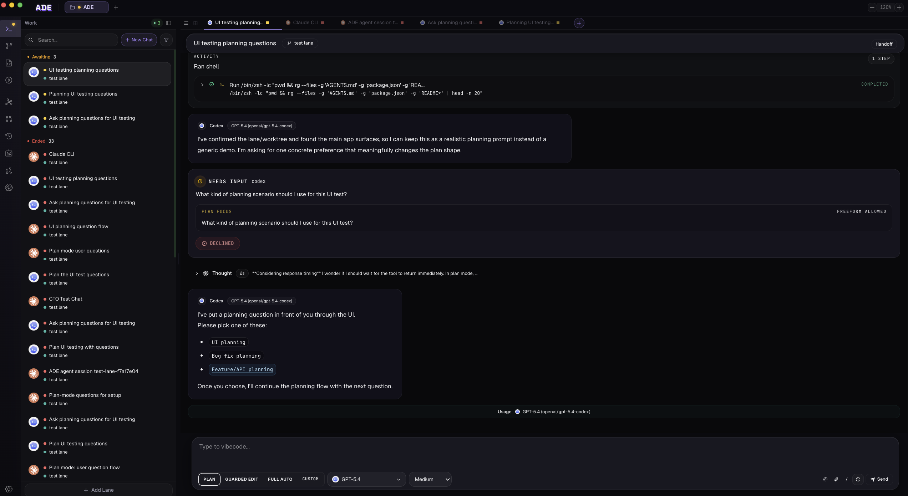

<p align="center">
  <a href="https://www.ade-app.dev">
    
  </a>
</p>

<p align="center">
  <strong>A single native workspace for every AI coding agent.</strong><br />
  <em>macOS, iOS, CLI — synced in real time.</em>
</p>

<p align="center">
  <a href="https://www.ade-app.dev"><strong>Website</strong></a>
  &nbsp;·&nbsp;
  <a href="https://www.ade-app.dev/docs"><strong>Docs</strong></a>
  &nbsp;·&nbsp;
  <a href="https://github.com/arul28/ADE/releases/latest"><strong>Download</strong></a>
  &nbsp;·&nbsp;
  <a href="https://www.ade-app.dev/docs/changelog/v1.1.0"><strong>Changelog</strong></a>
</p>

<p align="center">
  
  
  <a href="LICENSE"></a>
  <a href="https://github.com/arul28/ADE/releases/latest"></a>
  <a href="https://github.com/arul28/ADE/actions/workflows/ci.yml"></a>
</p>

<p align="center">
  
  &nbsp;
  
</p>

ADE runs **Claude Code, Codex, Cursor, opencode** — every major AI coding agent — inside one native workspace. Every task is its own git worktree, so agents ship features in parallel. Review and merge PRs in-app. Approve a diff from your phone while another agent tests on your Mac.

Free, open source, local-first. Bring your own keys or subs.

---

<table>
<tr>
<td width="55%" valign="middle">
  
</td>
<td width="45%" valign="middle">

### Manage worktrees. In parallel.
Every task gets its own git worktree. Branch, edit, test, and commit side by side — no stashing, no rebasing, no context switch.

</td>
</tr>

<tr>
<td width="45%" valign="middle">

### Every coding agent. One workspace.
Claude Code, Codex, Cursor, opencode — pick whichever model fits the task. All run against the same worktree, with live diffs and approval gates.

</td>
<td width="55%" valign="middle">
  
</td>
</tr>

<tr>
<td width="55%" valign="middle">
  
</td>
<td width="45%" valign="middle">

### Open, review, and merge PRs.
Every PR your agents open lands in ADE — diff, CI, comments, merge button. No GitHub tab. Auto-merge when green.

</td>
</tr>

<tr>
<td width="45%" valign="middle">

### The conductor for your agents.
An always-on CTO with context across every worktree. Pulls work from Linear, dispatches to the right worker, reports back when it's done.

</td>
<td width="55%" valign="middle">
  
</td>
</tr>

<tr>
<td width="55%" valign="middle" align="center">
  
</td>
<td width="45%" valign="middle">

### Everything above. On your phone.
Every worktree, every agent, every PR — synced to iOS. Start a task on macOS, approve the diff from the train.

</td>
</tr>
</table>

Plus files, terminals, git history, workspace graph, multi-tasking, Linear sync, long-running missions, cron automations, computer-use proofs, and the `ade` CLI.

## Install

Download the DMG from [**GitHub Releases**](https://github.com/arul28/ADE/releases/latest), drag **ADE.app** into `/Applications`, open it on any git repo, and add a provider key (or subscription) in Settings. Runs in Guest Mode without an account.

Requirements: macOS 13+, git on `PATH`, Node 22+ for headless CLI workflows.

## CLI

```bash
ade doctor --json
ade lanes create --name fix-checkout-flow
ade prs checks 168 --text
ade tests run --suite unit --wait
ade actions list --text   # discover every service action
```

[CLI reference →](apps/ade-cli/README.md)

## Architecture

Local-first, on purpose. Runtime state lives under `.ade/` inside each project — SQLite db, worktree checkouts, proof artifacts, encrypted secrets.

```text
apps/desktop   Electron host — SQLite, git, processes, AI runtimes, sync host
apps/ade-cli   Node CLI over the desktop socket (or headless)
apps/ios       SwiftUI companion that syncs with a desktop host
apps/web       Public website and download surface
docs/          Product and engineering docs
```

Deep reference: [ARCHITECTURE.md](docs/ARCHITECTURE.md).

## Develop

```bash
cd apps/desktop && npm install && npm run dev      # live Electron app
cd apps/ade-cli && npm install && npm run build    # build the CLI
```

Validate with `npm --prefix apps/desktop run typecheck` and `run test`. The desktop test suite is large — run the smallest relevant subset first.

## Links

[Quickstart](https://www.ade-app.dev/docs/quickstart) · [Key concepts](https://www.ade-app.dev/docs/key-concepts) · [Worktrees](https://www.ade-app.dev/docs/lanes/overview) · [Missions](https://www.ade-app.dev/docs/missions/overview) · [Computer use](https://www.ade-app.dev/docs/computer-use/overview) · [Changelog](https://www.ade-app.dev/docs/changelog/v1.1.0) · [Contributing](CONTRIBUTING.md)

## License

[AGPL-3.0](LICENSE) — © 2025 Arul Sharma. Free forever. Source on GitHub.
