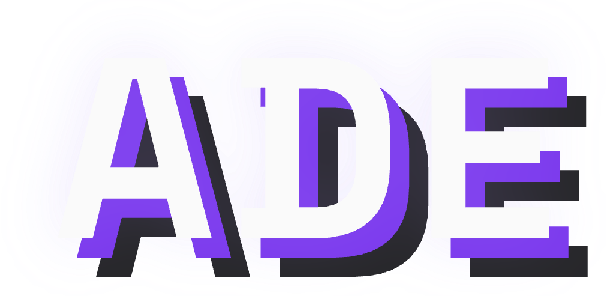

<p align="center">
  
</p>

<h1 align="center">ADE</h1>
<p align="center"><strong>Agentic Development Environment</strong></p>
<p align="center">
  Local-first desktop workspace for coding agents, lanes, missions, PR workflows, and proof capture.
</p>

<p align="center">
  <a href="https://github.com/arul28/ADE/releases"></a>
  <a href="https://github.com/arul28/ADE/actions/workflows/ci.yml"></a>
  <a href="https://github.com/arul28/ADE/releases"></a>
  <a href="https://github.com/arul28/ADE/blob/main/LICENSE"></a>
</p>

<p align="center">
  
  
  
  
  
  
</p>

<p align="center">
  <a href="https://www.ade-app.dev/docs"><strong>Documentation</strong></a> &nbsp;|&nbsp;
  <a href="https://www.ade-app.dev"><strong>Website</strong></a> &nbsp;|&nbsp;
  <a href="https://github.com/arul28/ADE/releases"><strong>Download</strong></a>
</p>

---

ADE is a desktop app for AI-native software development. It combines agent orchestration, persistent memory, multi-provider AI support, and deep git integration into a single local-first environment.

## Why ADE

ADE is built for people who want agents to operate inside a real development workspace, not a chat tab. It gives you isolated lanes for parallel work, mission orchestration for multi-step execution, persistent project memory, and proof-oriented computer use inside one desktop environment.

## What it includes

- **Lanes** -- Isolated git worktrees for parallel development with automatic conflict detection
- **Missions** -- Multi-step orchestrated execution with planning, workers, and approval gates
- **Agent chat** -- Multi-provider coding agents including Claude, Codex, and local models
- **CTO agent** -- Persistent AI lead with identity, memory, and Linear integration
- **Computer use** -- Screenshot-based verification and artifact capture
- **Automations** -- Event-driven background execution with triggers and guardrails
- **PR workflows** -- Stacking, conflict simulation, and queue landing
- **Context packs** -- Structured, bounded context delivery for agents
- **ADE MCP server** -- Shared services for both desktop and headless MCP flows
- **Memory system** -- Persistent knowledge across sessions with semantic search
- **Linear integration** -- Workflow automation triggered by Linear issues
- **Multi-repo aware workflows** -- Project-local state under `.ade/` plus machine-local secrets, cache, and artifacts

## Stack

- **Desktop** -- Electron, React, TypeScript, SQLite, node-pty
- **Protocols** -- Model Context Protocol (MCP), IPC, GitHub and Linear integrations
- **Runtime model support** -- Claude, Codex, OpenAI-compatible providers, and local models

## Install

1. Download the latest `.dmg` from [**Releases**](https://github.com/arul28/ADE/releases)
2. Open the `.dmg` and drag **ADE** into your Applications folder
3. Launch ADE from Applications
4. Open a project and configure your AI provider in Settings

## Early beta notes

ADE is still a very early beta. Expect rough edges, incomplete workflows, and occasional breaking changes between releases.

Official macOS releases are intended to ship as Developer ID-signed and notarized builds so Gatekeeper accepts them normally and ADE can apply future in-app updates without the quarantine workaround.

Older pre-signing beta builds may still need the manual `xattr -dr com.apple.quarantine /Applications/ADE.app` step if you are testing an older release artifact.

ADE auto-updates. When a new version is available, an update button appears in the header bar. Click it to restart and apply the signed update.

## Contributing

See [CONTRIBUTING.md](CONTRIBUTING.md). PRs welcome -- dev setup:

```bash
cd apps/desktop && npm install && npm run dev
```

## License

[AGPL-3.0](LICENSE) -- Copyright (c) 2025 Arul Sharma
