<p align="center">
  <a href="https://www.ade-app.dev">
    
  </a>
</p>

<h1 align="center">ADE</h1>

<p align="center">
  <strong>Agentic Development Environment</strong>
</p>

<p align="center">
  A local-first desktop control plane for coding agents, isolated lanes, missions, pull requests, computer-use proofs, and mobile workspace monitoring.
</p>

<p align="center">
  <a href="https://github.com/arul28/ADE/releases/latest"></a>
  <a href="https://github.com/arul28/ADE/actions/workflows/ci.yml"></a>
  <a href="https://github.com/arul28/ADE/releases"></a>
  <a href="LICENSE"></a>
</p>

<p align="center">
  <a href="https://www.ade-app.dev"><strong>Website</strong></a>
  ·
  <a href="https://www.ade-app.dev/docs"><strong>Docs</strong></a>
  ·
  <a href="https://github.com/arul28/ADE/releases/latest"><strong>Download</strong></a>
  ·
  <a href="https://www.ade-app.dev/docs/changelog/v1.0.19"><strong>v1.0.19 notes</strong></a>
</p>

<p align="center">
  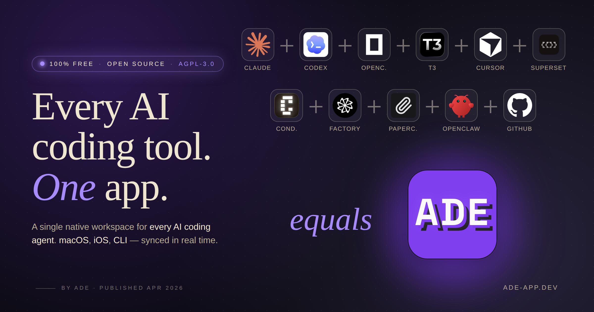
</p>

---

## What ADE is

ADE is a macOS desktop app for running AI coding agents inside a real software workspace. It gives every task an isolated git worktree called a **lane**, keeps project context warm, tracks runtime state in local SQLite, and turns review, testing, pull requests, and proof capture into first-class workflows.

The desktop app is the execution host. The iOS companion is a controller for that host: it shows Work sessions, lanes, files, PRs, notifications, widgets, and Live Activities while agents keep running on your own machine.

## Desktop host, iOS companion

<p align="center">
  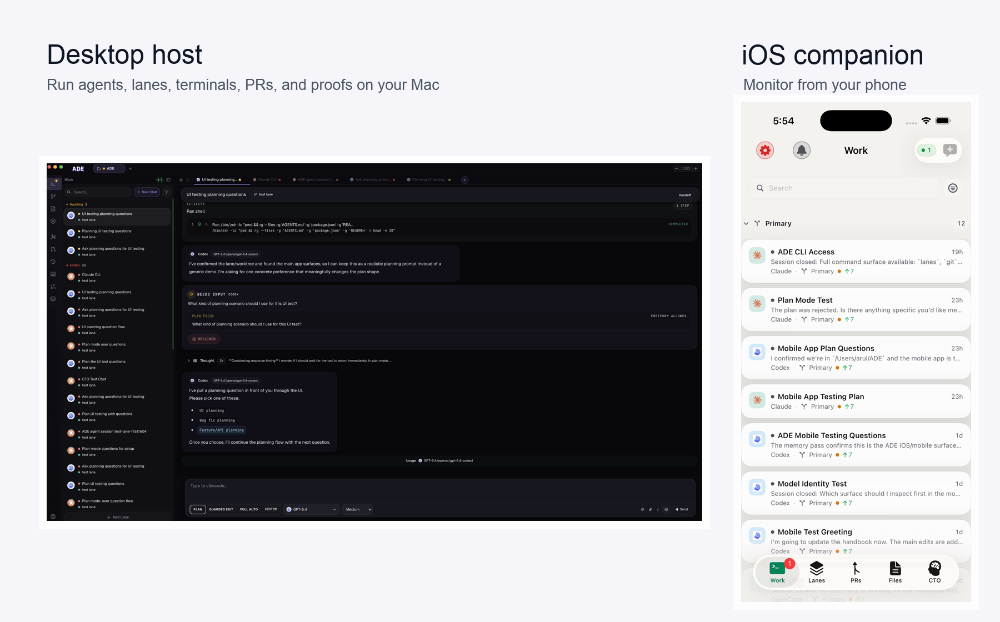
</p>

ADE is designed around a simple split: the Mac does the heavy work, and the phone keeps you close to the run. Desktop owns the local repository, isolated lane worktrees, terminals, provider sessions, PR workflows, and proof artifacts. The iOS app connects to that host so you can inspect active work, scan lanes and files, follow pull requests, receive push updates, and keep background agent sessions visible without staying at your desk.

The iOS screenshot above is captured from the native SwiftUI companion app running in the simulator against the same workspace model as desktop. It is not a separate mobile dashboard or docs surface; it is another controller for the local-first ADE runtime.

## Why teams use it

| Problem | ADE's answer |
| --- | --- |
| Agents collide when they edit the same repo | Lanes isolate work in git worktrees and surface branch state early |
| Long-running agent work is hard to supervise | Work, missions, run state, proofs, and PR checks stay in one timeline |
| Context gets rebuilt from scratch every session | Context packs, memory, and project-local state keep agents grounded |
| PR cleanup becomes a manual loop | Path to Merge, issue inventory, checks, and review resolution are built in |
| Local automation is scattered across scripts | ADE CLI exposes the same service actions used by the desktop app |
| You have to babysit the desktop app | The iOS companion, push notifications, widgets, and Live Activities keep you in the loop |

## Product tour

<p align="center">
  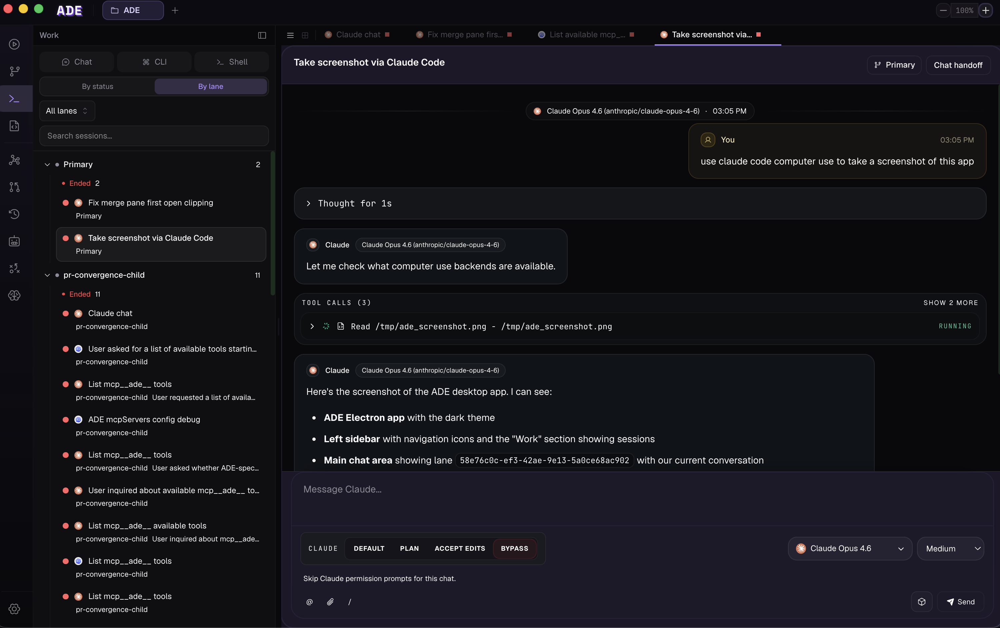
  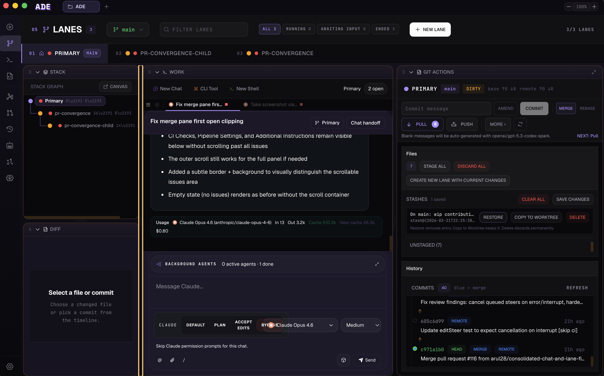
  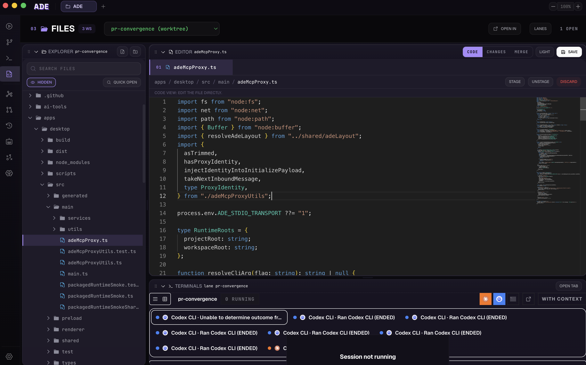
</p>

| Work and chat | Lanes | Pull requests |
| --- | --- | --- |
| 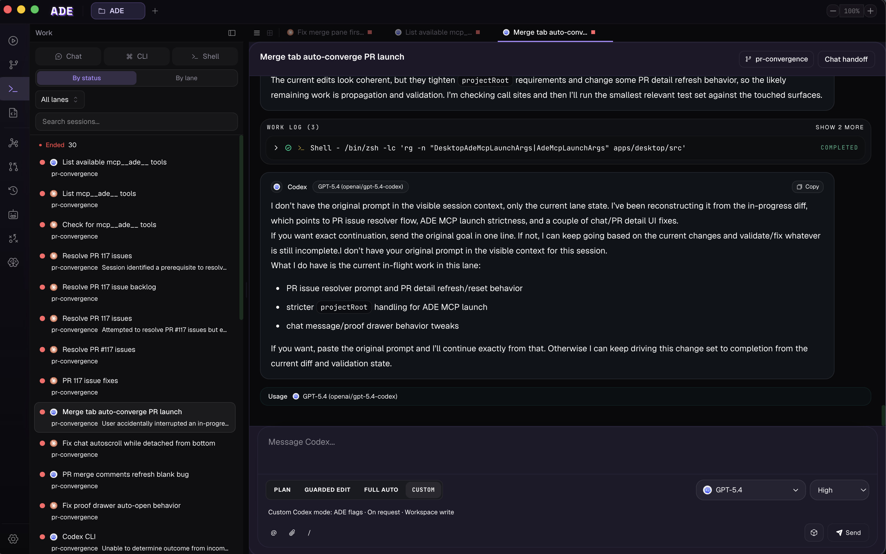 | 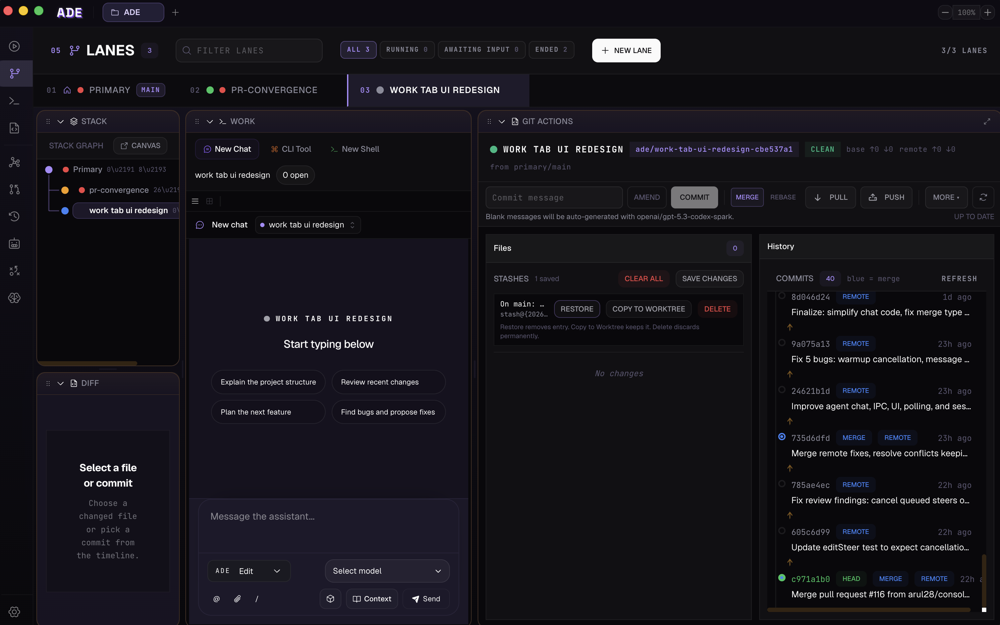 | 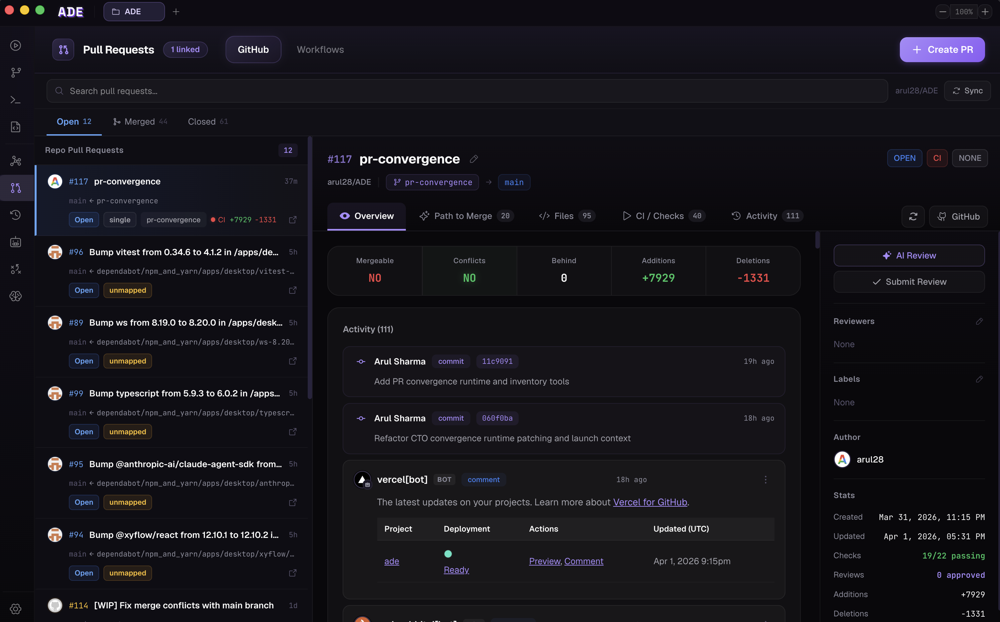 |
| Multi-provider agent sessions, model selection, transcripts, tool events, and terminal artifacts. | Parallel task worktrees with parent/child stacks, lane state, git metadata, and branch actions. | PR summaries, checks, issue inventory, stack views, review cleanup, and Path to Merge workflows. |

| CTO agent | Files | Workspace graph |
| --- | --- | --- |
| 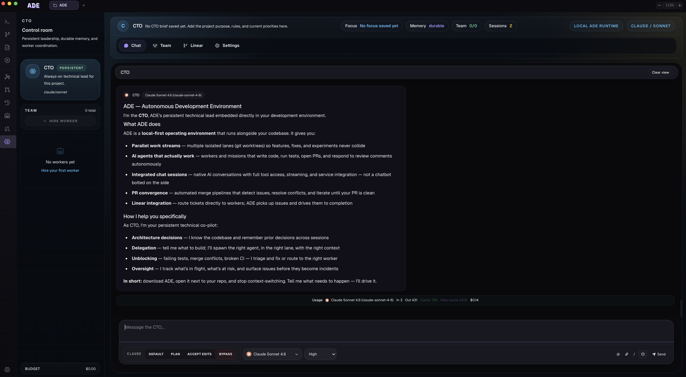 | 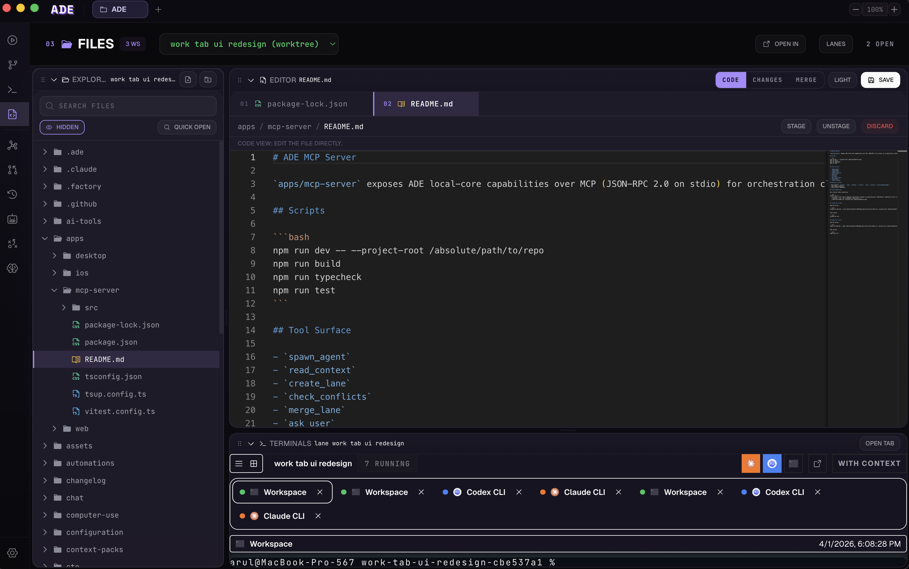 | 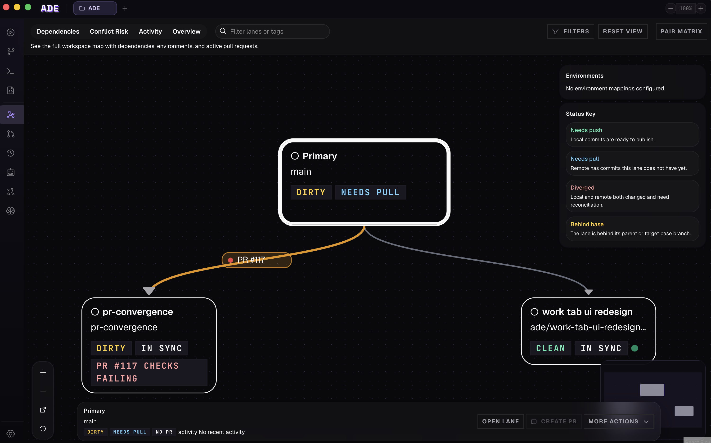 |
| Persistent project lead with identity, memory, workflow planning, and delegated workers. | Project-aware file browsing, diffs, editor surfaces, and code review context. | Visual branch/worktree topology, conflict signals, session state, and relationship maps. |

## Core capabilities

- **Lanes**: Isolated worktrees for parallel tasks, stacked branches, attached branches, and queueable work.
- **Work**: Chat-oriented agent sessions with transcripts, tool events, terminals, artifacts, and model selection.
- **Missions**: Structured multi-step execution with planning, worker delegation, approvals, and validation gates.
- **PR workflows**: PR creation, checks, stack views, convergence, review issue resolution, and merge readiness.
- **CTO agent**: Persistent project coordinator with memory, identity, Linear workflows, and worker management.
- **Files and terminals**: Project-aware file views, code context, terminal sessions, process runs, and test history.
- **Computer use**: Screenshot/video/browser proof flows with policy checks and artifact ownership.
- **Context packs and memory**: Bounded context delivery, freshness tracking, semantic memory, and project notes.
- **Automations**: Triggered workflows for git, Linear, schedules, guardrails, and background execution.
- **ADE CLI**: Agent-friendly command surface for lanes, files, git, PRs, tests, proof, memory, settings, and internal actions.
- **iOS companion**: SwiftUI controller with Work, Lanes, Files, PRs, Settings, APNs push, widgets, and Live Activities.

## Latest release: v1.0.19

v1.0.19 shipped the mobile push and companion-app release path, new AI backend work, smarter PR and rebase tooling, diagnostics, and the signed macOS release artifacts.

Relevant links:

- [GitHub release](https://github.com/arul28/ADE/releases/tag/v1.0.19)
- [Changelog](https://www.ade-app.dev/docs/changelog/v1.0.19)
- [Install guide](https://www.ade-app.dev/docs/getting-started/install)
- [Cursor integration](https://www.ade-app.dev/docs/ai-tools/cursor)
- [Windsurf and OpenCode setup](https://www.ade-app.dev/docs/ai-tools/windsurf)
- [iOS companion architecture](docs/features/sync-and-multi-device/ios-companion.md)

## Install

ADE currently ships as a macOS beta installer.

1. Download the latest DMG from [GitHub Releases](https://github.com/arul28/ADE/releases/latest).
2. Open the DMG and drag **ADE.app** into `/Applications`.
3. Launch ADE and open a git repository.
4. Configure at least one AI provider in **Settings**.
5. Create a lane and start a small first task.

Requirements:

- macOS 13 or newer recommended.
- Git installed and available on `PATH`.
- Node.js 22+ for local development and headless ADE CLI workflows.
- Provider credentials for the agents you want to run.

ADE auto-updates from signed releases. When a new version is available, use the update button in the app header to restart into the latest build.

## ADE CLI

ADE includes a real `ade` command for agents and local automation. The CLI prefers the live desktop socket at `.ade/ade.sock` so commands operate against the same lanes, PR state, process runtime, and proof artifacts as the UI. If desktop is not running, supported commands can fall back to headless mode.

Desktop-bundled install:

```bash
/Applications/ADE.app/Contents/Resources/ade-cli/install-path.sh
ade doctor --project-root /path/to/project --json
```

Local development install:

```bash
cd apps/ade-cli
npm install
npm run build
npm link
ade doctor --project-root /path/to/project
```

Useful commands:

```bash
ade doctor --json
ade actions list --text
ade lanes list --text
ade lanes create "fix-checkout-flow" --parent main
ade files read README.md --text
ade git status --lane lane-id --json
ade prs checks 168 --text
ade tests run --suite unit --wait
ade actions run git.stageFile --arg laneId=lane-id --arg path=src/index.ts --json
```

Use typed commands first. Use `ade actions list --text` for discovery and `ade actions run <domain.action>` as the escape hatch for service actions that do not yet have typed commands.

## Architecture

ADE is intentionally local-first.

```text
apps/desktop  Electron host
  main         Node process, SQLite, git, processes, AI runtimes, sync host
  preload      Typed IPC bridge exposed as window.ade
  renderer     React UI for lanes, Work, PRs, files, missions, settings

apps/ade-cli   Node CLI over desktop socket or headless runtime
apps/ios       SwiftUI companion that syncs with a desktop host
apps/web       Public website and download surface
docs/          Product and engineering docs
```

Runtime state lives primarily under `.ade/` inside the active project:

- `.ade/ade.yaml`: shared project configuration.
- `.ade/local.yaml`: machine-local overrides.
- `.ade/ade.db`: SQLite runtime database.
- `.ade/worktrees/`: lane worktrees.
- `.ade/artifacts/`: proof bundles, exports, and runtime artifacts.
- `.ade/secrets/`: encrypted or machine-local secret material.

Deep technical references:

- [Architecture reference](docs/ARCHITECTURE.md)
- [Product requirements](docs/PRD.md)
- [Sync and multi-device docs](docs/features/sync-and-multi-device/README.md)
- [Computer use docs](docs/features/computer-use/README.md)
- [Pull request workflows](docs/features/pull-requests/README.md)
- [ADE CLI README](apps/ade-cli/README.md)

## Development

This repository is not an npm workspace. Each app under `apps/` owns its own `package-lock.json` and `node_modules`.

Desktop app:

```bash
cd apps/desktop
npm install
npm run dev
```

ADE CLI:

```bash
cd apps/ade-cli
npm install
npm run build
npm run test
```

Useful validation commands:

```bash
npm --prefix apps/desktop run typecheck
npm --prefix apps/desktop run test
npm --prefix apps/desktop run build
npm --prefix apps/desktop run lint
npm --prefix apps/ade-cli run typecheck
npm --prefix apps/ade-cli run test
npm --prefix apps/ade-cli run build
```

The desktop test suite is large. For local iteration, run the smallest relevant subset first.

## Documentation map

- [Getting started](https://www.ade-app.dev/docs/quickstart)
- [Key concepts](https://www.ade-app.dev/docs/key-concepts)
- [Lanes](https://www.ade-app.dev/docs/lanes/overview)
- [Missions](https://www.ade-app.dev/docs/missions/overview)
- [PR convergence](https://www.ade-app.dev/docs/guides/pr-convergence)
- [Computer use](https://www.ade-app.dev/docs/computer-use/overview)
- [Configuration](https://www.ade-app.dev/docs/configuration/overview)
- [Changelog](https://www.ade-app.dev/docs/changelog/v1.0.19)

## Project status

ADE is an early beta. Expect rapid iteration, incomplete surfaces, and occasional workflow changes. The macOS release path is signed and notarized; the iOS app is distributed through TestFlight for registered testers while the mobile companion continues to mature.

## Contributing

PRs are welcome. Start with [CONTRIBUTING.md](CONTRIBUTING.md), keep changes scoped, and run the validation commands that cover the touched surface.

## License

[AGPL-3.0](LICENSE) - Copyright (c) 2025 Arul Sharma
