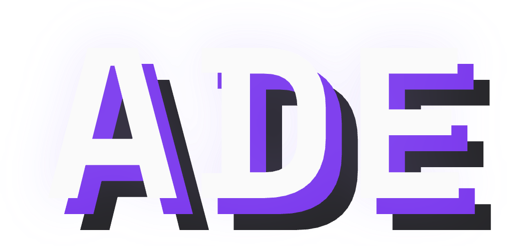
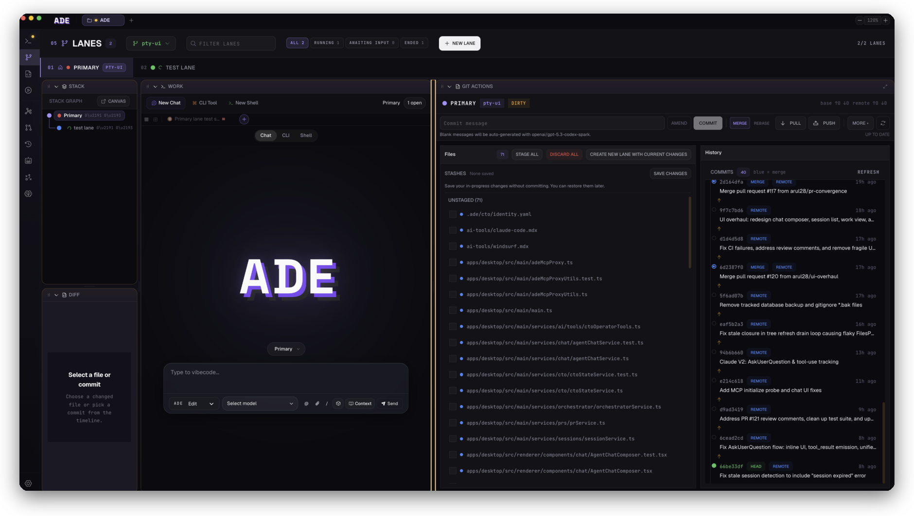
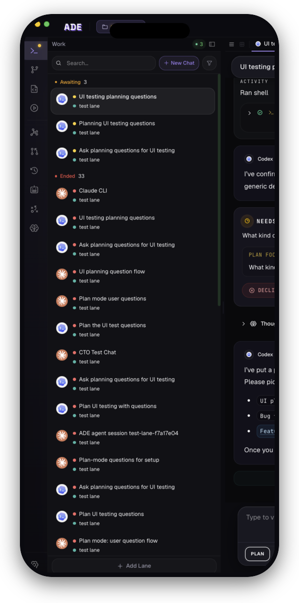
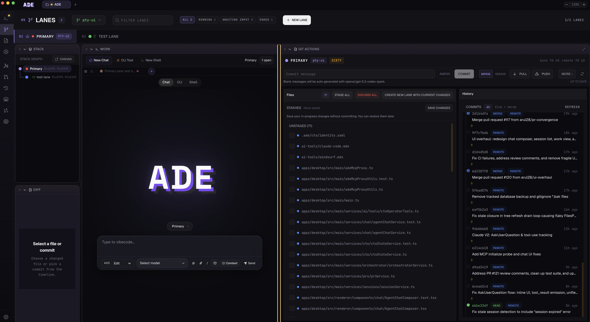
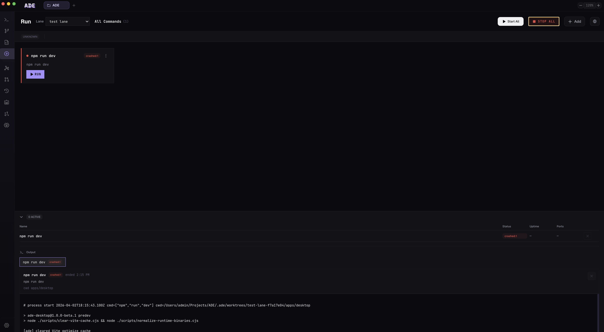
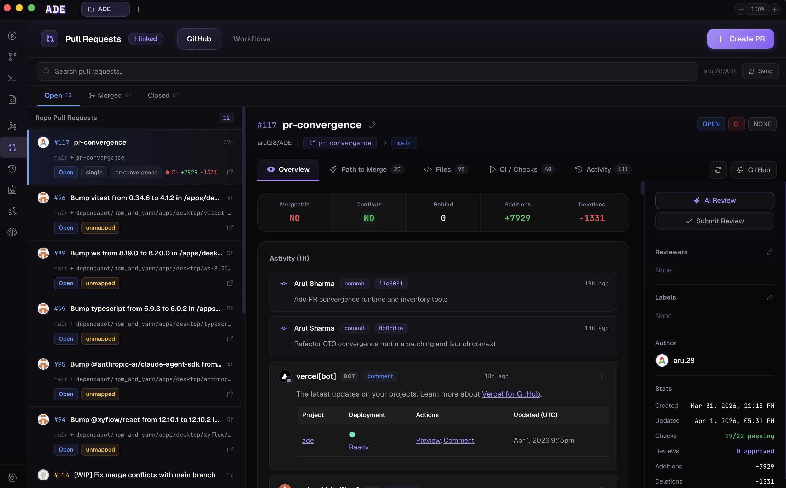
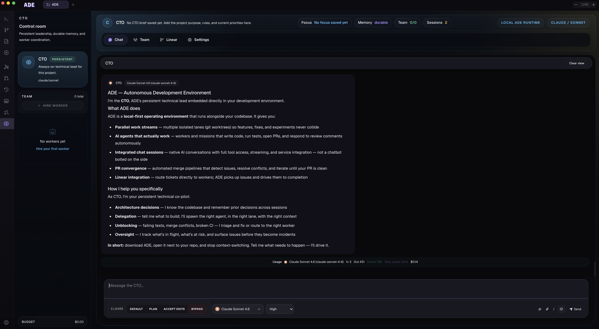
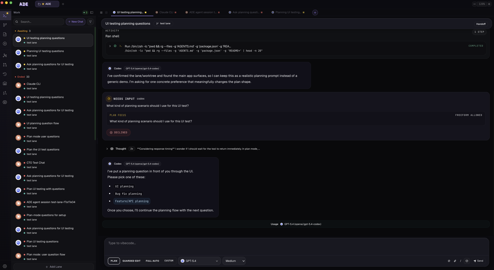

<p align="center">
  <a href="https://ade-app.dev">
    
  </a>
</p>

<p align="center">
  <strong>A single native workspace for every AI coding agent.</strong><br />
  <em>macOS, Windows, iOS, CLI — synced in real time.</em>
</p>

<p align="center">
  <a href="https://ade-app.dev"><strong>Website</strong></a>
  &nbsp;·&nbsp;
  <a href="https://ade-app.dev/docs"><strong>Docs</strong></a>
  &nbsp;·&nbsp;
  <a href="https://github.com/arul28/ADE/releases/latest"><strong>Download</strong></a>
  &nbsp;·&nbsp;
  <a href="https://www.ade-app.dev/docs/changelog"><strong>Changelog</strong></a>
</p>

<p align="center">
  
  
  <a href="LICENSE"></a>
  <a href="https://github.com/arul28/ADE/releases/latest"></a>
  <a href="https://github.com/arul28/ADE/actions/workflows/ci.yml"></a>
</p>

<p align="center">
  
  &nbsp;
  
</p>

ADE runs **Claude Code, Codex, Cursor, Factory Droid, OpenCode** — every major AI coding agent — inside one native workspace. Claude runs through the bundled Claude Agent SDK, while desktop and `ade code` share the same worktree-scoped chat runtime. Every task is its own git worktree, so agents ship features in parallel. Review and merge PRs in-app. Approve a diff from your phone while another agent tests on your Mac.

Free, open source, local-first. Bring your own keys or subs.

---

<table>
<tr>
<td width="55%" valign="middle">
  
</td>
<td width="45%" valign="middle">

### Manage worktrees. In parallel.
Every task gets its own git worktree. Branch, edit, test, and commit side by side — no stashing, no rebasing, no context switch.

</td>
</tr>

<tr>
<td width="45%" valign="middle">

### Every coding agent. One workspace.
Claude Code, Codex, Cursor, Factory Droid, OpenCode — pick whichever model fits the task. All run against the same worktree, with live diffs and approval gates.

</td>
<td width="55%" valign="middle">
  
</td>
</tr>

<tr>
<td width="55%" valign="middle">
  
</td>
<td width="45%" valign="middle">

### Open, review, and merge PRs.
Every PR your agents open lands in ADE — diff, CI, comments, merge button. No GitHub tab. Auto-merge when green.

</td>
</tr>

<tr>
<td width="45%" valign="middle">

### The conductor for your agents.
An always-on CTO with context across every worktree. Pulls work from Linear, dispatches to the right worker, reports back when it's done.

</td>
<td width="55%" valign="middle">
  
</td>
</tr>

<tr>
<td width="55%" valign="middle" align="center">
  
</td>
<td width="45%" valign="middle">

### Everything above. On your phone.
Every worktree, every agent, every PR — synced to iOS. Start a task on macOS, approve the diff from the train.

</td>
</tr>
</table>

Plus files, terminals, git history, workspace graph, multi-tasking, Linear sync, cron automations, computer-use proofs, and the `ade` CLI.

## Install

Download ADE from [**GitHub Releases**](https://github.com/arul28/ADE/releases/latest), open it on any git repo, and add a provider key (or subscription) in Settings. Runs in Guest Mode without an account.

### macOS

Download the latest `.dmg`, drag **ADE.app** into `/Applications`, and open it.

Requirements: macOS 13+, git on `PATH`, Node 22+ for headless CLI workflows.

### Windows

Download the latest Windows installer (`ADE-*-win-x64.exe`) from [**GitHub Releases**](https://github.com/arul28/ADE/releases/latest) and run it. Windows builds are published from the same release workflow as macOS and include the ADE runtime plus Windows auto-update metadata.

Requirements: Windows x64, git on `PATH`, Node 22+ for headless CLI workflows.

## CLI

```bash
ade desktop
ade runtime status --text
ade runtime start
ade runtime stop
ade doctor --json
ade code
ade lanes create --name fix-checkout-flow
ade prs checks 168 --text
ade tests run --suite unit --wait
ade actions list --text   # discover every service action
```

[CLI reference →](apps/ade-cli/README.md)

## Architecture

Local-first, on purpose. The center of ADE is the **machine runtime** — a single per-machine `ade serve` service that owns projects, lanes, agent chats, work sessions, processes, sync, and proof artifacts. Desktop, the terminal client, the iOS app, and SSH-attached desktop windows all attach to it as clients. Runtime state lives under `.ade/` inside each project (SQLite db, worktree checkouts, proof artifacts, encrypted secrets) and the machine-wide local endpoint lives under `~/.ade/sock/ade.sock`. When desktop is running, its Electron main process also hosts a **desktop bridge endpoint** at `~/.ade/sock/desktop-bridge.sock` (override: `ADE_DESKTOP_BRIDGE_SOCKET_PATH`) so the runtime can proxy `ade browser …` calls into the Electron-only `WebContentsView` APIs it can't reach under `ELECTRON_RUN_AS_NODE=1`.

```text
apps/ade-cli   ADE runtime (`ade serve`) + `ade` CLI + `ade code` terminal client
apps/desktop   Electron client — multi-window, attaches to a local or SSH-bound runtime
apps/ios       SwiftUI controller that pairs with an ADE machine over WebSocket
apps/web       Public website and download surface
docs/          Product and engineering docs
```

Deep reference: [ARCHITECTURE.md](docs/ARCHITECTURE.md).

## Develop

First-time setup:

```bash
npm run setup
```

Daily desktop dev:

```bash
npm run dev
```

That aliases to `npm run dev:desktop`: it rebuilds `apps/ade-cli`, refreshes the shared dev runtime at `/tmp/ade-runtime-dev.sock` when needed, launches the Electron desktop app, and points desktop at that runtime. This is the normal desktop-dev flow.

When these commands are run from an ADE lane worktree under `.ade/worktrees/`,
they still run code from that lane checkout, but they open the primary checkout's
project data by default. For example, running from
`/path/to/ADE/.ade/worktrees/my-lane` opens `/path/to/ADE` as the ADE project
and uses the lane path as the workspace root for `dev:code`.

Dev command matrix:

```bash
npm run dev:desktop          # refresh shared dev runtime, then launch desktop
npm run dev:desktop:attach   # desktop only; fail if dev runtime is not already running
npm run dev:desktop:clean    # desktop only; clear Vite cache before launch
npm run dev:code:web          # `ade code` in the browser (PTY + inspector WebSocket)
npm run dev:code:attach      # terminal TUI only; fail if dev runtime is not already running
npm run dev:runtime          # runtime only in the foreground
npm run dev:all              # start shared dev runtime, then run desktop/code attach commands in separate terminals
npm run dev:stop             # stop the dev runtime
npm stop dev                 # same as dev:stop
```

Browser preview of the desktop renderer (UI work without Electron):

```bash
cd apps/desktop
npm run dev:vite             # mock-only: synthetic window.ade, fast shell
ADE_PROJECT_ROOT=/path/to/project npm run dev:vite:live   # mock + live runtime bridge (Linear, sync, lanes)
```

`dev:vite:live` starts the ADE dev runtime, a localhost HTTP bridge to the runtime endpoint, and Vite with a proxy so the browser can call real backend methods on top of the mock. Set `ADE_PROJECT_ROOT` to your primary project checkout (where `.ade/` and secrets live), especially when working from a lane worktree. Full details: [apps/desktop/README.md](apps/desktop/README.md).

The dev commands intentionally use a temp endpoint and a separate Electron profile so they do not collide with the installed ADE app:

```text
/tmp/ade-runtime-dev.sock
~/Library/Application Support/ade-desktop-dev
```

Override it when needed:

```bash
npm run dev:desktop -- --socket /tmp/my-ade-dev.sock
npm run dev:code -- --socket /tmp/my-ade-dev.sock
ADE_DEV_RUNTIME_SOCKET_PATH=/tmp/my-ade-dev.sock npm run dev:runtime
ADE_DESKTOP_BRIDGE_SOCKET_PATH=/tmp/my-bridge.sock npm run dev:desktop
```

> [!WARNING]
> Never point `--socket` at an ADE runtime you do not want restarted. In the default
> `--auto` mode the wrapper **shuts down and recreates** whatever runtime is
> already listening on that endpoint whenever its build hash does not match the
> checkout you are launching — so aiming at the production `~/.ade/sock/ade.sock`
> or another lane's live runtime will kill it (and any clients attached to it).
> Point at a fresh per-lane endpoint (below), or use
> `npm run dev:desktop:attach -- --socket <path>` to connect to an already-running
> runtime — attach mode refuses on a build-hash mismatch instead of restarting.

### Run a specific lane worktree

To preview a lane's build without disturbing your installed ADE app or its
runtime, run `dev:desktop` **from the lane checkout** on its own endpoints. Running
from the worktree makes Vite serve that lane's code, while the wrapper
auto-resolves project *data* to the primary checkout (as described above), so you
see the lane's UI backed by your real lanes, PRs, and chats:

```bash
cd /path/to/ADE/.ade/worktrees/<lane>
ADE_DESKTOP_BRIDGE_SOCKET_PATH=/tmp/ade-desktop-bridge-<lane>.sock \
  npm run dev:desktop -- --socket /tmp/ade-runtime-<lane>.sock
```

The per-lane `--socket` gives the lane build an isolated runtime (and sidesteps
the warning above — nothing else is listening there); the per-lane bridge endpoint
avoids colliding with the installed app's `~/.ade/sock/desktop-bridge.sock`. Set
`ADE_PROJECT_ROOT=/path/to/other-project` only if you want a different project's
data. A fresh worktree has no `node_modules` — symlink the root and `apps/desktop`
`node_modules` from the primary checkout, or run `npm run setup` inside the
worktree first.

When launching that same flow through ADE App Control from a running Alpha/Beta
ADE window, also clear the packaged-channel environment variables inherited from
the host app (and use an absolute lane cwd). Otherwise the dev Electron app can
reuse the Alpha/Beta profile and lose the single-instance lock instead of opening
the lane build:

```bash
ade --socket app-control launch --force \
  --cwd "/path/to/ADE/.ade/worktrees/<lane>" \
  --command "sh -lc 'ADE_PACKAGE_CHANNEL= ADE_DESKTOP_APP_NAME= ADE_DESKTOP_BRIDGE_SOCKET_PATH=/tmp/ade-desktop-bridge-<lane>.sock npm run dev:desktop -- --socket /tmp/ade-runtime-<lane>.sock'" \
  --text
```

To test auto-runtime creation, use the default dev commands after stopping the dev runtime:

```bash
npm run dev:stop
npm run dev:desktop          # tests the desktop wrapper creating the dev runtime
npm run dev:stop
npm run dev:code             # tests TUI wrapper creating the dev runtime
```

Local packaged builds:

```bash
npm run package:alpha        # current checkout -> ADE Alpha.app, ade-alpha, ~/.ade-alpha
npm run package:beta         # origin/main -> ADE Beta.app, ade-beta, ~/.ade-beta
```

These are unsigned local macOS app builds under `apps/desktop/release-alpha` and `apps/desktop/release-beta`. Beta fetches `origin/main`, fast-forwards the local `main` checkout when possible, and builds that checkout as `ADE Beta`. It does not create a packaging worktree. These builds do not replace the production `ADE.app`, production `ade`, or `~/.ade` runtime/state. Alpha and Beta also use separate Electron profile directories (`ade-desktop-alpha` / `ade-desktop-beta`) so their browser storage and window state do not collide with dev or stable.
Local channel packages include this Mac's runtime binary. Release builds still require the full cross-platform runtime artifact set used by remote runtime bootstrap.

Validate with `npm --prefix apps/desktop run typecheck` and `npm run test:desktop:sharded` for the full desktop suite. The desktop test suite is large, so run the smallest relevant subset first.

## Links

[Quickstart](https://www.ade-app.dev/docs/quickstart) · [Key concepts](https://www.ade-app.dev/docs/key-concepts) · [Worktrees](https://www.ade-app.dev/docs/lanes/overview) · [Computer use](https://www.ade-app.dev/docs/computer-use/overview) · [Changelog](https://www.ade-app.dev/docs/changelog) · [Contributing](CONTRIBUTING.md)

## License

[AGPL-3.0](LICENSE) — © 2025 Arul Sharma. Free forever. Source on GitHub.
