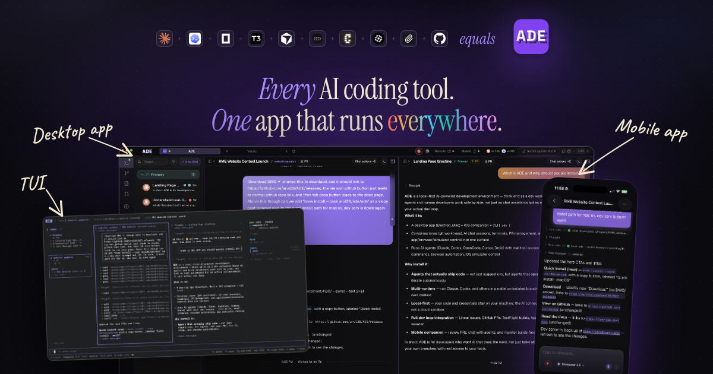
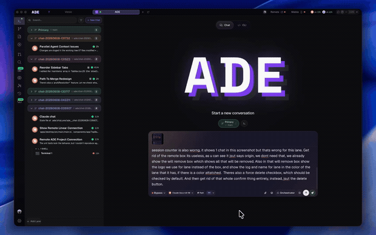
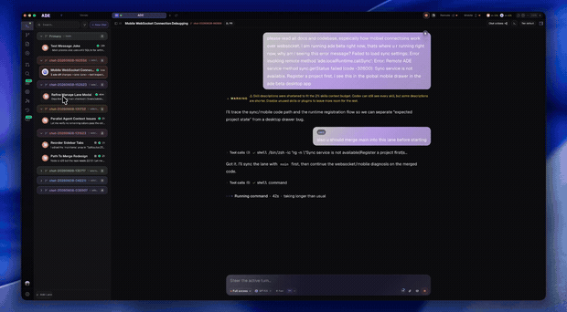
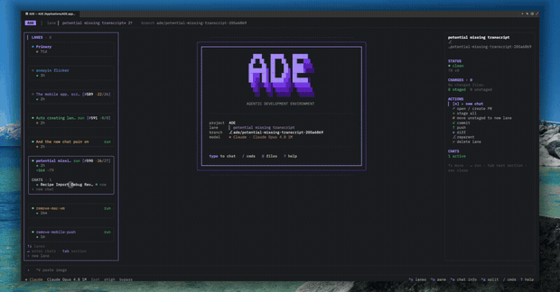
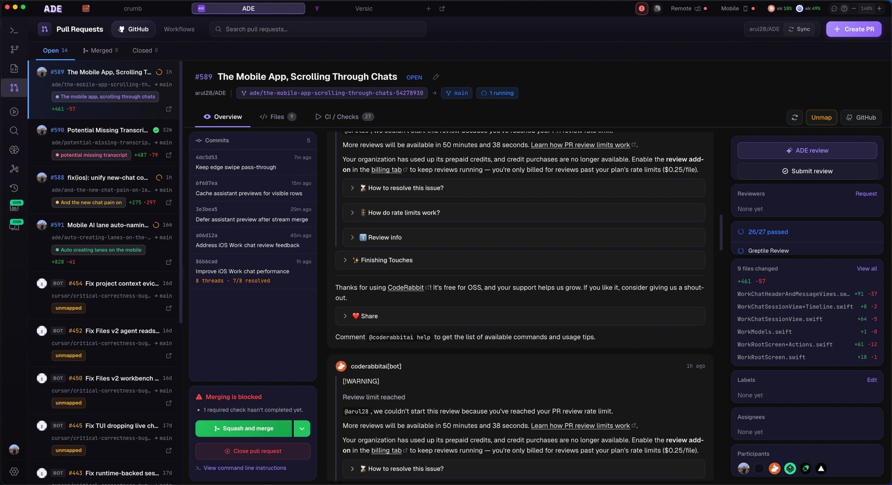
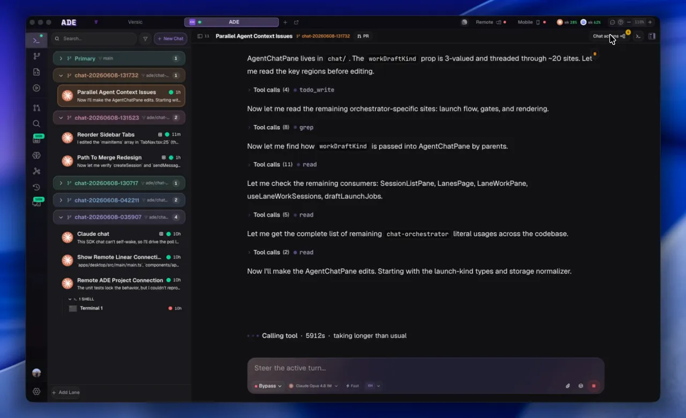
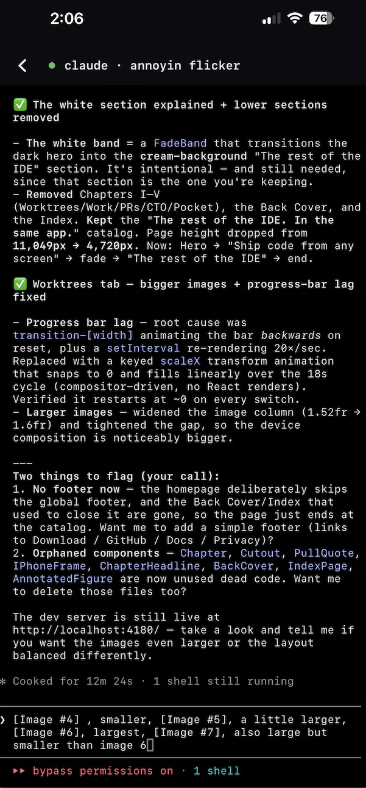
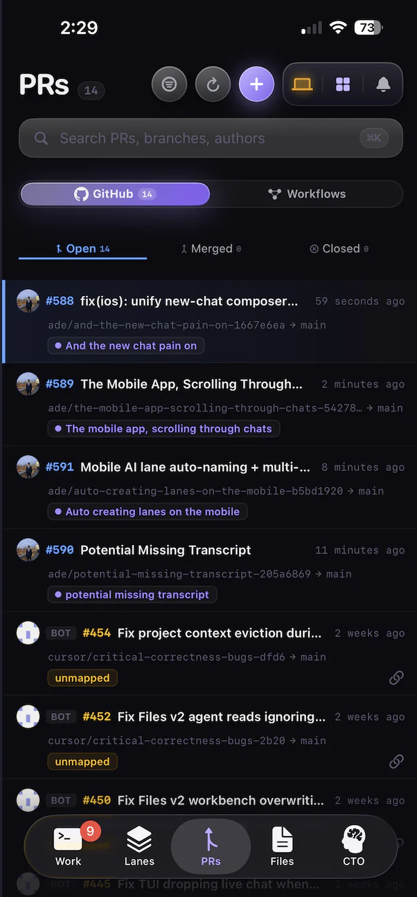
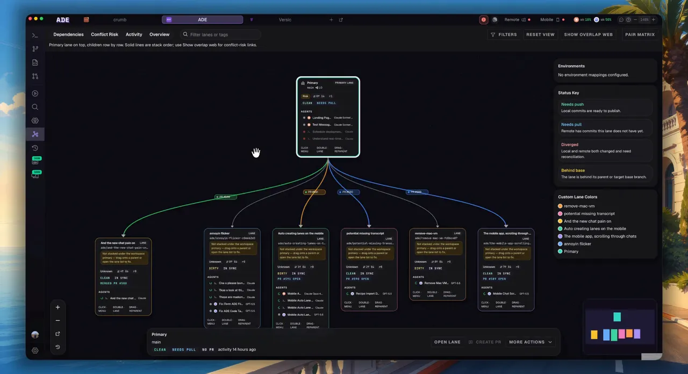

<p align="center">
  <a href="https://ade-app.dev">
    
  </a>
</p>

<p align="center">
  <strong>A single native workspace for every AI coding agent.</strong><br />
  <em>macOS, iOS, CLI — synced in real time.</em>
</p>

<p align="center">
  <a href="https://github.com/arul28/ADE/releases/latest"></a>
  &nbsp;
  <a href="https://testflight.apple.com/join/ZSdJGKPy"></a>
  &nbsp;
  <a href="https://ade-app.dev"></a>
  &nbsp;
  <a href="https://ade-app.dev/docs"></a>
  &nbsp;
  <a href="https://github.com/arul28/ADE"></a>
</p>

<p align="center">
  <a href="https://github.com/arul28/ADE/releases/latest"></a>
  <a href="https://github.com/arul28/ADE/actions/workflows/ci.yml"></a>
  <a href="LICENSE"></a>
  
  <a href="https://github.com/arul28/ADE/stargazers"></a>
  
</p>

<p align="center">
  <a href="https://ade-app.dev"></a>
</p>

ADE runs **Claude Code, Codex, Cursor, Factory Droid, OpenCode** — every major AI coding agent — inside one native workspace. Claude runs through the bundled Claude Agent SDK, while desktop and `ade code` share the same worktree-scoped chat runtime. Every task is its own git worktree, so agents ship features in parallel. Review and merge PRs in-app. Approve a diff from your phone while another agent tests on your Mac.

Free, open source, local-first. Bring your own keys or subs.

---

<table>
<tr>
<td width="55%" valign="middle">
  
</td>
<td width="45%" valign="middle">

### Manage worktrees. In parallel.
Every task gets its own git worktree. Describe it and ADE spins up the branch — edit, test, and commit side by side, with no stashing, no rebasing, no context switch.

</td>
</tr>

<tr>
<td width="45%" valign="middle">

### Every coding agent. One workspace.
Claude Code, Codex, Cursor, Factory Droid, OpenCode — pick whichever model fits the task. All run against the same worktree, with live diffs and approval gates. Grid view tiles every run side by side.

</td>
<td width="55%" valign="middle">
  
</td>
</tr>

<tr>
<td width="55%" valign="middle">
  
</td>
<td width="45%" valign="middle">

### The whole IDE. In your terminal.
`ade code` is ADE, terminal-native — the same worktrees, chats, and PRs in a fast TUI. Start in the shell, finish on the desktop or your phone.

</td>
</tr>

<tr>
<td width="45%" valign="middle">

### Open, review, and merge PRs.
Every PR your agents open lands in ADE — diff, CI, comments, merge button. No GitHub tab. Auto-merge when green.

</td>
<td width="55%" valign="middle">
  
</td>
</tr>

<tr>
<td width="55%" valign="middle">
  
</td>
<td width="45%" valign="middle">

### The conductor for your agents.
An always-on CTO with context across every worktree. Pulls work from Linear, dispatches to the right worker, reports back when it's done.

</td>
</tr>

<tr>
<td width="45%" valign="middle">

### Everything above. On your phone.
Every worktree, every agent, every PR — synced to iOS. Start a task on macOS, approve the diff from the train.

</td>
<td width="55%" valign="middle" align="center">
  
  &nbsp;
  
</td>
</tr>
</table>

<p align="center">
  
</p>

Plus files, terminals, git history, the workspace graph, multi-tasking, Linear sync, cron automations, computer-use proofs, and the `ade` CLI.

## Install

Download ADE for macOS from [**GitHub Releases**](https://github.com/arul28/ADE/releases/latest), open it on any git repo, and add a provider key (or subscription) in Settings. Install the iOS companion from [**TestFlight**](https://testflight.apple.com/join/ZSdJGKPy). Runs in Guest Mode without an account.

### macOS

With [Homebrew](https://brew.sh):

```bash
brew install --cask arul28/ade/ade
```

Or download the latest `.dmg`, drag **ADE.app** into `/Applications`, and open it. Both paths install the same signed + notarized universal app; ADE keeps itself current afterwards through its built-in auto-updater.

Requirements: macOS 13+, git on `PATH`, Node 22+ for headless CLI workflows.

### iOS

Install ADE Mobile from [TestFlight](https://testflight.apple.com/join/ZSdJGKPy), then pair it with the Mac from the desktop **Mobile** control or with `ade brain pin generate`.

### Windows

Windows releases are paused for now — current releases ship macOS only. The Windows build pipeline still exists (commented out in the release workflow) and will return in a future release.

## CLI

```bash
ade desktop
ade brain status --text
ade brain start
ade brain stop
ade doctor --json
ade code
ade lanes create --name fix-checkout-flow
ade prs checks 168 --text
ade tests run --suite unit --wait
ade actions list --text   # discover every service action
```

[CLI reference →](apps/ade-cli/README.md)

## Architecture

Local-first, on purpose. The center of ADE is the **brain** — the always-on, machine-owned ADE process for a channel. The brain owns the project catalog, sync websocket, and executor authority; desktop, `ade code`, the iOS app, and SSH-attached desktop windows attach to it as clients. Runtime state lives under `.ade/` inside each project (SQLite db, worktree checkouts, proof artifacts, encrypted secrets) and machine-wide state lives under `~/.ade` or `~/.ade-<channel>`. When desktop is running, its Electron main process also hosts a **desktop bridge endpoint** at `~/.ade/sock/desktop-bridge.sock` (override: `ADE_DESKTOP_BRIDGE_SOCKET_PATH`) so the brain can proxy `ade browser …` calls into the Electron-only `WebContentsView` APIs it can't reach under `ELECTRON_RUN_AS_NODE=1`.

```text
apps/ade-cli   ADE brain + manual runtime entry points + `ade` CLI + `ade code` terminal client
apps/desktop   Electron client — multi-window, attaches to a local brain or SSH-bound runtime
apps/ios       SwiftUI controller that pairs with an ADE machine over WebSocket
apps/web       Public website and download surface
docs/          Product and engineering docs
```

Deep reference: [ARCHITECTURE.md](docs/ARCHITECTURE.md).

## Glossary

| Term | Meaning |
| --- | --- |
| Brain | The always-on, machine-owned ADE process for one channel. It carries the sync websocket, project catalog, local RPC endpoint, and executor authority. |
| Runtime | ADE execution machinery: processes/services that open DBs and run agents, PTYs, git, and orchestration. A runtime process can host the brain role, but "brain" is the authority/lifecycle term. |
| Manual runtime | A foreground runtime process started explicitly with `ade runtime run --socket <path>`. Sync is always off; use it for dev/test work instead of the automated stable/beta/alpha brain service. |
| Machine | A physical computer with a per-channel ADE home and stable sync device identity. |
| Channel | A release lane such as stable, beta, alpha, or dev. Each channel has its own ADE home. |
| Client | A surface that attaches to the brain: desktop, `ade code`, ADE Mobile, or an SSH-bound desktop window. |
| Project | A registered repo with one ADE database at `<project>/.ade/ade.db`. |
| Lane | A task worktree under `.ade/worktrees/` that shares the project database. |
| Catalog | The machine-level project list served by the brain to clients and ADE Mobile. |

### Brain vs. manual runtime

This table describes the current code behavior.

| Capability | Brain | Manual runtime |
| --- | --- | --- |
| Lifecycle | Always-on login service for an ADE channel; Desktop can install/repair it in packaged builds. | Foreground process started explicitly with `ade runtime run --socket <path>`. |
| Owner | Machine / ADE install. | User or developer who launched it. |
| Sync | Yes. | No; `ade runtime run` forces sync off. |
| Mobile websocket | Yes. | No. |
| Phone pairing / PIN | Yes. | No. |
| Mobile/machine catalog authority | Yes. | No; it may expose registry data to explicitly attached clients, but ADE Mobile ignores manual runtimes. |
| Runs agents, PTYs, git, lanes, PR work | Yes. | Yes. |
| Clients | Desktop, `ade code`, and ADE Mobile attach to it; SSH-bound desktop windows attach to the remote machine's ADE transport. | Only clients explicitly pointed at its endpoint attach to it. |
| Survives client close | Yes, when service-owned. Desktop/TUI fallback spawns still exist for recovery and dev paths. | Only while that foreground process is still running. |

### How to test changes from a lane

| Change you made | What to run/test | Why |
| --- | --- | --- |
| iOS UI/client-only change | Build the iOS app from the lane and connect it to an existing ADE brain. | The phone is a client; UI-only work does not require a new brain. |
| iOS sync protocol, project catalog, pairing, or remote-command change | Rebuild/restart the target brain from the lane, then build the iOS app from the same lane. | The phone and brain both need the new contract. |
| Desktop renderer UI change | Run/build Desktop from the lane and let it attach to the channel brain. | Renderer code is client-side unless it depends on new brain APIs. |
| Desktop main/preload/runtime-bridge change | Run/build Desktop from the lane; rebuild/restart the brain only if the runtime RPC contract or brain behavior changed. | Electron main is a client/bridge, but some handlers route through the brain. |
| `ade code` / TUI UI change | Build/run `ade code` from the lane and attach to the existing brain. | The TUI is a client of the brain. |
| TUI command that depends on new RPC or shared types | Rebuild/restart the brain from the lane, then run the lane's `ade code`. | Both sides of the RPC contract must match. |
| Brain, sync, project catalog, pairing, agents, PTYs, lanes, PR workflows, or CLI runtime service change | Rebuild the ADE CLI/brain from the lane and restart the target brain before testing clients. | These live in the always-on process; existing installed brains keep running old code. |
| Manual runtime behavior | Start `ade runtime run --socket <path>` from the lane and point a client at that endpoint. | Manual runtimes are standalone and sync is always off. |
| Remote runtime / SSH transport change | Test with a remote target using the lane-built desktop/runtime artifacts. | SSH-bound windows talk to the remote ADE transport, not the local mobile brain. |
| Docs or web-only change | Run the docs/web preview or static checks for that surface. | No ADE brain/client lifecycle is involved. |

## Develop

First-time setup:

```bash
npm run setup
```

Daily desktop dev:

```bash
npm run dev
```

That aliases to `npm run dev:desktop`: it rebuilds `apps/ade-cli`, refreshes the shared dev runtime at `/tmp/ade-runtime-dev.sock` when needed, launches the Electron desktop app, and points desktop at that runtime. This is the normal desktop-dev flow.

When these commands are run from an ADE lane worktree under `.ade/worktrees/`,
they still run code from that lane checkout, but they open the primary checkout's
project data by default. For example, running from
`/path/to/ADE/.ade/worktrees/my-lane` opens `/path/to/ADE` as the ADE project
and uses the lane path as the workspace root for `dev:code`.

Dev command matrix:

```bash
npm run dev:desktop          # refresh shared dev runtime, then launch desktop
npm run dev:desktop:attach   # desktop only; fail if dev runtime is not already running
npm run dev:desktop:clean    # desktop only; clear Vite cache before launch
npm run dev:code:web          # `ade code` in the browser (PTY + inspector WebSocket)
npm run dev:code:attach      # terminal TUI only; fail if dev runtime is not already running
npm run dev:runtime          # runtime only in the foreground
npm run dev:all              # start shared dev runtime, then run desktop/code attach commands in separate terminals
npm run dev:stop             # stop the dev runtime
npm stop dev                 # same as dev:stop
```

Browser preview of the desktop renderer (UI work without Electron):

```bash
cd apps/desktop
npm run dev:vite             # mock-only: synthetic window.ade, fast shell
ADE_PROJECT_ROOT=/path/to/project npm run dev:vite:live   # mock + live runtime bridge (Linear, sync, lanes)
```

`dev:vite:live` starts the ADE dev runtime, a localhost HTTP bridge to the runtime endpoint, and Vite with a proxy so the browser can call real backend methods on top of the mock. Set `ADE_PROJECT_ROOT` to your primary project checkout (where `.ade/` and secrets live), especially when working from a lane worktree. Full details: [apps/desktop/README.md](apps/desktop/README.md).

The dev commands intentionally use a temp endpoint and a separate Electron profile so they do not collide with the installed ADE app:

```text
/tmp/ade-runtime-dev.sock
~/Library/Application Support/ade-desktop-dev
```

Override it when needed:

```bash
npm run dev:desktop -- --socket /tmp/my-ade-dev.sock
npm run dev:code -- --socket /tmp/my-ade-dev.sock
ADE_DEV_RUNTIME_SOCKET_PATH=/tmp/my-ade-dev.sock npm run dev:runtime
ADE_DESKTOP_BRIDGE_SOCKET_PATH=/tmp/my-bridge.sock npm run dev:desktop
```

> [!WARNING]
> Never point `--socket` at an ADE runtime you do not want restarted. In the default
> `--auto` mode the wrapper **shuts down and recreates** whatever runtime is
> already listening on that endpoint whenever its build hash does not match the
> checkout you are launching — so aiming at the production `~/.ade/sock/ade.sock`
> or another lane's live runtime will kill it (and any clients attached to it).
> Point at a fresh per-lane endpoint (below), or use
> `npm run dev:desktop:attach -- --socket <path>` to connect to an already-running
> runtime — attach mode refuses on a build-hash mismatch instead of restarting.

### Run a specific lane worktree

To preview a lane's build without disturbing your installed ADE app or its
runtime, run `dev:desktop` **from the lane checkout** on its own endpoints. Running
from the worktree makes Vite serve that lane's code, while the wrapper
auto-resolves project *data* to the primary checkout (as described above), so you
see the lane's UI backed by your real lanes, PRs, and chats:

```bash
cd /path/to/ADE/.ade/worktrees/<lane>
ADE_DESKTOP_BRIDGE_SOCKET_PATH=/tmp/ade-desktop-bridge-<lane>.sock \
  npm run dev:desktop -- --socket /tmp/ade-runtime-<lane>.sock
```

The per-lane `--socket` gives the lane build an isolated runtime (and sidesteps
the warning above — nothing else is listening there); the per-lane bridge endpoint
avoids colliding with the installed app's `~/.ade/sock/desktop-bridge.sock`. Set
`ADE_PROJECT_ROOT=/path/to/other-project` only if you want a different project's
data. A fresh worktree has no `node_modules` — symlink the root and `apps/desktop`
`node_modules` from the primary checkout, or run `npm run setup` inside the
worktree first.

When launching that same flow through ADE App Control from a running Alpha/Beta
ADE window, also clear the packaged-channel environment variables inherited from
the host app (and use an absolute lane cwd). Otherwise the dev Electron app can
reuse the Alpha/Beta profile and lose the single-instance lock instead of opening
the lane build:

```bash
ade --socket app-control launch --force \
  --cwd "/path/to/ADE/.ade/worktrees/<lane>" \
  --command "sh -lc 'ADE_PACKAGE_CHANNEL= ADE_DESKTOP_APP_NAME= ADE_DESKTOP_BRIDGE_SOCKET_PATH=/tmp/ade-desktop-bridge-<lane>.sock npm run dev:desktop -- --socket /tmp/ade-runtime-<lane>.sock'" \
  --text
```

To test auto-runtime creation, use the default dev commands after stopping the dev runtime:

```bash
npm run dev:stop
npm run dev:desktop          # tests the desktop wrapper creating the dev runtime
npm run dev:stop
npm run dev:code             # tests TUI wrapper creating the dev runtime
```

### Rebuild ADE Alpha or Beta locally

Use these commands when you need a local packaged macOS channel build without
waiting for the GitHub release workflow.

```bash
npm run package:alpha        # current checkout -> ADE Alpha.app, ade-alpha, ~/.ade-alpha
npm run package:beta         # origin/main -> ADE Beta.app, ade-beta, ~/.ade-beta
```

`package:alpha` builds exactly the checkout you are in. `package:beta` is
release-like: it fetches `origin/main`, fast-forwards the local `main` checkout
when possible, and builds that checkout as `ADE Beta`. It does not create a
packaging worktree.

To smoke-test the Beta channel from a PR branch before it lands on `main`, pass
the branch checkout explicitly:

```bash
node scripts/package-channel.mjs beta --repo "$PWD" --skip-install
```

Local channel outputs:

```text
apps/desktop/release-alpha/mac-arm64/ADE Alpha.app
apps/desktop/release-alpha/ADE-Alpha-local.zip
apps/desktop/release-beta/mac-arm64/ADE Beta.app
apps/desktop/release-beta/ADE-Beta-local.zip
```

Install the build you want to test by replacing the matching app in
`/Applications`:

```bash
rm -rf "/Applications/ADE Beta.app"
ditto "apps/desktop/release-beta/mac-arm64/ADE Beta.app" "/Applications/ADE Beta.app"
xattr -dr com.apple.quarantine "/Applications/ADE Beta.app" 2>/dev/null || true
```

Use `ADE Alpha.app` and `release-alpha` for Alpha. If the Dock already has an
ADE Alpha/Beta icon, remove and re-pin it after installing from `/Applications`;
Dock icons keep the exact bundle path they were pinned from, so an old icon can
launch a stale `apps/desktop/release-*` build even after `/Applications` was
updated.

Replacing the app bundle does not replace a brain process that is already
running for that channel. Before restarting the channel brain, close or finish
any active ADE Desktop, ADE Code, agent, or mobile sessions that depend on it.
Then restart and verify the channel brain through the CLI:

```bash
ADE_PACKAGE_CHANNEL=beta ADE_HOME="$HOME/.ade-beta" ade brain status --text
ADE_PACKAGE_CHANNEL=beta ADE_HOME="$HOME/.ade-beta" ade brain restart --text
ADE_PACKAGE_CHANNEL=beta ADE_HOME="$HOME/.ade-beta" ade doctor --text
ADE_PACKAGE_CHANNEL=beta ADE_HOME="$HOME/.ade-beta" ade sync status --text
```

For Alpha, use `ADE_PACKAGE_CHANNEL=alpha` and `ADE_HOME="$HOME/.ade-alpha"`.
Do not kill ADE brain processes directly during normal testing; the channel
brain owns the mobile sync websocket and may have desktop, terminal, or phone
clients attached. If you intentionally leave an old incompatible brain running,
the packaged desktop may preserve it and launch a private no-sync fallback
runtime for the desktop window, which means the Mobile drawer will not be using
that fallback's sync service.

Launching a packaged channel build should install or repair that channel's
always-on brain service. Official auto-updates also refresh this service on the
first launch after an update, and the installed service is expected to report the
same runtime build hash as the packaged desktop CLI:

```bash
launchctl print gui/$(id -u)/com.ade.runtime.beta
ls -l ~/Library/LaunchAgents/com.ade.runtime.beta.plist ~/.ade-beta/sock/ade.sock
```

Set or rotate the channel's mobile pairing PIN from the Desktop Mobile control,
or from the CLI against that channel home:

```bash
ADE_PACKAGE_CHANNEL=beta ADE_HOME="$HOME/.ade-beta" ade brain pin generate
ADE_PACKAGE_CHANNEL=beta ADE_HOME="$HOME/.ade-beta" ade brain pin set 123456
```

For Alpha, use `com.ade.runtime.alpha` and `~/.ade-alpha`. These builds do not
replace the production `ADE.app`, production `ade`, or `~/.ade` runtime/state.
Alpha and Beta also use separate Electron profile directories
(`ade-desktop-alpha` / `ade-desktop-beta`) so browser storage and window state
do not collide with dev or stable. Local channel packages include this Mac's
runtime binary. Release builds still require the full cross-platform runtime
artifact set used by remote runtime bootstrap.

Validate with `npm --prefix apps/desktop run typecheck` and `npm run test:desktop:sharded` for the full desktop suite. The desktop test suite is large, so run the smallest relevant subset first.

## Links

[Quickstart](https://www.ade-app.dev/docs/quickstart) · [Key concepts](https://www.ade-app.dev/docs/key-concepts) · [Worktrees](https://www.ade-app.dev/docs/lanes/overview) · [Computer use](https://www.ade-app.dev/docs/computer-use/overview) · [Changelog](https://www.ade-app.dev/docs/changelog) · [Contributing](CONTRIBUTING.md)

## Commit Chart

[](https://gitstock.org/arul28/ADE)

## License

[AGPL-3.0](LICENSE) — © 2025 Arul Sharma. Free forever. Source on GitHub.
