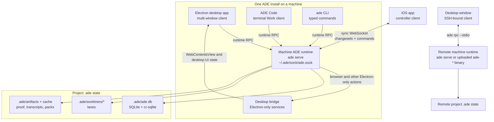

ADE is built around one per-machine runtime. Desktop, `ade code`, the shell CLI, iOS, and SSH-bound desktop windows are clients of that runtime; they do not each own a separate copy of project state.

## Runtime first

The ADE runtime (`apps/ade-cli`, started with `ade serve`) is the durable source of truth for projects, lanes, agent chats, work sessions, processes, sync, credentials, and proof artifacts. It hosts multiple projects through a project registry and exposes project-scoped actions through one JSON-RPC surface.

Desktop is a client of that surface. It owns the Electron window, preload bridge, renderer, and a narrow desktop bridge for services that physically require Electron APIs, such as ADE Browser. Runtime-backed work stays in the runtime even when the desktop window closes.

`ade code` is also a client of the same runtime. It opens the terminal-native Work chat, attaches to `~/.ade/sock/ade.sock` by default, and can run in explicit embedded/headless mode for CI or one-off local checks.

## Remote and mobile

An SSH-bound desktop window talks to a remote machine runtime through `ade rpc --stdio`. On first connect, desktop can upload the bundled `ade-<platform-arch>` runtime binary and native dependencies, then uses the same runtime action surface as a local window.

The iOS app is a controller. It pairs with a machine runtime over WebSocket, mirrors project state with cr-sqlite-compatible changesets, and sends commands back to the runtime. The phone never runs agents or owns lane processes.

## State boundaries

Project state lives under the repo's `.ade/` directory: `ade.db`, lane worktrees, artifacts, transcripts, and caches. Machine-global state lives under `~/.ade/`: the project registry, sockets, secrets, remote-machine records, and runtime metadata.

Source code crosses machines through git. ADE does not host a git server, and it does not move secrets out of the local encrypted stores.

<CardGroup cols={2}>
  <Card title="Architecture reference" icon="book" href="https://github.com/arul28/ADE/blob/main/docs/ARCHITECTURE.md">
    Read the full internal engineering map with service catalogs and build details.
  </Card>
  <Card title="Terminal workflows" icon="terminal" href="/tools/terminals">
    Work with terminal sessions and CLI-based agents that share the runtime with desktop.
  </Card>
</CardGroup>
