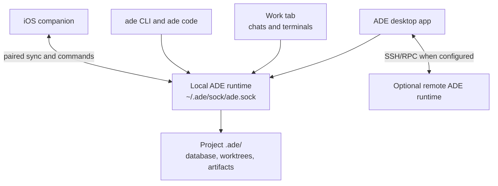

ADE is local-first. The desktop app is the visible control plane, and a machine-local ADE runtime owns the durable project state and action surface.



## The desktop app

Desktop owns the window, navigation, renderer UI, and Mac-only integrations. It displays lanes, Work sessions, files, PRs, History, Settings, CTO, and mobile pairing state.

## The ADE runtime

The runtime is the local service that reads and writes project state. It handles lanes, chats, terminals, Git operations, PR actions, provider sessions, proof artifacts, and mobile sync. Desktop and CLI clients call the same runtime surface, so a chat in the app and `ade code` in a terminal operate on the same project.

## Project state

ADE writes local state under the repository's `.ade/` directory:

```text
.ade/
  ade.db
  worktrees/
  artifacts/
  cache/
  secrets/
```

The source repository remains a normal Git checkout. ADE uses Git branches, worktrees, commits, and PRs rather than replacing them.

## CLI and terminal clients

The `ade` CLI gives agents and humans a typed way to reach ADE actions from a shell. `ade code` is the terminal-native Work client for people who prefer to stay in a terminal while sharing the same runtime and project state as desktop.

## iOS companion

The iOS app pairs with the local runtime. It mirrors useful state and can send commands back to the Mac. Agents still run on the Mac or configured remote runtime.

## Optional remote runtimes

ADE can connect to another machine over SSH and talk to an ADE runtime there. Use this when the repository or dev stack lives on a remote box, but you still want the desktop control plane locally.

<CardGroup cols={2}>
  <Card title="Key concepts" icon="lightbulb" href="/key-concepts">
    Learn the product vocabulary.
  </Card>
  <Card title="iOS companion" icon="mobile-screen" href="/tools/ios-companion">
    Pair your phone and understand what mobile can do.
  </Card>
</CardGroup>
