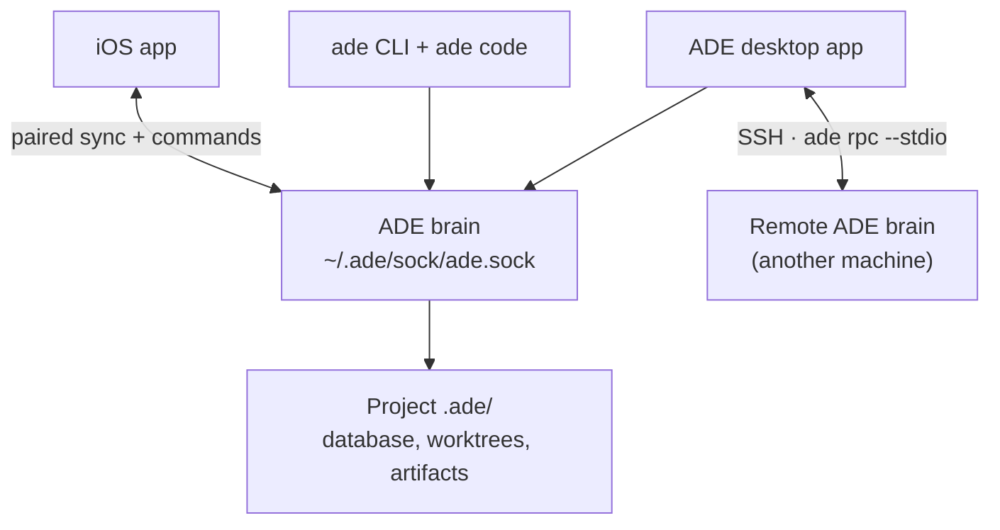

ADE is local-first. The center is the **brain** — the always-on, machine-owned ADE process for a channel. The brain owns the project catalog, the durable project state, the sync websocket, and the authority to run agents. Everything you see is a **client** of that brain: the desktop app, `ade code`, the iOS app, and any SSH-attached desktop window.



## The brain

The brain is the source of truth on a machine. It owns lanes, agent chats, terminals, Git operations, PR actions, provider sessions, proof artifacts, the project catalog, and the sync service. It runs every agent — **Claude Code, Codex, Cursor, Factory Droid, and OpenCode** — against the same projects. Because desktop and CLI clients call the same brain, a chat you start in the app and one you start with [`ade code`](/tools/ade-code) operate on the same project state.

The brain installs as a per-user login service — launchd on macOS, a per-user startup entry on Windows that needs no administrator rights — so it stays running even when no window is open.

## Clients

<CardGroup cols={2}>
  <Card title="Desktop app" icon="display">
    The Electron control plane — windows, navigation, the renderer UI, and platform integrations. Each window attaches to a local brain, or binds to a remote one over SSH. macOS-only integrations such as the Notch and the iOS Simulator drawer are hidden on [Windows](/getting-started/windows).
  </Card>
  <Card title="ade code" icon="rectangle-terminal" href="/tools/ade-code">
    The terminal-native client. Attaches to the same brain — the same lanes, chats, and PRs in a fast TUI.
  </Card>
  <Card title="iOS app" icon="mobile-screen">
    A SwiftUI controller that pairs with a machine over WebSocket. It mirrors state and sends commands; it never runs agents itself.
  </Card>
  <Card title="ade CLI" icon="terminal" href="/reference/cli">
    The typed control plane for any shell — used by humans and by the agents running inside ADE.
  </Card>
</CardGroup>

## Project state

ADE writes local state under each repository's `.ade/` directory and leaves your source tree under Git's control:

```text
.ade/
  ade.db        # the project database
  worktrees/    # one git worktree per lane
  artifacts/    # proof and capture artifacts
  secrets/      # encrypted project credentials
```

A **lane** is a git worktree under `worktrees/`. ADE uses real Git branches, worktrees, commits, and PRs rather than replacing them, so a lane is a normal checkout on disk you can also open in any editor.

## Remote runtimes over SSH

A desktop window can bind to a brain on **another machine** over SSH. ADE runs `ade rpc --stdio` on the remote and tunnels the same JSON-RPC back, so lanes, chats, diffs, and PRs behave exactly as they do locally — but the agents, builds, and tests run on the remote, against its filesystem and its own GitHub, Linear, and provider credentials. The desktop stays local and stays the control plane.

<Note>
iOS does not SSH into machines. The phone pairs with a brain and connects to its sync websocket over the LAN or a Tailscale tailnet — install Tailscale on both when they aren't on the same network.
</Note>

<CardGroup cols={2}>
  <Card title="Key concepts" icon="lightbulb" href="/key-concepts">
    The product vocabulary — brain, lane, stack, CTO — in two minutes.
  </Card>
  <Card title="ade CLI" icon="terminal" href="/reference/cli">
    The typed control plane behind everything ADE does.
  </Card>
</CardGroup>
