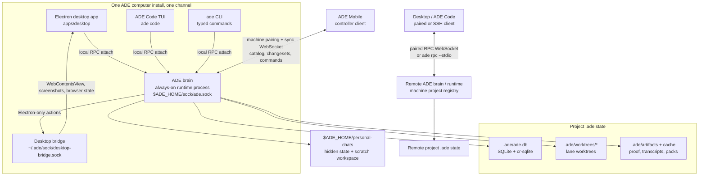

# ADE Architecture Reference

Consolidated technical reference for the ADE (Agentic Development Environment) system. This document is the entry point for engineers and AI agents who need to understand the shape of the system before reading feature-specific docs. Deeper subsystem docs live under `docs/features/`.

---

## 1. System at a Glance

ADE is a local-first development control plane that orchestrates AI-assisted software engineering across parallel worktrees and also hosts projectless personal chats. The center of the system is the **ADE brain**: the always-on, machine-owned ADE process for one channel. The brain hosts every project on that machine through a project registry, owns a separate machine-level personal-chat scope, exposes both through one JSON-RPC surface on the channel's local endpoint, serves the sync websocket for ADE Mobile, and carries executor authority. Desktop, the terminal `ade code` client, the iOS app, hosted web, and SSH-attached desktop windows are all **clients** that attach to a local brain or remote runtime transport and invoke runtime-owned actions through that one surface.

The brain owns everything that needs to survive a client closing: worktree-per-lane git isolation, project and personal multi-provider agent chat, work-session orchestration, a persistent CTO agent with durable memory and a Linear read/write surface, rule-based automations, stacked pull requests with conflict simulation, computer-use proofs, the sync service that replicates projects to other devices, and the per-machine credential store and agent registry. Nothing leaves the user's machine by default: AI work runs through user-authenticated CLIs (Claude Code, Codex), local API-key routes (OpenCode server), or local model endpoints (Ollama, LM Studio, vLLM).

ADE ships as one computer install, ADE Mobile, and the marketing site:

### Brain and runtime topology



```
                              ┌───────────────────────────────┐
                              │ apps/web (marketing + DL page)│
                              └───────────────────────────────┘

                ┌───────────────────────────────────────────────┐
                │        apps/ade-cli (BRAIN + RUNTIME)         │
                │  ─────────────────────────────────────────────│
                │  ADE brain process                             │
                │   - always-on runtime for one channel          │
                │   - listens on $ADE_HOME/sock/ade.sock         │
                │   - login service (launchd / systemd / Win)    │
                │   - machine RPC + project registry             │
                │   - hidden projectless personal-chat scope     │
                │   - sync service (cr-sqlite over WebSocket)    │
                │   - credential store, agent registry           │
                │   - dispatches CLI runtimes:                   │
                │       claude · codex · opencode · cursor       │
                │   - SQLite + cr-sqlite per project (.ade/ade.db)│
                │  ─────────────────────────────────────────────│
                │  Also exposes:                                 │
                │   - `ade rpc --stdio` single-session over SSH  │
                │   - `ade <command>` typed CLI surface          │
                │   - `ade code` terminal Work client (Ink+React)│
                └───────────────────────────────────────────────┘
                  ▲              ▲              ▲             ▲
                  │ local        │ local        │ WebSocket   │ paired WS
                  │ local RPC    │ local RPC    │             │ or SSH stdio
                  │              │              │             │
        ┌──────────────────┐ ┌──────────────┐ ┌──────────┐ ┌──────────────────┐
        │ apps/desktop     │ │ ade code TUI │ │ apps/ios │ │ apps/desktop     │
        │ (Electron, multi-│ │ (apps/ade-cli│ │ SwiftUI  │ │ window bound to a│
        │ window — project │ │  /tuiClient) │ │ controller│ │ remote brain     │
        │ or machine chat) │ │              │ │ (never   │ │ (RemoteConnection│
        │ LocalRuntime-    │ │ defaults to  │ │ runs     │ │ Pool, bootstrap- │
        │ ConnectionPool   │ │ machine brain│ │ agents)  │ │ uploads bundled  │
        │                  │ │              │ │          │ │ runtime binary)  │
        └──────────────────┘ └──────────────┘ └──────────┘ └──────────────────┘
                              All clients share the brain's view of
                                projects, lanes, project/personal chats, work sessions,
                                processes, sync.
                                            │
                                            ▼
                                ┌─────────────────────────┐
                                │ User code: git worktrees│
                                │ under .ade/worktrees/   │
                                └─────────────────────────┘
```

Live runtime state is replicated between paired devices through cr-sqlite changesets carried over WebSocket; the **sync service runs inside the ADE brain**, not in the desktop app. ADE Mobile pairs with a machine — typically the user's primary desktop-class machine — and receives that machine's project catalog from the brain. The sync WebSocket is one brain-level listener on a stable port (default 8787, with preferred-port retry before any scan); when the hosted project switches, the new project's host service adopts the connected phones instead of dropping them. A second desktop on the same network is also a client of that brain, not a peer host. A desktop window or `ade code remote` can bind to a remote brain through the paired DPoP runtime channel (LAN → tailnet → relay) or, for an explicitly eligible target, through SSH `ade rpc --stdio`. The binding is per-window/client, and both transports route actions through the same multi-project JSON-RPC surface. See [features/remote-runtime/README.md](./features/remote-runtime/README.md).

Source code crosses machines through plain git. ADE does not own a git server.

Product positioning and workflows live in [`docs/PRD.md`](../docs/PRD.md). This document is strictly technical.

---

## 2. Apps & Processes

### 2.1 ADE brain and runtime (`apps/ade-cli/`)

`apps/ade-cli/` contains the brain process, manual runtime entry points, the `ade` CLI surface, and the `ade code` terminal client. It ships as one Node binary that runs in several modes.

**Run modes:**

- **Brain** — the normal mode. Boots the multi-project JSON-RPC server, hosts the per-project services on demand, serves sync, and listens on the channel's local endpoint (POSIX: `$ADE_HOME/sock/ade.sock`; Windows: a named pipe under `\\.\pipe\ade-<hash>`, with the hash derived in `apps/desktop/src/shared/adeRuntimeIpc.ts`). On POSIX the headless RPC socket directory is created `0700` and the socket itself chmodded `0600` so only the owning user can connect (named pipes skip the chmod). Installable / removable as a login service with `ade brain start` / `ade brain stop` (per-platform installers in `apps/ade-cli/src/serviceManager/`).
- **Manual runtime (`ade runtime run`)** — starts a foreground runtime process on an explicit endpoint. Sync is always off so it cannot claim brain authority; use a separate `ADE_HOME` when you also want full machine-state isolation.
- **Single-session CLI** — `ade <command>` connects to the local brain over the machine endpoint, dispatches one project-scoped action, and exits. With `--headless`, the CLI bootstraps a project's services directly from the repository instead of going through the machine brain — used in CI and for one-off scripts.
- **SSH stdio bridge (`ade rpc --stdio`)** — runs a single-session JSON-RPC runtime over stdin/stdout. This is what desktop's `RemoteConnectionPool` execs over SSH after `bootstrapRemoteRuntime` has uploaded a matching `ade-<platform-arch>` binary. Exits when the SSH channel closes.
- **Terminal client (`ade code`)** — launches the Ink + React Work chat (`apps/ade-cli/src/tuiClient/`). Defaults to attaching to the machine brain and will start it if the endpoint is missing. `ade --socket /path code` requires a specific endpoint; `ade code --embedded` keeps the in-process runtime fallback explicit.

**Machine and multi-project RPC.** The runtime exposes runtime-scoped methods (`projects.list/add/remove/touch`, `sync.*`, `runtime/info`, `machineInfo.get`, `runtimeEvents.subscribe/unsubscribe`) directly. Project-scoped operations dispatch through `ade/actions/call` with a `projectId`. Personal chats use the separate machine methods `personalChats.call` and `personalChats.streamEvents`; they never enter project dispatch and their capability/version is advertised by `runtime/info`. Per-project services are spun up lazily by `ProjectScopeRegistry` (`apps/ade-cli/src/services/projects/projectScope.ts`) which calls `createAdeRuntime({ projectRoot, ... })` the first time a project is touched. `PersonalChatScope` (`apps/ade-cli/src/services/personalChats/personalChatScope.ts`) lazily boots a chat-only runtime under `$ADE_HOME/personal-chats`, with distinct state and scratch roots and no project-registry entry. The project registry (`projectRegistry.ts`) is the durable list of known projects; `machineLayout.ts` resolves machine-wide paths under `$ADE_HOME`. Wire formats live in `apps/ade-cli/src/multiProjectRpcServer.ts`. Runtime-event replay is backed by `apps/ade-cli/src/eventBuffer.ts`, a bounded buffer (10k events, 16 MB total, 1 MB per retained event by default) that returns `eventEpoch`, `gap`, and `oldestCursor` so clients can detect daemon restarts or evicted history. `projects.list` resolves host-side project icons under a connect-path budget (64 icons / 12 MB per call); records outside the budget get a null icon instead of blocking connection setup.

**Runtime-side services** (under `apps/ade-cli/src/services/`):

| Directory | Role |
|-----------|------|
| `projects/` | Project registry, project scope (per-project runtime), machine layout. |
| `personalChats/` | Lazy machine-owned personal-chat runtime, allowlisted action/terminal/attachment ingress, and durable transcript/event access outside the project registry. |
| `sync/` | Sync service, peer client, device registry, pairing store, PIN store, sync protocol, remote command service, Tailscale CLI resolver. The sync service now lives here; desktop's old in-process sync host is disabled by default (env-gated `ADE_ENABLE_DESKTOP_SYNC_HOST=1` for diagnostics only). |
| `account/` | Optional ADE account authentication. The machine brain owns loopback OAuth, the account-directory device-code bridge for SSH/display-less hosts, `account.session.v1` refresh storage, and in-memory `ADE_ACCOUNT_TOKEN` credentials for agents and CI. Interactive and token-provisioning actions are CTO-only. |
| `credentials/` | Per-machine credential store. |
| `agentRegistry.ts` | Per-machine agent registry. |

**Service managers.** `apps/ade-cli/src/serviceManager/installLaunchd.ts` (macOS), `installSystemd.ts` (Linux), `installWindows.ts` (Windows) register the brain as a login-time service. `index.ts` is the platform router; `common.ts` carries shared types (`ServiceManagerResult`, `ServiceManagerStatusResult`).

**Session identity.** The runtime resolves caller role from ADE context env vars and command flags. Role vocabulary: `cto`, `orchestrator`, `agent`, `external`, `evaluator`. Browser automation adds a separate bearer capability: ADE-launched chat and owned-terminal environments receive an opaque `ADE_BROWSER_ACTOR_TOKEN` bound in Electron memory to that chat's trusted lane/project or personal tab collection. The runtime requires the token, strips caller-supplied routing, and carries it only over the authenticated desktop bridge. Electron validates it in the same process that issued it before restoring the bound scope; role alone never grants access to a human-authenticated browser profile.

**Optional ADE account auth.** `ade login` preserves the local-browser loopback OAuth path, but selects the account-directory device authorization bridge for explicit `--headless`, SSH, display-less hosts, or a failed browser launch. The brain generates and retains the device redemption secret, polls the bridge, and persists the resulting refresh-capable session under `account.session.v1`. For a JWT access token, its decoded `exp` claim is authoritative over the OAuth `expires_in` bookkeeping: status reports that expiry, and `getAccessToken()` refreshes inside the two-minute skew even when an older stored session record claims a later expiry. Tokens without a usable JWT expiry retain the stored `expiresAt` fallback. The desktop and brain share the encrypted session file and may race a rotating refresh credential; after an OAuth `invalid_grant`, the loser re-reads persistence and retries once only when another process has written a different refresh token. Other refresh failures are not replayed, and raw tokens are never logged. `ADE_ACCOUNT_TOKEN` takes precedence without starting a login flow: JWT access credentials are used through their declared expiry, while refresh credentials are exchanged and rotated only in memory. `ade account token create` wraps the current interactive refresh credential with its public issuer/client context in a versioned secret envelope, so a newly provisioned agent or CI host needs no local Clerk configuration. Legacy raw opaque refresh tokens retain local-config compatibility and return migration guidance when that config is absent. Distributed CLI/brain binaries and packaged Electron set `ADE_RUNTIME_PACKAGED=1` before account services start. In that mode, a Clerk issuer or JWKS URL under `*.clerk.accounts.dev`, plus the exact ADE development directory override, is rejected atomically in favor of the complete built-in production OAuth, attestation, and directory configuration; a non-development custom issuer remains valid, and source checkouts retain their existing override behavior. `ADE_ALLOW_DEVELOPMENT_CLERK=1` is the explicit packaged-build escape hatch for controlled development testing. The desktop Account page exposes one honest browser continuation because the bridge opens the generic hosted account flow rather than selecting a provider; the browser presents whichever methods are enabled. Native iOS uses ClerkKit's transferable OAuth result to distinguish new accounts from returning users. Its identifier-first email path starts sign-in, falls back to sign-up only for Clerk's precise account-not-found codes, sends the sign-up email verification code, and verifies against the matching sign-in or sign-up attempt. Account status exposes `loopback`, `device`, or `env-token`; signed-out state never gates local projects, `ade code`, local pairing, or PIN workflows.

**Action surface.** First-class command families cover lanes (including `ade lanes link-linear-issue` / `detach-linear-issue` for post-creation Linear issue linking, and `ade lanes create-from-linear` / `batch-create-from-linear` to spin up one or many issue lanes — optionally launching an agent chat with `--start-chat`), git, diffs, files, PRs, runs, shells, chats (including `ade chat create --prompt` for a persistent Work chat followed by an initial chat message, `ade chat send` / `message` / `steer` / `wait` for peer chat delivery and status polling, `ade chat read <session>` for recent transcript messages, `ade chat scheduled-work create --cron "<expr>" --prompt "<text>" [--once]` for durable provider-neutral scheduling, `ade chat create --from-linear-issue <id>`, `ade chat attach-linear-issue` / `detach-linear-issue` / `linear-issues` for session-scoped issue attachment, and `--parent <sessionId>` / `--no-parent` to control child-chat lineage — a chat created via `ade chat create` / `ade new --mode chat` defaults its parent to `$ADE_CHAT_SESSION_ID` (the spawning agent's own chat, injected into every tracked agent shell) so it lists in the parent's subagents panel instead of becoming an orphan, and `--no-parent` opts out), agents, CTO, Linear (the write bridge an attached CLI agent uses: `ade linear attach` / `detach` / `issues` / `issue` / `comment` / `set-state` / `assign` / `label`, with `--this-session` resolving the issue id from `$ADE_LINEAR_ISSUE_IDS` so a launched agent needs no Linear token — see [features/linear-integration/README.md](./features/linear-integration/README.md#session-scoped-issue-attachment-and-cli-context-injection)), tests, proof, settings, the iOS Simulator (`ade ios-sim` / `ade ios` / `ade simulator` — see [features/ios-simulator/README.md](./features/ios-simulator/README.md)), the Cursor Cloud bridge (`ade cursor cloud agents | runs | artifacts | repos | models | me` — talks directly to `@cursor/sdk` without going through the ADE runtime endpoint), the App Control bridge for Electron apps (`ade app-control` / `ade app` / `ade electron` — `launch`, `connect`, `stop`, `status`, `screenshot`, `snapshot`, `inspect`, `select`, `click`, `type`, `scroll`, `key`, `targets`, `attach`, `logs`, `terminal write`, `terminal signal` — see [features/computer-use/app-control.md](./features/computer-use/app-control.md)), the chat-scoped terminal (`ade terminal list` / `read` / `write` / `signal` / `active`), universal search (`ade search "<query>"` over chats, terminals, PRs, commits, branches, lanes, files, and Linear — see [features/search/README.md](./features/search/README.md)), and a generic `ade actions run <domain.action>` escape hatch for every registered ADE service action. The chat action surface includes `chat.createSession`, `chat.sendMessage` (low-level normal-turn send), `chat.messageSession` (normalized peer delivery: auto, queue, wake, interrupt-replace), `chat.readTranscript`, `chat.createScheduledWork`, `chat.listScheduledWork`, `chat.getScheduledWorkState`, `chat.cancelScheduledWork`, `chat.setScheduledWorkPaused`, and model-catalog actions; session-bound non-CTO callers are restricted to their own eligible session for every scheduled-work read or mutation (a chat or ADE-tracked provider CLI), and to their own chat for `chat.sendMessage` / `chat.readTranscript`, while `chat.messageSession` is the reviewed primitive for deliberately messaging another ADE chat through routing semantics. The action allow-list adds three domains for these surfaces: `app_control` (every public method on `AppControlService`), `terminal` (`list`, `read`, `write`, `signal`, `activeForChat` against `ptyService`), named iOS Simulator actions for launch, live view, inspection, input, and Preview Lab workflows, and `search` (`query`, `indexStatus`, and the CTO-only `rebuildIndex` against `searchService`; session-bound non-CTO callers get chat/terminal hits scoped to their own session).

Scheduled work is part of that typed chat family: `ade chat scheduled-work create --cron "<expr>" --prompt "<text>" [--once] [--reason "<text>"] [--session <id>]` calls `chat.createScheduledWork`, while list/cancel call `chat.listScheduledWork` / `chat.cancelScheduledWork`; `ade chat schedules <session> --pause|--resume` calls `chat.setScheduledWorkPaused`, and omitting the flag calls `chat.getScheduledWorkState` for pause, next-wake, and active-job state. Create writes a durable provider-neutral row for any chat runtime or ADE-tracked provider CLI. A due chat row stays armed while a foreground turn is active, then starts a wake turn at the next safe boundary; live CLIs wait for a provider-specific visible composer boundary, and ended CLIs resume before delivery. For a session-bound non-CTO caller, the daemon defaults an omitted target to the caller's own eligible session and denies cross-session, untracked-shell, or unbound-external scheduling. Management reads come from the KV-backed scheduler snapshot rather than reconstructed transcript events; provider-owned cancellation is reported as requested vs confirmed instead of being hidden optimistically.

Personal chat is an explicit machine-only variant of the typed chat family: `ade chat list|create|show|read|send|interrupt|archive|unarchive|delete --personal`. It connects to the running brain, invokes `personalChats.call`, and rejects lane/Linear project flags rather than falling back to `--headless` project dispatch. ADE Code remains a project Work TUI and intentionally has no personal-chat UI in this release.

**Proof subcommands** — `ade proof capture` (alias of `screenshot`), `ade proof attach <path>`, `ade proof record`, `ade proof launch`, `ade proof interact`, `ade proof list/status/environment/ingest`. `attach` infers the artifact kind from the file extension and routes through `ingest_computer_use_artifacts` with `backendStyle: "manual"`. Capture-style commands set `preferHeadless: true` on the plan so the connection layer drops to headless mode unless `--socket` is explicitly requested. All proof subcommands accept `--owner-kind` / `--owner-id` (with `chat` and `pr` aliases) to layer an explicit owner on top of the inferred session identity.

**Bundled runtime artifacts.** Per-platform `ade-<platform-arch>` binaries plus their native dep tarballs live under `apps/desktop/resources/runtime/`, with packaged ADE CLI resources providing the `ptyHostWorker.cjs` used by remote terminals. `release-core.yml` builds the cross-platform set, validates that every darwin/linux arm64/x64 runtime binary and native archive is present, and publishes those runtime assets plus `install.sh` and `SHA256SUMS` on the GitHub release. `bootstrapRemoteRuntime` uploads missing or hash-mismatched artifacts on first SSH connect from the desktop client.

**Headless install + update.** A standalone runtime can be installed on a headless machine without going through the desktop installer. Remote machines reached over SSH don't need this path: `bootstrapRemoteRuntime` uploads the desktop app's bundled runtime artifacts.

```bash
curl -fsSL https://github.com/arul28/ADE/releases/latest/download/install.sh | sh
ade brain update --text
ade brain update status --text
```

Use `ADE_VERSION=vX.Y.Z` for a pinned release or `ADE_INSTALL_DIR` to choose the destination directory. The installer defaults to `$ADE_HOME/bin/ade`; both install and `ade brain update` verify downloaded runtime assets against `SHA256SUMS`. `ade brain update` stages the next release under `$ADE_HOME/runtime/updates/`, verifies the staged binary against the staged native deps, promotes the binary/deps into place, and restarts the per-user brain service.

**Install + PATH wiring (when the desktop ships `ade`).** On macOS / Linux the desktop installer drops the launcher at `$HOME/.local/bin/ade`; on Windows it lands at `%LOCALAPPDATA%\ADE\bin\ade.cmd`. After a successful install on Windows, the packaged `.cmd` installer adds the target directory to HKCU `Environment\Path` when needed and broadcasts an environment-change notification. After a successful install on POSIX, `ensureUserBinOnShellPath` appends a marked `export PATH="$HOME/.local/bin:$PATH"` block to the user's shell rc (`.zshrc` for zsh, `.bashrc` for bash, `.profile` otherwise) iff (a) the install dir isn't already on the inherited `PATH` and (b) the file doesn't already contain the marker / line / target dir. The install IPC reply tells the renderer which profile was edited so the Settings/Onboarding UI can prompt the user to open a new terminal or `source` it.

**Windows packaging.** The installer lays down `ade-cli-windows-wrapper.cmd` plus an `ade-cli-install-path.cmd` helper alongside the bundled Electron Node runtime. The helper installs `%LOCALAPPDATA%\ADE\bin\ade.cmd`, updates the user PATH when needed, and then `ade` works from a new normal Windows shell without a global Node install. See §14.4 for the packaging flow.

**Desktop bridge endpoint.** The ADE runtime runs `apps/ade-cli/dist/cli.cjs` under `ELECTRON_RUN_AS_NODE=1`, so it has no access to renderer-side Electron APIs (`WebContentsView`, `nativeImage`, `session`, …). A small set of services own real desktop UI and therefore cannot live in the runtime — most notably `BuiltInBrowserService`, which drives the Browser pane's `WebContentsView`. The desktop main process hosts those services and exposes them to the runtime over a side-channel JSON-RPC Unix-domain socket / named pipe.

The endpoint path is resolved by `apps/ade-cli/src/services/projects/machineLayout.ts`: `<adeHome>/sock/desktop-bridge.sock` on macOS / Linux (e.g. `~/.ade/sock/desktop-bridge.sock` stable, `~/.ade-beta/sock/desktop-bridge.sock` beta), and `\\.\pipe\ade-desktop-bridge[-<channel-suffix>]` on Windows. `ADE_DESKTOP_BRIDGE_SOCKET_PATH` overrides it for dev launches against a non-default ADE home. The server lives in `apps/desktop/src/main/services/builtInBrowser/desktopBridgeServer.ts`, wired up from `main.ts` right after `builtInBrowserService` is constructed and torn down with it on app shutdown. The runtime-side proxy is `apps/ade-cli/src/services/builtInBrowser/desktopBridgeClient.ts`; `createAdeRuntime` in `bootstrap.ts` assigns it to `runtime.builtInBrowserService` so the existing action registry slot resolves transparently (skipped when `runtimeProfile === "chat"`). Both sides share the same method allowlist: `getStatus, requestOriginAccess, claim, startSession, listSessions, endSession, showPanel, setBounds, navigate, createTab, switchTab, closeTab, reload, goBack, goForward, stop, observe, getTrace, click, typeText, dispatchKey, scroll, fill, clear, wait, startInspect, stopInspect, captureScreenshot, selectPoint, selectCurrent, clearSelection`. Profile diagnostics and permission administration are deliberately absent.

The socket is not an authority by itself. Electron mints a rotating 256-bit bridge token in memory for each desktop launch, sends it only through the trusted local desktop client's `ade/initialize` request, and requires it on every bridge request using a timing-safe comparison. The token is held by the runtime proxy and is not placed in agent environments. Independently, `builtInBrowserActorCapabilities.ts` issues each opaque per-chat actor capability in Electron. `adeRpcServer.ts` requires the connecting CLI's token, strips caller-supplied lane/project/personal routing, and carries it through the authenticated bridge. `desktopBridgeServer.ts` validates the token against Electron's issuer-owned in-memory registry, replaces routing with the capability's bound chat/lane/project or personal scope, and forces `force: false`; revoked or cross-process-fabricated tokens fail closed. This two-token boundary prevents a raw local socket caller, an unbound CLI, or an agent that forges action arguments from inheriting the human browser session.

Today only the `built_in_browser` domain rides this bridge; the pattern is generic and other Electron-only domains can be added the same way. The client lazy-connects on first call and reconnects on the next call after any failure. When no desktop is running, each call surfaces a clear `Desktop browser bridge not running at <path>. Open ADE Desktop with a project to enable \`ade browser\` commands.` error and every other runtime domain stays functional. This is distinct from the retired renderer-hosted RPC mode used before the multi-project runtime: the ADE runtime still owns the full action surface, and the bridge is narrowly scoped to services that physically require an Electron renderer host.

### 2.2 Electron desktop client (`apps/desktop/`)

The desktop app is a **client of the runtime**. It owns a trusted main process, a narrow typed preload bridge, the React renderer, and the shared TypeScript contracts that the whole monorepo (including the ADE CLI runtime) consumes — but the data plane it operates on lives in the ADE runtime.

| Directory | Role |
|-----------|------|
| `apps/desktop/src/main/` | Node process with full OS access. Hosts windows, registers IPC handlers, routes runtime-backed APIs through local/remote runtime pools, spawns the local ADE runtime when needed, and owns Electron-only services that cannot run inside the runtime. Entry: `main.ts`. |
| `apps/desktop/src/preload/` | Typed bridge. Entry: `preload.ts`. Uses `contextBridge.exposeInMainWorld("ade", { ... })`. Runtime-backed APIs route through `LocalRuntimeConnectionPool` (local) or `RemoteConnectionPool` (paired/SSH-bound window); file APIs are strict once a local/remote runtime is bound, while usage/budget reads only route to runtime for remote-bound windows. During project switches, mutating runtime/sync calls that target the ambiguous active binding are blocked, read-only calls avoid refreshing stale bindings, active remote opens can be awaited before retrying reads, and remote lane preview URLs are localized through desktop-owned TCP forwards. If a packaged local window is temporarily bound to an isolated runtime whose sync service is disabled, only the exact machine-level sync-unavailable/register-project failures retry through main-process sync IPC; remote-bound failures never fall back locally. Explicitly targeted work can pass an `OpenProjectBinding` pin through `callPinnedRuntimeAction` to route to the captured project during a switch, used by detached draft launches and rollback. |
| `apps/desktop/src/renderer/` | React 18 SPA. No Node access, no filesystem access, no direct process/network. Everything goes through `window.ade`. Entry: `main.tsx`. |
| `apps/desktop/src/shared/` | Types, IPC channel constants (`ipc.ts`), model registry (`modelRegistry.ts`), keybindings, and cross-client derivations such as `chatScheduledWork.ts` and `externalSessionAffordances.ts` (the desktop/ADE Code Continue/Copy policy for provider-native imports). Imported by desktop, `apps/ade-cli`, and mobile contract generation paths. New runtime-facing types live in `shared/types/remoteRuntime.ts` and `shared/types/core.ts`. |
| `apps/desktop/src/generated/` | Build-time generated code (e.g., bootstrap SQL snapshots). |
| `apps/desktop/src/test/` | Shared vitest setup and fixtures. |
| `apps/desktop/src/types/` | Ambient type declarations. |

**Multi-window shell.** `main.ts` hosts multiple `BrowserWindow` instances; opening another project opens it in a dedicated window. Each window has its own runtime binding (local pool or a specific remote target). The global `/chats` route surfaces through a real machine-level **Chats** top tab (its existence tracked in session-only `personalChatsTabOpen` app state, active-ness derived from the route) that coexists with project tabs and survives project open/switch/close, or runs inside the current project tab without clearing that binding. Personal-chat IPC therefore targets the local brain from local/no-project windows and the remote brain from an SSH-bound project window. External controllers — for example a `ade code` TUI — can drive desktop window navigation via the `app/navigate` JSON-RPC method against the runtime; the desktop's IPC tracing carries window ID so logs distinguish which renderer surface invoked a channel.

**Runtime binding pools.**

- `apps/desktop/src/main/services/localRuntime/localRuntimeConnectionPool.ts` — desktop-side client for the local brain endpoint. Spawns or attaches to the machine endpoint, registers local projects with `projects.add`, dispatches local runtime actions, applies short per-call timeouts for project registration / file actions / event polling, emits a `local_runtime.action_slow` warning log when an action call exceeds 500 ms or throws (the log breaks the total into `ensureProjectMs` / `connectMs` / `daemonCallMs` so a stalled renderer call is debuggable before the IPC timeout fires), and best-effort installs the background service in packaged builds. Local project windows use this binding consistently outside unit tests.
- `apps/desktop/src/main/services/remoteRuntime/` — paired/SSH runtime pool. `remoteTargetRegistry.ts` stores saved machines under `~/.ade/secrets/remote-machines.json` (manual host plus an optional `routes[]` of Tailscale / Bonjour / manual addresses with per-route `lastSucceededAt` and manual-disconnect state); `sshTransport.ts` handles ssh-agent / key based transport with bounded connect/exec timeouts, normalized handshake errors, disabled SSH keepalives, and alternate routes ranked by most-recent success; `remoteBootstrap.ts` does first-connect runtime upload + version/hash negotiation against the bundled `ade-<platform-arch>` binary, native deps, and PTY host worker, and walks alternate ADE channel homes (`.ade` / `.ade-alpha` / `.ade-beta`) when the preferred runtime is missing **or fails validated initialization** (including a just-uploaded Beta), retaining the winning home for follow-up commands such as the JSON-stdin SSH-to-paired upgrade; version / channel / capability skew becomes `compatibilityWarnings`; `remoteConnectionPool.ts` keeps the per-window remote runtime binding alive, gates `projects.*` runtime calls against the connection's `capabilities.machineProjects` flags (missing capabilities reject the call with a self-describing error), reconnects safely on read-only actions (`get*/list*/read*/search*/diagnosticsGet*` and a small allowlist) after genuine connection failures, owns local TCP forwards for remote preview ports, memoizes optional-action fallbacks, and emits eviction notifications when the paired/SSH transport or JSON-RPC client closes; `remoteConnectionService.ts` listens for those evictions, marks targets as `error`, preserves explicit manual disconnects, pauses automatic reconnect after repeated implicit failures, surfaces the capabilities + compatibility warnings on every `RemoteRuntimeConnectionStatus`, and re-probes saved connections on `powerMonitor.resume` / `unlock-screen`; `runtimeRpcClient.ts` is the JSON-RPC client (per-call timeouts expire only the matching request without replay, while transport close/error or malformed JSON framing rejects every pending call; bounded oversized responses reject only the matching request, and remote errors preserve the original method plus the JSON-RPC `code` / `message` / `data`); `runtimeDiscovery.ts` runs Bonjour + Tailscale in parallel and returns `{ machines, diagnostics }` so a missing or stuck `tailscale` CLI does not silently swallow LAN discovery.

Build outputs (configured in `apps/desktop/tsup.config.ts`):

| Entry | Source | Purpose |
|-------|--------|---------|
| `main/main.cjs` | `src/main/main.ts` | Electron main process |
| `main/packagedRuntimeSmoke.cjs` | `src/main/packagedRuntimeSmoke.ts` | Post-package smoke test for PTY spawn, Claude SDK init, Codex availability, and ADE CLI readiness. |
| `preload/preload.cjs` | `src/preload/preload.ts` | Renderer bridge. |

### 2.3 ADE Code terminal client (`ade code`)

Terminal-native **Work** chat client (Ink 7 + React 19) for agents and power users who live in a shell, built into `apps/ade-cli/src/tuiClient/`. Its UI dependencies live under `apps/ade-cli` and are intentionally independent of the desktop renderer's React stack. It is a peer of the desktop client, not a wrapper around it: it speaks the same multi-project JSON-RPC surface and binds to an ADE runtime the same way.

- **Attached mode** (default): connects to `$ADE_HOME/sock/ade.sock`, or to an explicit endpoint passed on the parent `ade` invocation. Starts the brain if the endpoint is missing.
- **Remote mode**: `ade code remote` reads the desktop's saved remote-target registry, picks a target/project/session, and uses the target's declared transport. Paired targets use the DPoP-bound sync runtime bridge; SSH targets start `ade rpc --stdio` over a validated route. Both expose a local one-connection socket through `remoteBridge.ts`, then run the normal TUI against that bridged endpoint. Account-created targets are paired-only: account authentication is accepted only for initial adoption over an exact allowlisted WSS relay. Later direct LAN/tailnet connections use the stored paired secret plus pinned DPoP; every later Relay connection additionally fetches and attaches a fresh in-memory account proof that the host accepts only for its currently signed-in owner. The launcher recognizes the exact legacy account-machine shape that older desktop builds saved as credentialless SSH, adopts it into the paired store, and fails closed if account verification or pairing is unavailable; an explicitly configured SSH user/key continues to mean SSH. For true SSH targets, the saved hostname remains the OpenSSH `Host` selector while `-o HostName=<route>` dials each concrete route, preserving alias-scoped credentials, agent/proxy settings, and strict host-key verification. Account resolution, paired dialing, and the SSH route × channel-home × binary probe matrix share one 45-second cancellable startup budget and return aggregated attempt diagnostics. Compatibility checks that only make sense for local processes (entrypoint build hash and project-root equality) are skipped.
- **Embedded mode**: `--embedded` / `--headless` runs the shared `apps/ade-cli` services in-process without going through a machine brain. Used when no brain endpoint or manual runtime endpoint is reachable.

Shared DTOs and cross-client policies are imported from `apps/desktop/src/shared/*` (never the renderer barrel) so `npm run typecheck` in `apps/ade-cli` covers both typed commands and the TUI. This includes `externalSessionAffordances.ts`, which keeps ADE Code's provider-native Continue/Copy choices aligned with desktop while `externalSessionBrowser.ts` owns TUI-only navigation and the Open-existing action. Entry: `apps/ade-cli/src/tuiClient/cli.tsx` → `apps/ade-cli/dist/tuiClient/cli.mjs`, loaded by `ade code`. The built TUI bundle is intended to run in isolation: tsup bundles its Ink/xterm/highlight dependencies and injects ESM shims for `__dirname` / `__filename`; both `apps/ade-cli/scripts/verify-built-cli.mjs` and the desktop artifact validators smoke-import it and run `runAdeCodeCli(["--help"])`. Provider/model/interface setup is kept in pure helpers (`modelState.ts`, `providerMetadata.ts`, `modelPickerController.ts`) so Chat-vs-CLI availability, Cursor SDK-vs-CLI model filtering, permission presets, Fast Mode, and setup rows stay testable outside the Ink root. Chat Info uses shared derivations for subagents, tasks, and scheduled work, so Claude wakeups/cron/background activity rendered in desktop also appears in ADE Code; `AgentChatSessionSummary.nextWakeAt` adds the runtime scheduler's earliest armed fire as an alarm countdown in the Schedule block. The TUI can hand off to a desktop window via the `app/navigate` JSON-RPC method when a desktop client is attached to the same runtime.

Model setup shares the desktop registry: GPT-5.6 Sol/Terra/Luna lead the Codex
list, Sol is the default, and host-advertised reasoning defaults and effort
ladders are honored, including Max before Sol/Terra's Ultra. Transcript aggregation also
preserves MCP app/action labels and collapses web/image lifecycle updates. In
CLI interface mode, attached and embedded runtime actions use the same signed,
explicit-opt-in `computer_use` MCP resolver as desktop when launching or
resuming Codex.

### 2.4 iOS client (`apps/ios/`)

Native SwiftUI app acting as a controller. It pairs with an ADE machine over WebSocket and reads live state from a local cr-sqlite-backed SQLite database that mirrors the project's `ade.db`. The phone never runs agents.

- Stack: native SwiftUI + `SQLite3` C API + iOS system SQLite.
- CRDT: pure-SQL CRR emulation layer (trigger-based change tracking) since iOS blocks `sqlite3_load_extension()`/`sqlite3_auto_extension()`. Changesets are wire-compatible with desktop cr-sqlite.
- Core services: `Database.swift`, `SyncService.swift`, `KeychainService.swift`, `DpopKeyService.swift` (Secure Enclave P-256 pairing proof), `PushNotificationService.swift`, `LiveActivityService.swift`, and `ProductAnalytics.swift` (affirmative-consent, content-free native analytics with an independent identity and 20-event daily ceiling).
- Shipped project tabs: Lanes, Files, Work, PRs, CTO, Settings (including a Push delivery panel). The projectless Chats surface is entered only from the Hub, outside the project tab bar. It uses runtime-scoped commands and the same chat event union/Work transcript renderer while suppressing lane/project actions. The Work chat decodes the same chat event union as desktop for live transcripts, including scheduled-work updates and transcript retractions; scheduled work appears in a native Chat Info popup/sheet while the phone remains a controller only. Durable active rows expose Cancel and the Schedule header exposes per-chat Pause/Resume when the host advertises those actions. Project chats use `chat.cancelScheduledWork` / `chat.setScheduledWorkPaused`; Hub personal chats map the same UI to runtime-scoped `personalChats.*` actions. The host also advertises non-queueable schedule creation, but iOS does not render a create control. Native clients gate every implemented control on its descriptor, so transport availability does not make an older brain accept unsupported mutations.
- Shipped widgets: a Lock Screen widget for prioritized agent/PR/sync/offline/idle status, plus an ActivityKit Live Activity + Dynamic Island for active agent runs (`ADEWidgets/ADEAgentActivityWidget.swift`).
- Push: APNs alert pushes (deep-linked) and Live Activity updates arrive via the Cloudflare push relay (§2.7); the phone hands tokens/prefs to the brain over the paired sync WebSocket.
- Connection: ADE account sign-in is the primary PIN-less path; direct pairing uses a user-set 6-digit PIN after scanning the v3 smart-URL QR or choosing a Nearby machine. Pairing is hardened with device-bound DPoP proofs.
- Planned: Automations, Graph, History tabs; iPad layout; Spotlight.
- Target: iOS 26+, iPhone + iPad.

### 2.5 Hosted web client (`apps/desktop/src/renderer/webclient/`)

Static Cloudflare Pages controller built from the desktop renderer package. New
connections start with ADE account sign-in and adopt a machine from the
account directory over Relay; the resulting credential is DPoP-bound. The
client keeps no local ADE DB and installs a sync-backed subset of `window.ade`.
Its project routes use remote
commands plus file/chat/terminal sub-protocols; `/chats` is also reachable from
the project picker and uses runtime-scoped `personalChats.*` commands without
selecting a project. Product analytics requires an affirmative browser-local
choice; the adapter reasserts that peer-scoped choice on every sync connection
and sends accepted events through the machine runtime rather than owning a
browser PostHog transport. See [Web client](./features/web-client/README.md).

### 2.6 Web app (`apps/web/`)

A Vite/React SPA that serves the public marketing site, download page, the internal smart-QR/App Clip pairing handoff, deeplink landing page, privacy/terms pages, and not-found route. Independent package (`ade-web`), deployed via Vercel (`apps/web/vercel.json`). Not a runtime dependency of the desktop app. Shared-origin with the Mintlify docs site (`docs.json` at repo root).

Public-site product analytics is separately consented and uses the `ade_marketing_*` namespace. `marketingAnalytics.ts` owns its closed taxonomy and durable 40-event browser/day budget; `marketingAnalyticsBrowser.ts` sends directly from the browser to PostHog's US Capture API with credentials and referrers omitted. It does not route through `apps/web/api/`, add a Vercel Function or Edge Function, enable Vercel Web Analytics, or create a log drain. The only Vercel impact is the small static JavaScript added to the normally cached site bundle. Production receives the public `VITE_POSTHOG_*` values; Preview and Development remain analytics-inert.

The `/open` route is the HTTPS half of the ADE deeplink scheme (`https://ade-app.dev/open?type=...&...`). `apps/web/api/open.ts` is a Vercel serverless function that self-fetches `index.html`, rewrites OpenGraph + Twitter meta tags from the query params so chat-app unfurlers (Slack, Discord, iMessage, Gmail, Linear) show a rich card without executing JavaScript, then hands the SPA over to `OpenPage` which attempts the `ade://` upgrade in the browser and falls back to an install/marketing card if no handler is registered. Supported targets include lanes, Work sessions, repo branches, PRs, and Linear issues. See [features/deeplinks/README.md](./features/deeplinks/README.md).

### 2.7 Cloudflare relay workers (`apps/push-relay/`, `apps/tunnel-relay/`, `apps/webhook-relay/`)

Four independent Cloudflare Workers, each its own npm package / lockfile / `wrangler.jsonc` with its own trust model. None is a runtime dependency of the desktop app; the brain talks to them over HTTPS/WebSocket.

- **`apps/push-relay/`** — fans ADE agent-state transitions out to iPhones as APNs alert pushes and Live Activity updates (Worker + a single D1 database; free-plan compatible, no Durable Objects). The brain is the only publisher: it claims an unguessable 32–64-hex `machineKey` with a relay secret (`POST /machines/:key/claim`, first-writer-wins) and HMAC-signs every later call (`x-ade-push-signature: sha256=HMAC(secret, "<ts>.<METHOD>.<path>.<sha256(body)>")`). It stores only device tokens and in-flight notification payloads — no chat/PR content. APNs auth is an ES256 provider JWT from the `.p8` (wrangler secrets `APNS_KEY` / `APNS_KEY_ID` / `APNS_TEAM_ID`). Brain-side publisher lives at `apps/ade-cli/src/services/push/`. See [features/sync-and-multi-device/push-notifications.md](./features/sync-and-multi-device/push-notifications.md).
- **`apps/tunnel-relay/`** — pipes ADE **sync** WebSocket frames between a controller and a brain when there is no direct LAN/Tailscale path (Worker + Durable Object with SQLite storage, one instance per `machineKey`, WebSocket Hibernation API). The brain holds a persistent HMAC-signed outbound control socket while the machine has a valid ADE account session; a controller dials `/connect/:machineKey`; the DO pairs it with a dedicated brain-side pipe socket and passes bytes through 1:1 with no frame wrapping, so the normal ADE hello / pairing / DPoP handshake is unchanged. Brain-side client is `apps/ade-cli/src/services/sync/syncTunnelClientService.ts`. There is no user relay toggle: sign-in starts and advertises Relay, while sign-out closes it. It remains the lowest-priority `relay` address candidate after LAN and Tailscale. TLS terminates at the Worker, so this is a trusted-operator plaintext path rather than end-to-end encryption; relay payload E2E encryption is planned security work.
- **`apps/account-directory/`** — Clerk-authenticated machine directory and OAuth device-authorization bridge (Worker + D1). The machine brain publishes one health-filtered registration every 30 seconds through `accountMachinePublisherService.ts`; the Worker scopes rows by Clerk `sub` and treats a machine as online for 90 seconds. Authentication failures return only fixed classifications such as `token expired`, `invalid issuer`, and `invalid audience`; directory clients consume at most 512 response bytes before exposing the short reason in machine-list results and publisher health. Desktop, ADE Code, hosted web, and iOS use the compiled HTTPS Worker origin by default. Headless login binds each short-lived device code to a daemon secret, uses Clerk OAuth + PKCE in any browser, and atomically burns the approved token pair on redemption.
- **`apps/webhook-relay/`** — the pre-existing GitHub webhook relay (different trust model and lifecycle again). See its own docs.

---

## 3. Data Plane

### 3.1 SQLite + cr-sqlite CRDT layer

ADE uses Node's native `node:sqlite` driver (no better-sqlite3 dependency) with a vendored cr-sqlite loadable extension:

- **Engine source**: `apps/desktop/src/main/services/state/kvDb.ts` (schema bootstrap, CRR enablement, sync API) and `crsqliteExtension.ts` (extension loader). Both the desktop main process and the ADE CLI runtime import the same engine module from here; they do not maintain parallel schemas. The database is owned by whichever process opened it first for a given project; in normal desktop operation that owner is the ADE runtime, while desktop in-process users are limited to pre-binding flows, diagnostics, tests, and Electron-only work.
- **Database file**: `<project_root>/.ade/ade.db`.
- **WAL mode** handles durability; `flushNow()` is a no-op.
- **CRRs**: eligible tables are marked via `SELECT crsql_as_crr('table_name')` at startup. Virtual/internal tables (`sqlite_%`, `crsql_%`) are excluded. Marking is dynamic — new tables are picked up automatically unless excluded.
- **Sync API** (`AdeDb.sync`): `getSiteId()`, `getDbVersion()`, `exportChangesSince(version)`, `applyChanges(changes)`. Used by the sync transport.
- **Merge semantics**: last-writer-wins per column with Lamport timestamps; each device has a site ID at `.ade/secrets/sync-site-id`.
- **Engineering rule under CRR retrofit**: app-level `ON CONFLICT(...)` upserts must target PK only; secondary UNIQUE constraints do not survive CRR marking.
- **Restart-safe recovery**: table rebuilds are transactional, and
  `recoverInterruptedTableRebuilds()` classifies legacy staging tables before
  schema migration. Durable JSON uses atomic replace plus one `.lkg`; typed
  open failures flow through `lastFailureStore` and the brain-independent
  `projectRecoveryService`. See
  [Storage and recovery](./features/storage-and-recovery/README.md).

### 3.2 Schema highlights

Schema bootstrap in `kvDb.ts` creates ~104 tables. Anchor tables for agents reading this doc:

| Table | Purpose |
|-------|---------|
| `projects` | One row per opened repo. Keyed by `root_path`. |
| `lanes` | Worktree-backed units of work. Types: `primary`, `worktree`, `attached`. Supports parent/child stacks, run binding, color/icon/tags. |
| `local_worktree_residual_cleanups` | Machine-local lane-delete cleanup debt for residual managed worktree directories. Stores absolute paths and is excluded from CRR replication because only the runtime on that machine can safely retry removal. |
| `terminal_sessions` | Tracked PTY sessions per lane with transcript path and head SHAs. The `chat_session_id` column (indexed) marks terminals owned by a chat (chat terminal drawer, App Control launch terminal); `ptyService` exposes them through the `ade.terminal.*` IPC and the `terminal` ADE action domain. The `owner_pid` column (indexed) identifies the ADE OS process that owns the live runtime for the row — cross-process reconcile/dispose paths check it before sweeping so concurrent surfaces don't mark each other's live sessions dead. See §3.5. |
| `runtime_processes` | Machine-local process-liveness registry. Every ADE process (desktop main, brain process, TUI runtime) inserts a row on boot keyed by the process incarnation (`pid`, `started_at`) and refreshes `last_seen` on a 5 s heartbeat. The table is excluded from CRR replication because PIDs are only meaningful on the current OS; reconcile / dispose paths cross-reference `terminal_sessions.owner_pid` and `owner_process_started_at` against locally known and live rows to tell "row whose local owner crashed" from "row a sibling process is actively managing" without detaching sessions owned by another synced machine. See §3.5. |
| `session_deltas` | Post-session diff stats + touched files + failure lines. Input to pack generation. |
| `operations` | Audit log of every significant mutation (git, pack updates). Pre/post HEAD SHAs enable undo. |
| `usage_events` | Low-volume local ledger of successful user mutations, attributed to `desktop`, `mobile`, `tui`, `web`, or `api`. It is excluded from CRR replication; controllers read its aggregates through `usage.getAdeStats` instead of syncing raw events. |
| `process_definitions` / `process_runtime` / `process_runs` | Managed-process lifecycle (derived from `ade.yaml`). |
| `test_suites` / `test_runs` | Declared test suites and their execution history. |
| `pull_requests` / `pr_review_threads` / `pr_checks` | GitHub PR projections with queue and stack metadata. |
| `integration_proposals` | PR merge-plan simulations. Stores source lanes, pairwise results, sequential resolution state, optional adopted merge target (`preferred_integration_lane_id`), and merge-target drift snapshot (`merge_into_head_sha`). |
| `computer_use_artifacts` + `computer_use_artifact_links` | Canonical proof-artifact records and cross-domain ownership. |
| `devices` + `sync_cluster_state` | Device registry and singleton host-authority row (host is `brain_device_id` internally; legacy naming). |
| `local_crr_change_suppressions` | Local-only (excluded from CRR replication) high-water marks per `(table_name, site_id)`. `AdeDb.sync.exportChangesSince` filters local-site rows for any listed table at or below `through_db_version` so a viewer-join wipe of `devices` / `sync_cluster_state` cannot leak DELETE rows back to the host. See §13.1. |
| `kv` | Generic key-value store for UI layout, config trust hashes, misc settings, short-lived recovery records such as `agent-chat-parallel-launch:<projectRoot>:<laneId>`, and versioned durable chat schedule state at `agent-chat:scheduled-work:v1`. The schedule value contains ADE action rows plus Claude-owned armed/terminal records, optional exact Claude SDK-session ownership and provider ids, expiry and terminal timestamps, and paused session ids; Electron-main and headless runtimes restore the same state. Every successful Claude `CronCreate` is mirrored here with ADE durability even when the tool omits `durable`; `durable: true` separately persists Claude's advisory provider copy. `chat.createScheduledWork` writes a provider-neutral row that wakes a chat through `messageSession(kind: "wake")` or a tracked provider CLI through its verified composer boundary. Provider snapshots reconcile only rows owned by that exact SDK session, so an empty snapshot from a fresh session cannot cancel a prior owner's active rows. Startup drops legacy `cron-tool:` intent placeholders, quarantines older provider rows without ownership metadata as paused, and prunes terminal history after seven days or 200 rows. |

Types for these tables are split into domain modules under `apps/desktop/src/shared/types/`. The barrel `index.ts` re-exports `core`, `models`, `git`, `lanes`, `conflicts`, `prs`, `files`, `sessions`, `chat`, `config`, `automations`, `packs`, `budget`, `usage`, and more. Feature docs under `docs/features/` call out the table subsets that are load-bearing for each surface.

### 3.3 Filesystem state

```
<project-root>/
├── .ade/
│   ├── .gitignore               # Tracked; ignores machine-local ADE state
│   ├── ade.yaml                 # Shared (tracked): processes, stacks, tests, templates
│   ├── local.yaml               # Personal overrides (ignored)
│   ├── local.secret.yaml        # Secret integration config (ignored)
│   ├── ade.db                   # SQLite + cr-sqlite (runtime, ignored)
│   ├── worktrees/<slug>-<uuid>/ # Lane worktrees (ignored)
│   ├── transcripts/             # PTY transcripts (ignored)
│   ├── cache/                   # Runtime scratch (ignored)
│   ├── artifacts/               # Pack exports, history artifacts (ignored)
│   ├── cto/
│   │   ├── identity.yaml        # Local CTO identity (ignored)
│   │   ├── CURRENT.md           # Running status markdown (ignored)
│   │   ├── MEMORY.md            # Curated durable facts (ignored)
│   │   ├── thread-state.md      # Rolling thread summary (ignored)
│   │   └── daily/<YYYY-MM-DD>.md # Per-turn journal
│   ├── templates/               # Lane and automation templates (tracked when human-authored)
│   ├── skills/                  # Exported skill markdown (tracked when human-authored)
│   ├── workflows/linear/        # Reserved scaffold dir; the legacy Linear workflow-config subsystem was removed and nothing writes here anymore
│   ├── project-icons/           # Imported project icon overrides (tracked when ade.yaml.iconPath points at one)
│   ├── ade.sock                 # Unix socket for ADE RPC (runtime)
│   └── secrets/                 # Machine-local secret material (ignored)
│       ├── github/*.bin         # safeStorage-encrypted tokens
│       ├── project-secrets.v1.enc # encrypted ADE project secrets for agents/CLI/UI
│       ├── sync-site-id
│       ├── sync-device-id
│       └── sync-bootstrap-token
└── ~/.ade/                      # Stable-channel ADE home (beta/alpha use their own homes)
    ├── global-state.json        # Recent projects list
    ├── projects.json            # Machine project registry
    ├── personal-chats/
    │   ├── state/               # Hidden chat runtime DB, transcripts, attachments
    │   └── workspaces/          # Separate provider cwd + personal terminal scratch
    └── logs/                    # Main-process structured logs
```

**Portability buckets** (intentionally distinct):

1. **Git-tracked shared scaffold** — `.ade/.gitignore`, `ade.yaml`, human-authored `templates/**`, `skills/**`, `workflows/linear/**`, `project-icons/**`. This is the only `.ade/` subset that flows through normal clone/pull. The shared `.ade/.gitignore` is now `*` with explicit allowlist entries for those scaffold files (so the next time someone touches `.ade/` from a fresh tool the runtime state stays out of git automatically).
2. **ADE sync state** — the replicated `ade.db` tables that flow through cr-sqlite over WebSocket when devices join the same host.
3. **Machine-local runtime** — worktrees, caches, transcripts, artifacts, secrets, sockets, generated context markdown, and the channel-local personal-chat state/scratch roots. Never leaves the device. Personal chats can still be controlled from another client connected to that machine brain; they are not CRR rows in an active project's database.

The storage domain lives under
`apps/desktop/src/main/services/storage/`: `diskPressure` gates new
write-producing work, `storageInsightsService` provides categorized and
preview-confirmed cleanup without following links, and `historyCompression`
compresses inactive history only after byte-for-byte verification. Renderer
surfaces are `StoragePressureIndicator`, `StorageSection`, and
`ProjectRecoveryScreen`.

**Project scaffold modes.** `initializeOrRepairAdeProject(projectRoot, { mode })` controls whether a project gets the full shared scaffold or stays local-only:

- `mode: "shared"` always materializes the canonical files (`.ade/.gitignore`, `ade.yaml`, the tracked placeholder `.gitkeep`s, plus local-only CTO identity state) and scrubs any leftover `.ade/` ignore lines from `.gitignore` / `.git/info/exclude`. Triggered automatically from `createLocalProject`, every shared-config save, and any helper that calls `ensureSharedAdeProjectScaffold(projectRoot)` (e.g. `setProjectIconOverrideFromSelection`).
- `mode: "auto"` (the default for `openProject`) keeps the project local-only when no shared scaffold files exist yet — it ensures `.git/info/exclude` has a `.ade/` entry so a brand-new clone or a personal-only setup never accidentally promotes runtime state into git, and only flips to the shared layout when shared scaffold files are already present (or after a save call promotes them).
- `mode: "local"` is reserved for force-local repair flows.

### 3.4 Cross-process ownership

ADE is a multi-process system on a single machine: the desktop main process, the brain process, and any number of manual/TUI runtimes can all be live against the same project DB simultaneously. To prevent one process from disposing or reconciling another's live PTYs and SDK sessions, every long-lived row gets an `owner_pid` / `owner_process_started_at` identity and every process maintains a heartbeat in the machine-local `runtime_processes` table.

`apps/desktop/src/main/services/runtime/processRegistryService.ts` is the per-process registrar.

- On `start()` it inserts/refreshes its own process-incarnation row in `runtime_processes` (`pid`, `role`, optional `projectRoot`, `startedAt`, `lastSeen`) and runs an idempotent `pruneStale()` over rows older than 10× the liveness window.
- A 5 s heartbeat (`heartbeatIntervalMs`, configurable) writes `last_seen` so siblings can see this process is alive. The interval `unref()`s so it never blocks shutdown.
- Liveness checks (`isPidLive(pid)`, `listLivePids()`, `listLiveProcessIdentities()`) consider a row live when `last_seen` is within `livenessWindowMs` (default 15 s = 3× heartbeat) so a single missed heartbeat doesn't false-positive a sibling as dead. `listKnownPids()` and `listKnownProcessIdentities()` expose all locally recorded owners regardless of heartbeat age. The registrar's own pid is always reported as live and known.
- `stop()` clears its row outright on graceful shutdown so siblings don't have to wait the liveness window to free up ownership.

`ptyService.create()` records `processRegistry.pid` and `processRegistry.startedAt` on the new `terminal_sessions` row's owner columns. `sessionService.reconcileStaleRunningSessions()` accepts both live owners and known local owners: rows with live local owners are left alone, rows with known but no-longer-live local owners can be swept to `detached`, and rows with unknown owner identity are preserved because they may have been synced from another machine. Dispose paths run the same ownership check before tearing down runtimes a sibling still manages.

Roles are open-ended strings; today's vocabulary is `desktop-main`, `ade-serve-daemon` for the brain process role, and `tui-runtime`. The desktop main process constructs the registry in `main.ts` and threads it into `ptyService`, `sessionService`, and reconcile callers via the per-project context. The `ade-serve-daemon` literal is retained in live `runtime_processes` rows until the internal role vocabulary is migrated.

### 3.5 Migration strategy

- Schema is defined idempotently — `CREATE TABLE IF NOT EXISTS` + `CREATE INDEX IF NOT EXISTS`.
- One-time schema-compat migration at startup: retrofits `NOT NULL` on PKs and strips UNIQUE/FK constraints incompatible with cr-sqlite CRRs. A pre-cr-sqlite backup (`<db>.pre-crsqlite-w1.bak`) is written on first CRR enablement.
- Feature migrations add columns via `ALTER TABLE ADD COLUMN`, wrapped by `crsql_begin_alter`/`crsql_commit_alter` to stay CRR-safe.
- Targeted per-domain migrations live in `kvDb.migrations.test.ts`, which covers the consolidated upgrade path for orchestration/worker tables plus later CRR-safe schema cleanups.
- The canonical iOS bootstrap schema is exported from desktop `kvDb.ts` to `apps/ios/ADE/Resources/DatabaseBootstrap.sql` so iOS stays schema-compatible.

---

## 4. AI Integration Layer

Service entry points live under `apps/desktop/src/main/services/ai/`. The subsystem has three parts: provider-routed execution, permission profiles, and ADE CLI-backed tool surfaces.

### 4.1 Provider routing

- **Router** — `aiIntegrationService.ts` resolves a task → model → provider class and dispatches.
- **Model registry** — `apps/desktop/src/shared/modelRegistry.ts` is the single source of truth. Each `ModelDescriptor` carries identity (`id`, `shortId`, `providerRoute`, `providerModelId`), capabilities, pricing, context sizing, auth type (`cli-subscription`, `api-key`, `openrouter`, `local`), optional reasoning tiers plus `defaultReasoningEffort`, and optional `harnessProfile`/`discoverySource` for safety metadata.
- **Classes**:
  - **CLI-wrapped** (Claude via `@anthropic-ai/claude-agent-sdk`, Codex via the pinned `@openai/codex` package) — spawned as subprocesses; Claude uses the SDK `query()` stream with ADE's async input pump and bundled Claude Code binary, while Codex uses its app-server JSON-RPC bridge. Desktop and runtime packages pin Codex `0.144.5`, including the matching native app-server binary. Authentication inherits from the user's own CLI login. ADE context is exposed through environment variables, and agents can call back into ADE with the `ade` CLI.
  - **API-key / OpenRouter** (Anthropic, OpenAI, Google, Mistral, DeepSeek, xAI, Groq, Together AI, OpenRouter) — routed through the **OpenCode server** (`opencode` binary, user-installed or bundled). Discovery via `openCodeInventory.ts`; replaces dynamic portion of the registry.
  - **Local** (Ollama, LM Studio, vLLM) — OpenAI-compatible local endpoints through OpenCode. Discovery via `localModelDiscovery.ts`.
- **Detection pipeline**:
  - `authDetector.ts` — detects subscriptions, API keys, OpenRouter, local endpoints.
  - `providerCredentialSources.ts` — reads Claude OAuth credentials, Codex tokens, macOS Keychain.
  - `providerConnectionStatus.ts` — builds the `AiProviderConnections` snapshot surfaced to the renderer.
  - `providerRuntimeHealth.ts` — per-provider health (`ready`, `auth-failed`, `runtime-failed`).
  - `claudeRuntimeProbe.ts` — lightweight SDK probe on force-refresh to distinguish bundled Claude binary readiness from authentication readiness.
  - `modelsDevService.ts` — non-blocking 6-hour refresh that enriches pricing and context-window metadata in the registry from `models.dev`.
- **ADE action status surface**: `ai.getStatus`, `ai.listApiKeys`, and
  `ai.getOpenCodeRuntimeDiagnostics` expose the same provider readiness,
  stored-key, and OpenCode runtime health data to renderer settings and
  `ade code` model setup through the shared ADE action registry.
- **Fallback**: if no usable provider is present, ADE runs in **guest mode** — deterministic features (packs, diffs, conflicts) continue; AI surfaces are disabled with explanatory UI.

### 4.2 Permission modes (provider-native + ADE)

Permission configuration is class-based, not provider-bucketed:

- `permissionConfig.cli` — for CLI-wrapped models. Claude uses `claudePermissionMode` (`default`, `auto`, `acceptEdits`, `bypassPermissions`, `plan`); Codex uses `approvalMode` (`untrusted`, `on-request`, `on-failure`, `never`) + `sandboxPermissions` (`read-only`, `workspace-write`, `danger-full-access`).
- `permissionConfig.inProcess` — for API/local models. ADE-defined planning/coding tool profiles constitute the full tool surface.
- **ADE-owned tools** (repo mutation, context export, proof registration) always enforce ADE's own permission and policy layers regardless of provider mode — preserving the audit boundary.
- **Sandbox budgets**: `maxBudgetUsd` per-session cap for Claude; per-task daily budgets for narratives, PR descriptions, and terminal summaries.

### 4.3 Tool system

Agent tools are split by domain:

| File | Domain |
|------|--------|
| `ai/tools/universalTools.ts` | Mutating tools (`bash`, `writeFile`, `editFile`), read/search tools, web tools, todos, and ask-user. |
| `ai/tools/workflowTools.ts` | Workflow interaction tools. |
| `ai/tools/ctoOperatorTools.ts` | CTO-only operator tools. |
| `ai/tools/linearTools.ts` | Linear integration tool surface. |
| `ai/tools/webFetch.ts` / `webSearch.ts` | Outbound web access. |
| `ai/tools/readFileRange.ts` / `globSearch.ts` / `grepSearch.ts` | Read-only file tools shared across all roles. |
| `ai/tools/editFile.ts` | Edit-path tool wired to ADE-controlled write flow. |
| `ai/tools/systemPrompt.ts` | Base system prompt; adapts wording based on exposed tool names. |

**ADE CLI is the cross-process action surface.** Workers spawned as CLI children inherit ADE context env vars and can call the `ade` command to invoke ADE-owned actions layered on top of their native provider tools.

### 4.4 Model registry specifics

`apps/desktop/src/shared/modelRegistry.ts` + `apps/desktop/src/shared/modelProfiles.ts`:

- `MODEL_REGISTRY` — static CLI-wrapped entries + dynamically populated API-key/local entries. The OpenAI/Codex block is ordered GPT-5.6 Sol, Terra, Luna, then the retained GPT-5.5 and older rows; `pickDefaultCodexModel` chooses the newest Sol row, so new Codex sessions default to GPT-5.6 Sol. All three GPT-5.6 descriptors have a 372k context window and advertise Fast. Sol and Terra expose `low | medium | high | xhigh | max | ultra`; Luna exposes `low | medium | high | xhigh | max`. The product labels those tiers Light, Medium, High, Extra High, Max, and (for Sol/Terra) Ultra. Runtime app-server ladders pass through in their advertised order, including Max. `defaultReasoningEffort` is `low` for Sol and `medium` for Terra/Luna and is honored by desktop, TUI, iOS, CTO, review, and handoff pickers. The Claude block is ordered for every picker as Fable 5, Opus 4.8 1M, Sonnet 5, Haiku 4.5, then Opus 4.7 1M. Sonnet 5 uses provider model `claude-sonnet-5` (1,000,000 context / 128,000 max output); removed Sonnet 4.6 and basic Opus 4.7 ids resolve forward as compatibility aliases but do not appear as selectable rows. Opus 4.7 1M remains available as `anthropic/claude-opus-4-7-1m` with aliases `opus[1m]` / `claude-opus-4-7[1m]`. `ModelDescriptor.serviceTiers?: string[]` advertises optional service tiers (today: `"fast"`, set on Fable/Opus, GPT-5.6 and older fast-capable Codex entries, and dynamic Cursor SDK/CLI rows) that the UI's Fast Mode toggle keys off. Codex maps it to the JSON-RPC `serviceTier` argument; Cursor SDK maps it through discovered model parameters, and Cursor CLI launches use the matching fast model alias when present.
- `ModelProviderGroup` = `"claude" | "codex" | "opencode" | "cursor" | "droid"`. Cursor and Droid each have their own top-level provider group used by the model picker, identity routing, and tracked CLI provider catalog.
- Helpers: `getModelById`, `getModelPricing`, `updateModelPricingInRegistry`, `replaceDynamicOpenCodeModelDescriptors`, `resolveProviderGroupForModel`, `resolveModelDescriptorForProvider`, `getRuntimeModelRefForDescriptor`, `modelSupportsServiceTier(descriptor, tier)` / `modelSupportsFastMode(descriptor)`.
- Reasoning tier passthrough (`providerOptions.ts`) maps tier strings directly to each provider's native config (`thinking.type`, `reasoningEffort`, `thinkingConfig.thinkingLevel`, etc.) — no arbitrary token budgets. Claude Fable and Opus 4.8 rows advertise `low | medium | high | xhigh | max | ultracode`; Sonnet 5 advertises `low | medium | high | max`.
Interactive chat (Terminals, Work), CTO delegation, and automation-launched agent sessions flow through the unified executor with the same permission plumbing.

Related feature docs: [Chat](./features/chat/README.md), [Agents](./features/agents/README.md), [CTO](./features/cto/README.md), and [Automations](./features/automations/README.md).

---

## 5. IPC Contract (the glue)

### 5.1 Typed preload

`apps/desktop/src/preload/preload.ts` (~8,545 lines) exposes ~550 methods on `window.ade`:

- `contextBridge.exposeInMainWorld("ade", { ... })` — the only cross-isolated-world surface.
- Methods are typed via TypeScript imports from `apps/desktop/src/shared/types/`.
- Two categories: **invoke methods** (`ipcRenderer.invoke(channel, args)` returning `Promise<T>`) and **event subscriptions** (`ipcRenderer.on(channel, handler)`).
- Runtime-backed event subscriptions can merge local Electron IPC and the runtime event stream behind one renderer API. For example, `window.ade.lanes.onLifecycleEvent` listens to `ade.lanes.lifecycle.event` for desktop-local fallback paths and to runtime `lane_lifecycle_event` payloads for local-brain or SSH-bound windows. Runtime stream results (`RemoteRuntimeStreamEventsResult` in `apps/desktop/src/shared/types/remoteRuntime.ts`) carry `eventEpoch`, `gap`, and `oldestCursor`; preload resets cursors/dedupe on epoch changes and notifies project-binding refresh paths when a gap means replay history was evicted.
- `contextIsolation: true`, `nodeIntegration: false`, `sandbox: false` (required for preload functionality).
- Global window type: `apps/desktop/src/preload/global.d.ts`.
- `window.ade.project.getDroppedPath(file)` wraps Electron's `webUtils.getPathForFile()` so renderer drag-drop handlers can resolve the absolute path of a `File` payload without the renderer needing Node APIs. Used by the Command Palette project browser to accept dropped folders.

### 5.2 Channel design

`apps/desktop/src/shared/ipc.ts` defines the single `IPC` const with ~550 named channel strings in a `ade.<domain>.<action>` namespace:

```
ade.app.*                    # app lifecycle, clipboard text and image (writeClipboardText, writeClipboardImage, saveClipboardImageAttachment), paths, image data-URL preview (getImageDataUrl), the deeplink navigation push channel ade.app.navigate (AppNavigationRequest payloads from the ade:// protocol handler, the ade code app/navigate JSON-RPC, and the iOS deeplinks.open sync command — see features/deeplinks/README.md), the one-way zoom push channel ade.app.zoomCommand (AppZoomCommand "in"/"out"/"reset" sent from the native View menu to the renderer's window.ade.zoom.onCommand so menu/keyboard zoom shares the in-app zoom path — display %, persistence, and the macOS traffic-light inset), and the resource-pressure snapshot ade.app.getResourceUsage (async, coalesced `AppResourceUsageSnapshot` backing the TopBar pressure indicator: one bounded/timeout-guarded `ps` sample shared across windows behind a 900 ms cache + in-flight coalescing, with disjoint per-role attribution built in `services/pty/resourceUsageSampling.ts` — see features/terminals-and-sessions/pty-and-processes.md)
ade.project.*                # project open/close/switch/state, unified local+remote recents (listRecent, key-based forget/reorder, setRecentPinned), in-app directory browser (browseDirectories, getDetail), git path inspection (inspectPath — ProjectPathInspection behind the renderer's worktree-open gate; promise-cached in services/projects/projectPathInspector.ts with a `fresh` bypass and invalidated on lane attach/adopt from both the in-process handler and the runtime-bridge action path), favicon resolver/override (resolveIcon, chooseIcon, removeIcon) with local-only filesystem allowlists. openRepo/switchToPath surface AdeRecoveryErrorCode-coded failures (via surfaceCodedError) so the renderer can route a failed open into the recovery screen
ade.recovery.*               # brain-independent project-open recovery: diagnose / repair
                             # (projectRecoveryService against projectRecoveryConnectionPool).
                             # See features/storage-and-recovery/README.md
ade.storage.*                # disk-pressure snapshot (getPressure) + storage dashboard:
                             # getSnapshot / compressNow / cleanupPreview / cleanup, backed by
                             # diskPressureMonitor + storageInsightsService and the `storage`
                             # ADE action domain (cleanup is CTO-only)
ade.onboarding.*
ade.lanes.*                  # lane list/create/delete/stack/template/env/port/proxy/rebase
                             # delete pipeline: ade.lanes.delete + ade.lanes.delete.cancel
                             # + ade.lanes.delete.risk preflight + ade.lanes.delete.event push
                             # one-shot create/archive/delete notifications:
                             # ade.lanes.lifecycle.event push, mirrored from
                             # runtime event type lane_lifecycle_event
                             # Linear linkage: ade.lanes.linkLinearIssues / unlinkLinearIssues
                             # (lane-scoped) + attachLinearIssueToSession /
                             # detachLinearIssueFromSession / listLinearIssuesForSession /
                             # listLinearIssuesForLaneSessions (session-scoped, backed by
                             # session_linear_issues; see features/linear-integration/README.md)
ade.files.*                  # file tree, read, write, search, watch
ade.diff.*                   # lane-scoped change list + per-file diff / patch (diffService)
ade.pty.*                    # PTY spawn/write/kill, data/exit events
ade.git.*                    # stage/commit/push/sync/revert/cherry-pick/stash
ade.github.*                 # PR list, review, merge, checks. Also exposes
                             # repo-scoped helpers used by the Linear setup flow:
                             # listRepoAutolinks / createRepoAutolink (autolink
                             # references like ADE-* -> Linear), listRepoLabels,
                             # listRepoCollaborators, listRepoIssues. Plus the
                             # ADE-GitHub-App user authorization device flow that
                             # backs hosted webhook-relay reads:
                             # getAppUserAuthStatus / startAppUserDeviceAuth /
                             # pollAppUserDeviceAuth / clearAppUserAuth (start/poll/
                             # clear are CTO-only actions in the ADE Actions registry).
ade.prs.*                    # stacked PR queue, integration, rebase/issue
                             # resolver sessions, and merge readiness
ade.conflicts.*              # risk matrix, simulation, proposals
ade.cto.*                    # identity, agent roster, Linear
ade.sessions.*               # terminal session CRUD
ade.files.*                  # runtime-routed file workspace/tree/read/write/watch/search actions,
                             # including paginated children, Git decorations, range reads,
                             # blame, and local-only explicit external opens; fallback IPC handlers
                             # run the same fileService code.
ade.agentChat.*              # agent chat sessions, model inventory, parallel launch state.
                             # Includes ade.agentChat.modelCatalog (provider-grouped catalog
                             # used by desktop + TUI + iOS ModelPickers; accepts
                             # `{ mode: "cached"|"refresh-stale"|"force", refreshProvider?: "opencode"|"cursor"|"droid"|"lmstudio"|"ollama" }`)
                             # and ade.agentChat.codex.* goal controls backed by
                             # Codex app-server thread/goal RPCs, plus
                             # recoverCodexTurn for guarded Wait/Nudge/Retry/Resume
                             # handling of the currently active stalled turn, and
                             # recoverContinuity (retry_original / recover_from_history /
                             # start_new_chat) for a chat whose provider thread could not be
                             # resumed — see features/storage-and-recovery/README.md. Also includes the typed
                             # createScheduledWork, listScheduledWork, cancelScheduledWork, and
                             # setScheduledWorkPaused mutations; list/get session summaries
                             # project durable nextWakeAt, scheduledWorkPaused, and the
                             # optional KV-backed scheduledWork management snapshot.
ade.personalChats.*          # preload namespace over machine RPC: allowlisted personal-chat
                             # call + cursor event stream. Local/no-project windows target the
                             # local brain; a remote-bound project window targets that remote brain.
                             # The allowlist includes scheduled-work create/cancel/pause so Hub
                             # chat controllers can reuse the shared schedule controls.
modelPicker.*                # cross-surface model favorites/recents backed by
                             # per-project CRR tables (`model_picker_favorites`,
                             # `model_picker_recents`) and shared by desktop,
                             # TUI, and iOS sync commands.
ade.ai.*                     # AI integration status + provider auth (storeApiKey/deleteApiKey/getStatus/...).
                             # ade.ai.isOpenCodeInstalled is a cheap probe (no runtime spin-up)
                             # used to gate the ModelPicker OpenCode rail + Settings install CTA.
ade.ai.cursorCloud.*         # Cursor background-agents bridge: listRepositories, listAgents, listRuns, getAgent, createRun, followUp, streamRun, cancelRun, archiveAgent / unarchiveAgent / deleteAgent, listArtifacts / downloadArtifact, openChat (mirror an existing cloud agent into an ADE chat session)
ade.automations.*
ade.orchestration.*          # work-tab orchestration: runCreate, bundleRead, manifestReadSection,
                             # manifestPatch, planAppend, planWrite, spawnAgent, agentInject,
                             # assetRegister, claimTask, subscribe (push). Lead-only planning
                             # and validation transitions are service methods exposed through
                             # orchestration runtime tools, not raw renderer IPC patches.
                             # Preload bridge in
                             # preload/orchestrationBridge.ts; renderer consumes via
                             # components/orchestration/orchestrationDataSource.ts.
ade.processes.* / ade.tests.* # processes also expose group bulk ops:
                             # ade.processes.startGroup / stopGroup / restartGroup
ade.config.*                 # project config get/save/trust
ade.keybindings.*
ade.sync.*                   # device registry, PIN pairing (getPin/setPin/clearPin), QR payload, lane presence announce (setActiveLanePresence), host transfer
ade.usage.*                  # cached live provider quota reads, explicit quota-only refresh,
                             # adaptive-demand registration, budgets, and a separate
                             # retrospective history/activity refresh path
ade.layout.* / ade.graph.*
ade.computerUse.*
ade.iosSimulator.*           # macOS-only iOS Simulator drawer + Preview Lab: getStatus/launch/shutdown/screenshot/getScreenSnapshot/getInspectorSnapshot/inspectPoint/getPreviewCapability/listPreviewTargets/resolvePreviewMatch/ensurePreviewWorkspace/renderCurrentPreview/renderPreview/openPreviewWorkspace/startStream/stopStream/getStreamStatus/getWindowState/listWindowSources/tap/typeText/drag/swipe/selectPoint, plus the ade.iosSimulator.event push channel
ade.appControl.*             # Electron app control bridge over Chrome DevTools Protocol: getStatus/launch/launchInTerminal/connect/stop/screenshot/getSnapshot/inspectPoint/selectPoint/click/typeText/scroll/dispatchKey/listTargets/attachToTarget, plus the ade.appControl.event push channel (session-started/updated/stopped, selection, screencast frame)
ade.builtInBrowser.*         # in-app web browser owned by `builtInBrowserService`: getStatus/requestOriginAccess/getProfileDiagnostics/listPermissions/clearPermissions/showPanel/setBounds/attachWebview/navigate/createTab/switchTab/closeTab/reload/goBack/goForward/stop/startSession/listSessions/endSession/observe/getTrace/click/typeText/dispatchKey/scroll/fill/clear/wait/startInspect/stopInspect/captureScreenshot/selectPoint/selectCurrent/clearSelection/claim, plus the ade.builtInBrowser.event push channel (status / open-request / selection / selection-cleared / error). Backs the Work sidebar's Browser tab, personal chat's independent tab collection on the global profile, and the renderer-wide `openUrlInAdeBrowser()` link router. Profile diagnostics and permission administration are trusted-renderer-only and rejected on CLI/runtime bridge paths.
ade.terminal.*               # chat-owned terminal control: list/read/write/signal/activeForChat. Resolves a chat's active terminal via chatSessionId so in-chat agents and the App Control panel can drive the visible launch terminal.
ade.updates.*
```

### 5.3 Main-process handlers

`apps/desktop/src/main/services/ipc/registerIpc.ts` (~6,400 lines) is the single registration point:

- `ipcMain.handle(IPC.channelName, async (event, args) => { ... })` for invoke channels.
- Every handler is wrapped with a timeout — 30 seconds by default, with explicit longer budgets for known long operations such as direct lane delete, iOS Simulator launch/control, App Control, and built-in browser actions. Runtime-dispatched actions use the runtime-call channel budget; the timeout wrapper no longer inspects the action payload to give `lane.delete` a special runtime-dispatch override.
- Every handler emits structured tracing: `ipc.invoke.begin`, `ipc.invoke.done`, `ipc.invoke.failed` with call ID, channel, window ID, duration, and summarized args/results.
- `AppContext` indirection: handlers close over a context pointer that swaps atomically on project switch, so IPC channels remain registered across project transitions.
- **Multi-window shell** — the app can host multiple `BrowserWindow` instances (for example when opening another project in a dedicated window). Handler tracing already carries **window ID** so logs and diagnostics distinguish which renderer surface invoked a channel; `main.ts` ties each window to its **set** of open project roots before routing into services. Two maps in `main.ts` drive this: `windowProjectRoots` tracks the active foreground project per window, and `windowProjectTabRoots` tracks every project root that window currently has open as a tab. Project-scoped event broadcasts (`emitToProjectWindows`) deliver to any window whose active **or** open-tab set contains the project, so background tabs keep receiving live updates. `ade.app.getWindowSession` returns `{ project, binding, openProjectTabs }` for the requesting window; the renderer mirrors its open-tab list back to main with `ade.app.setWindowProjectTabs({ rootPaths })` so the main process can keep those project contexts warm and clean up on window close. Renderer tab switches use cached project/lane snapshots for warm activation, retain caches for every open tab root even if a project is absent from recents, keep Work and Lanes mounted after first visit, and cover cold switches with a project-transition veil.
- **Project context retention.** `MAX_WARM_IDLE_PROJECT_CONTEXTS = 100` is a soft cap for project contexts with no user work. `hasActiveProjectWorkloads(ctx)` protects any context that has live chat sessions (via `agentChatService.hasRetainableSessions()` — any session the user hasn't explicitly closed or deleted, not just mid-turn ones), live PTYs (`ptyService.hasLiveSessions()`), active managed processes, or queued tests. Eviction is best-effort and never tears down a context with work; the cap exists only as a safety valve against opening hundreds of empty projects in a long session.

### 5.4 Event subscriptions (push, not poll)

High-frequency events flow from main → renderer via `webContents.send(channel, payload)`. Partial list:

| Event | Producer | Consumer |
|-------|----------|----------|
| `ade.pty.data` / `ade.pty.exit` | ptyService | TerminalView, Work tab |
| `ade.files.change` | fileWatcherService | Files tree, diff views |
| `ade.processes.event` | processService | Run tab, stack buttons |
| `ade.tests.event` | testService | Test panel |
| `ade.conflicts.event` | conflictService | Conflicts page, Graph overlay |
| `ade.prs.event` | prPollingService | PRs page, stacked queue |
| `ade.agents.event` | CTO service | CTO tab feed |
| `ade.lanes.lifecycle.event` | laneService / runtime `lane_lifecycle_event` | AppShell toast stack |
| `ade.lanes.rebaseSuggestions.event` / `ade.lanes.autoRebase.event` / `ade.lanes.rebase.event` | rebase services | Lanes + Graph; automated terminal-state rebase outcomes also feed AppShell toasts |
| `ade.project.missing` | projectService | Shell banner |
| `ade.project.state.event` | projectState | Startup flow |
| `ade.sync.*` events | syncService | Top-bar Connections panel |

Renderer telemetry events flow back to main: `renderer.route_change`, `renderer.tab_change`, `renderer.window_error`, `renderer.unhandled_rejection`, `renderer.event_loop_stall`.

---

## 6. Services Catalog (Desktop Client Main Process)

Most services described here live under `apps/desktop/src/main/services/<domain>/` in the desktop client's main process. Some are runtime delegations: they front a runtime-owned subsystem (project registry, sync service, agent registry, credential store, multi-project RPC) through a thin local or remote pool. The runtime-side equivalents live under `apps/ade-cli/src/services/`. Summary:

| Domain | Key files | Role |
|--------|-----------|------|
| `ai/` | `aiIntegrationService.ts`, `authDetector.ts`, `providerConnectionStatus.ts`, `claudeRuntimeProbe.ts`, `modelsDevService.ts`, `compactionEngine.ts`, `tools/*` | Provider routing, detection, tool definitions, compaction. |
| `agentTools/` | `agentToolsService.ts` | Agent tool registry metadata surfaced to the renderer. |
| `analytics/` | `productAnalyticsService.ts`, `productAnalyticsPolicy.ts`, `usageProductAnalyticsExporter.ts`, `dailyUsageAnalytics.ts`, `agentTurnProductAnalytics.ts` | Machine-scoped anonymous product analytics: direct PostHog capture transport, consent/kill switches, closed sanitizer, salted identifier hashing, durable quotas/deduplication, usage-ledger export, and coarse aggregate/work-session producers. See [logging.md](./logging.md). |
| `appControl/` | `appControlService.ts`, `appControlLaunchCommand.ts` | Chrome DevTools Protocol bridge for developer-owned Electron apps. Launches a chat-owned PTY running the user's dev command (or connects to an existing `--remote-debugging-port`), polls `/json` for ready CDP targets, attaches a long-lived `CdpClient` WebSocket, and exposes screenshot / DOM snapshot / hit-test / click / type / scroll / key dispatch / screencast frames. `appControlLaunchCommand.ts` owns the shell-command detection and debug-flag injection helpers for direct Electron and package-script launches. `inspectPoint` and `selectPoint` produce `AppControlContextItem`s for the chat composer (DOM packet + screenshot + source-file candidates resolved by `findSourceMatches` over an indexed tree of project source files). See [features/computer-use/app-control.md](./features/computer-use/app-control.md). |
| `builtInBrowser/` | `builtInBrowserService.ts`, `builtInBrowserAgentAccess.ts`, `builtInBrowserActorCapabilities.ts`, `builtInBrowserAuthentication.ts`, `builtInBrowserProfileMigration.ts`, `builtInBrowserStateStore.ts`, `builtInBrowserNavigation.ts`, `builtInBrowserPermissions.ts`, `builtInBrowserWebAuthn.ts`, `desktopBridgeServer.ts` | In-app web browser owned by the main process. Every remote-content `WebContentsView` uses the single persistent `persist:ade-browser` storage profile (`storageProfileKey: "global"`), while service keys combine the ADE window id with a project/window/personal tab-collection key so visible tabs stay independent. Project roots route project commands and scratch observations; validated personal commands retain the personal tab collection and use the channel-specific machine-local browser-observation scratch root. Neither route partitions cookies or site storage. On first use, a bounded, idempotent migration copies unexpired persistent cookies from this channel's legacy project-derived partitions into the global profile without overwriting global cookies or copying session cookies; it preserves the old partition directories because Chromium DOM storage, IndexedDB, service-worker state, and WebAuthn credentials cannot be safely merged across partitions. The bounded machine-local state store restores HTTP(S)/blank tab URLs and the active tab for each collection, but never restores agent leases, lightweight browser sessions, or synthetic session cookies. The service caps each collection at 10 tabs, routes global-session network events back to their owning collection, drives OAuth popups and downloads, and emits targeted events. HTTP/proxy authentication uses a sandboxed, local credential prompt and passes values directly to Chromium without persisting or logging them; client-certificate requests use an explicit native chooser and only accept a certificate Electron offered. Permission requests are deny-by-default, limited to managed browser web contents and secure origins, and use persisted per-origin/embedding-origin decisions with a native human prompt; only Google's `storage-access` and `top-level-storage-access` requests retain a narrow accounts-domain compatibility exception. The Browser toolbar's trusted-renderer Profile panel exposes non-secret cookie/cache/flush diagnostics and list/remove/clear controls for remembered permission decisions; these operations are not bridged to agents or unbound CLI callers. A separate non-persistent agent-access controller requires a per-chat/lane native human grant for every non-local origin and for local origins with allowed privileged permissions; cross-origin navigations and redirects are intercepted, and sensitive popups are blocked until explicitly approved. The grant follows the agent-owned tab without a timer and clears only when an explicit trusted-renderer navigation reclaims the tab. Tabs carry owner/lease metadata. ADE-launched chats receive opaque in-memory browser actor capabilities bound to their trusted chat/lane/project or personal collection. The runtime requires the token and strips caller routing; Electron validates it in the issuing process, restores only the bound scope, forces `force: false`, and separately authenticates the bridge with the desktop launch's rotating token. Agents cannot force or impersonate a takeover, read another agent's tab status, inspect global cookie-domain diagnostics, or administer permissions. Browser sessions bind one workflow to one tab. Project observations live under `.ade/cache/browser-observations/`; personal observations live under the channel user-data `browser-observations/personal/` root, which is narrowly allowlisted for proof promotion. The issuer-restored scope selects the matching independent tab collection. Navigation/protocol policy lives in `builtInBrowserNavigation.ts`; WebAuthn account selection lives in `builtInBrowserWebAuthn.ts`. |
| `automations/` | `automationService.ts`, `automationPlannerService.ts`, `automationIngressService.ts`, `automationSecretService.ts` | Rule lifecycle, NL → rule planner, inbound triggers, per-rule secrets. |
| `chat/` | `agentChatService.ts`, `chatScheduledWorkScheduler.ts`, `runtimeEvents.ts`, `claudeStructuredActivity.ts`, `openCodeStructuredActivity.ts`, `codexMcpElicitation.ts`, `buildClaudeV2Message.ts`, `markdownSlashCommandDiscovery.ts`, `claudeSlashCommandDiscovery.ts`, `codexSlashCommandDiscovery.ts`, `cursorSlashCommandDiscovery.ts`, `projectSlashCommandDiscovery.ts`, `slashCommandPromptExpansion.ts`, `cursorSdk*` (`cursorSdkPool.ts`, `cursorSdkWorker.ts`, `cursorSdkProtocol.ts`, `cursorSdkPolicy.ts`, `cursorSdkSystemPrompt.ts`, `cursorSdkEventMapper.ts`, `cursorSdkErrors.ts`), `droidSdkEventMapper.ts`, `sessionRecovery.ts` | Agent chat sessions (lane-scoped + orchestration worker/coordinator). Builds Claude messages, hosts the Cursor SDK in a Node worker pool with official local-store persistence, formalizes the cross-runtime event vocabulary, normalizes provider-native web/MCP/image activity into compact shared events, handles Codex app-server MCP elicitations and stalled-turn recovery, recovers sessions on restart, derives prompt-based lane names for parallel model launches, keeps Claude Agent SDK streams alive for scheduled wake/cron/background work after visible turns, emits transcript retractions for provider-superseded assistant rows, and manages Codex app-server goals with persisted, unlimited-budget session state. `chat.createScheduledWork` validates a five-field cron plus a bounded prompt and writes an ADE-owned recurring or one-shot row for any chat provider runtime or ADE-tracked provider CLI. Claude remains authoritative for provider schedule tool success and canonical ids, while ADE's store is authoritative for delivery: successful `PostToolUse` mirrors `ScheduleWakeup`, every successful `CronCreate`, and `/loop` records in `kv`, and scopes Stop/SubagentStop reconciliation to the exact provider-session owner so a new session's empty snapshot preserves prior-owner rows. `durable: true` persists Claude's provider copy, but the SDK's schedule view remains advisory; ADE state wins. The SDK gets the native fire opportunity at `fireAt`; ADE's timer waits through a 90-second grace window before backstopping a skipped or unavailable provider. A native claim requires an explicit SDK cron-task start; an exact provider id wins when present, while older ambiguous task events may claim only the earliest due CronCreate-owned row and can never consume a `ScheduleWakeup` or loop. Every managed chat row that becomes due during a foreground Claude, Codex, Cursor, Droid, or OpenCode turn stays armed and retries after 20 seconds rather than entering that turn's disposable input queue; only an actual delivery advances a cron, and expiry still wins. At an idle chat boundary the scheduler sends `messageSession(kind: "wake")`. Tracked CLI rows wait for a provider-specific visible composer boundary, resume ended sessions, and retry proven pre-delivery failures without consuming the occurrence. The scheduler restores timers, coalesces missed occurrences to one late fire, applies session/global pause state, cold-starts idle chats when necessary, expires recurring crons after seven days, and emits lifecycle rows while summaries and `chat.getScheduledWorkState` expose management state. Cancellation of Claude-owned jobs routes through `CronDelete` and remains visible until provider confirmation; ADE-owned rows cancel directly. There is no scheduled-work-specific spend cap. |
| `computerUse/` | `computerUseArtifactBrokerService.ts`, `controlPlane.ts`, `localComputerUse.ts`, `syntheticToolResult.ts` | Proof-artifact broker (ingests, owner links, review state, routing), control-plane snapshot helpers, macOS capture capability descriptor, and the synthetic-tool-result helper used by the Claude compaction path. `proofObserver.ts` was removed in the rebuild — there is no passive auto-ingest. Direct Codex Computer Use executable resolution lives outside this folder in `main/utils/codexComputerUse.ts` because it configures provider runtimes rather than ingesting proof. |
| `proof/` | `agentBrowserArtifactAdapter.ts` | Parses agent-browser payloads into broker inputs. |
| `config/` | `projectConfigService.ts`, `laneOverlayMatcher.ts` | Load/save `.ade/ade.yaml` + `local.yaml`; trust enforcement; lane overlays. |
| `conflicts/` | `conflictService.ts` | Pairwise dry-merge simulation, risk matrix, proposal generation. |
| `cto/` | `ctoStateService.ts`, `ctoMemoryService.ts`, `ctoPromptContent.ts`, `linearClient.ts`, `linearIssueTracker.ts`, `linearCredentialService.ts`, `linearOAuthService.ts`, `linearTokenRefresh.ts`, `linearLaneCardService.ts`, `linearLiveStatusService.ts` | CTO identity, the smart-memory file store, session logs, and the Linear read/credential/OAuth surface. `linearLaneCardService` posts the Linear attachment card and builds the cross-machine ADE deeplink that backs the card's URL; `linearLiveStatusService` is the optional launch/PR/merge status round-trip. |
| `deeplinks/` | `protocolHandler.ts` | Registers the `ade://` OS protocol handler for the packaged Stable desktop build, owns the single-instance lock, buffers cold-start URLs until `app.whenReady()`, and dispatches parsed URLs through `IPC.appNavigate` to the focused window. Beta, Alpha, and source builds can receive explicitly delivered links but do not claim the OS-default handler. Re-used by the iOS Send-to-Mac sync command (`syncRemoteCommandService.deeplinks.open`). Shared parser + builder live in `apps/desktop/src/shared/deeplinks.ts`; the PR "Open in ADE" footer is in `apps/desktop/src/shared/adeDeeplinkFooter.ts`. See [features/deeplinks/README.md](./features/deeplinks/README.md). |
| `devTools/` | `devToolsService.ts` | Probe for git + `gh` CLI availability. |
| `diffs/` | `diffService.ts` | Diff computation for file panes. |
| `feedback/` | `feedbackReporterService.ts` | In-app feedback reporting. Two-stage: `prepareDraft` generates a structured issue title + labels (AI-assisted when a model is selected, deterministic fallback otherwise) so the user can review before posting; `submitPreparedDraft` files the GitHub issue. Each submission records `generationMode` and a `generationWarning` so the UI can flag deterministic drafts. |
| `files/` | `fileService.ts`, `fileWatcherService.ts`, `fileSearchIndexService.ts` | Workspace file tree, read/write, watch, index. |
| `git/` | `git.ts`, `gitOperationsService.ts`, `gitConflictState.ts` | Low-level git runner, high-level lane-scoped ops, conflict state queries. |
| `github/` | `githubService.ts` | GitHub REST/GraphQL access; PR CRUD; checks; reviewers. |
| `history/` | `operationService.ts` | Operation audit records (one row per mutation). |
| `ios/` | `iosSimulatorService.ts` | macOS-only iOS Simulator backend: tool readiness probes, simctl device + app discovery, build/install/launch with progress events (hardened with `simctl bootstatus` and `simctl install` timeouts), screenshot + ADEInspector + accessibility hit-test, Simulator.app window live-view status, idb-backed input, and single-owner chat session locking. The macOS Simulator window placement / capture state probe (`getSimulatorWindowState`, `prepareSimulatorWindowForCapture`) lives next to the IPC handlers in `ipc/registerIpc.ts` because it depends on the active `BrowserWindow`. See [features/ios-simulator/README.md](./features/ios-simulator/README.md). |
| `ipc/` | `registerIpc.ts`, `runtimeBridge.ts`, `ipcTimeouts.ts` | Single registration point for all IPC handlers. `runtimeBridge.ts` owns the runtime-facing channels (remote target registry, remote-runtime connect / project list / project-open / action dispatch / sync dispatch / event stream, per-target `listActionRegistry` lookup against the remote daemon, local-work checks, LAN + Tailscale discovery with diagnostics) and routes runtime calls through `LocalRuntimeConnectionPool` or `RemoteConnectionPool` based on the active window binding. The explicit `ade.sync.getLocalStatus` handler is the exception: it calls machine-level `sync.getStatus` on `LocalRuntimeConnectionPool` (with only the local in-process diagnostics service as fallback) so a remote-bound Connections panel can still identify the physical Mac (its This Mac card, pairing code, and local Phone/Web device lists). Device and pairing *mutations* still follow the window binding, so the panel presents them read-only while remote-bound rather than routing them to the remote machine. Event-stream subscription init/results preserve replay-gap metadata (`gap`, `oldestCursor`, `eventEpoch`) for both local and remote bindings. Remote project opens are generation-guarded per window/webContents before main persists the binding. It also subscribes `powerMonitor` `resume` and `unlock-screen` to `remoteConnectionService.probeSavedConnections()` so a laptop waking up cycles dead SSH sessions before the renderer pokes them. Machine-level sync fallback recognizes only the canonical unavailable-service predicates in `shared/runtimeErrors.ts`, shared with preload and renderer recovery guidance. `ipcTimeouts.ts` carries the default 30-second handler timeout plus named channel-level overrides for long direct IPC operations; it does not inspect runtime action payloads. |
| `jobs/` | `jobEngine.ts` | Event-driven background scheduler for lane refresh + conflict prediction. Coalesced, debounced. |
| `keybindings/` | `keybindingsService.ts` | User keybindings read/write. |
| `lanes/` | `laneService.ts`, `laneEnvironmentService.ts`, `laneTemplateService.ts`, `laneProxyService.ts`, `portAllocationService.ts`, `autoRebaseService.ts`, `rebaseSuggestionService.ts`, `laneLaunchContext.ts`, `oauthRedirectService.ts`, `runtimeDiagnosticsService.ts` | Worktree lifecycle, env bootstrap, templates, reverse proxy, port leases, auto-rebase, suggestions, OAuth redirect, diagnostics. |
| `logging/` | `logger.ts` | File-backed structured logger. |
| `localRuntime/` | `localRuntimeConnectionPool.ts` | Desktop-side client for the local brain endpoint. Spawns or attaches to the machine endpoint, registers local projects with `projects.add`, dispatches local runtime actions with per-call timeouts where needed, emits `local_runtime.action_slow` warn logs (with `ensureProjectMs` / `connectMs` / `daemonCallMs` breakdown) whenever a call exceeds 500 ms or throws, polls/subscribes to runtime events while preserving `eventEpoch`/gap metadata, and installs the background service best-effort in packaged builds. |
| `onboarding/` | `onboardingService.ts`, `onboardingSuggestedConfig.ts` | First-run flow, defaults detection, existing lane discovery. `onboardingSuggestedConfig.ts` contains pure workflow parsing and suggested `.ade/ade.yaml` generation. |
| `opencode/` | `openCodeRuntime.ts`, `openCodeServerManager.ts`, `openCodeBinaryManager.ts`, `openCodeInventory.ts`, `openCodeModelCatalog.ts` | OpenCode server spawn, binary resolution, model discovery. |
| `orchestration/` | `orchestrationService.ts`, `applyPatches.ts`, `patchPolicy.ts`, `manifestNormalization.ts`, `runtimeProfile.ts` | Work-tab orchestration for multi-phase plans. `orchestrationService` manages run lifecycle, manifest persistence, the `leadState.planning` state machine, `plan.md`, validation strategy/findings, asset bundles, and the `lineage` delegation ledger (lead→worker/validator spawn + result edges). `patchPolicy` keeps privileged fields (`leadState.planning`, `planSpec`, and the `/lineage` ledger) behind service methods so the lead cannot forge intake, planning rounds, model routing, approval readiness, or delegation edges with a raw patch. `runtimeProfile` resolves the active orchestration profile per session and gates model selection / plan approval on planning readiness. The renderer surfaces live in `renderer/components/orchestration/` (see §7.3). The former `orchestrator/` and `missions/` directories were consolidated into this service. |
| `processes/` | `processService.ts` | Managed-process lifecycle per lane, readiness probes, restart policies. |
| `projects/` | `adeProjectService.ts`, `configReloadService.ts`, `projectService.ts`, `logIntegrityService.ts`, `recentProjectSummary.ts`, `projectBrowserService.ts`, `projectDetailService.ts` | Project detection + `.ade` repair/bootstrap, reload on config change, recent-project metadata. `recentProjectSummary.ts` emits local and remote recent summaries without disk-inspecting remote paths. `projectBrowserService` is the in-app directory autocomplete used by the Command Palette project browser (typed-path completion, `.git` detection, home expansion, system-picker fallback); `projectDetailService` returns repo metadata (branch, dirty count plus staged/unstaged/untracked breakdown, ahead/behind, last commit, README excerpt inputs, language mix, lane count, last-opened) for the palette's preview pane. |
| `prs/` | `prService.ts`, `prPollingService.ts`, `prSummaryService.ts`, `queueLandingService.ts`, `prIssueResolver.ts`, `prRebaseResolver.ts`, `integrationPlanning.ts`, `integrationValidation.ts` | PR CRUD, polling (with per-PR `last_polled_at` cursor), AI summary cache keyed by `(prId, head_sha)`, stacked-queue landing, AI-assisted issue resolution, rebase resolution, integration planning, and merge-into-existing-lane proposal adoption. |
| `pty/` | `ptyService.ts` | `node-pty` spawn, PTY I/O bridging, transcript writing. |
| `remoteRuntime/` | `remoteTargetRegistry.ts`, `sshTransport.ts`, `remoteBootstrap.ts`, `remoteConnectionPool.ts`, `remoteConnectionService.ts`, `runtimeRpcClient.ts`, `runtimeDiscovery.ts` | Saved SSH machines (manual host + alternate `routes[]` with `lastSucceededAt` and manual-disconnect state), ssh-agent/key transport with bounded connect/exec timeouts and multi-route fallback, first-connect runtime upload/version/SHA verification with channel-home fallback (`.ade` / `.ade-alpha` / `.ade-beta`) and capability/version skew demoted from fatal errors to `RemoteRuntimeConnectResult.compatibilityWarnings`, remote project catalog, action dispatch (with a `projects.*` capability gate against `RemoteRuntimeCapabilities.machineProjects`), handoff storage/Git preflight, route-pinned sensitive calls, local TCP forwards for remote preview ports, reconnect/eviction with pool eviction listeners and implicit reconnect backoff, `powerMonitor` resume probe, and LAN + Tailscale discovery that returns diagnostics alongside machines. The JSON-RPC client formats remote errors with the original method name plus the JSON-RPC `code` / `message` / `data` for clearer diagnostics. See [Cross-machine session handoff](./features/sync-and-multi-device/cross-machine-session-handoff.md). |
| `runtime/` | `tempCleanupService.ts`, `processRegistryService.ts`, `machineStateMigration.ts`, `packagedNodePath.ts`, `lastFailureStore.ts`, `projectRecoveryService.ts` | Runtime temp cleanup. `processRegistryService` is the per-process heartbeat registrar against machine-local `runtime_processes` (see §3.4); reconcile/dispose paths in `sessionService` and `ptyService` consult live and known owner sets before sweeping `terminal_sessions` rows so sibling processes and synced remote-machine owners are preserved. `machineStateMigration` carries one-shot migrations of the per-machine state files under `~/.ade/`. `packagedNodePath.ts` centralizes the `Resources/app*.asar(.unpacked)/node_modules` search path used by packaged runtime children. `lastFailureStore` records bounded typed project/machine failure reports and crash-loop backoff; `projectRecoveryService` runs the brain-independent diagnose/repair sequence behind `ade.recovery.*` (see [features/storage-and-recovery/README.md](./features/storage-and-recovery/README.md)). |
| `search/` | `searchService.ts`, `searchIndexDb.ts`, `searchQueryParser.ts`, `searchRanking.ts`, `terminalChunking.ts`, `searchServiceWiring.ts` | Universal search over chat/terminal/PR/commit/branch text via a disposable FTS5 index (`.ade/cache/search-index.db`, never inside `ade.db`, never synced), unioned at query time with delegated lanes/files/artifacts/Linear. Debounced off-hot-path ingestion with cursor-based incremental reads, deterministic ranking tiers, and the `search` ADE action domain (`query`/`indexStatus`/`rebuildIndex`). `searchServiceWiring.ts` is shared with the `ade` runtime so wiring can't drift. See [features/search/README.md](./features/search/README.md). |
| `sessions/` | `sessionService.ts`, `sessionDeltaService.ts` | Terminal session CRUD, post-session delta computation. |
| `shared/` | `utils.ts`, `imageDimensions.ts`, `queueRebase.ts`, `packLegacyUtils.ts`, `transcriptInsights.ts` | Cross-domain utilities, including shared record guards and PNG/JPEG dimension parsing used by App Control and iOS Simulator capture paths. |
| `state/` | `kvDb.ts`, `crsqliteExtension.ts`, `globalState.ts`, `projectState.ts`, `onConflictAudit.ts` | SQLite schema + open, CRR extension loader, global state file, per-project state init. `globalState.upsertRecentProject` accepts `preserveRecentOrder` so reactivating an already-known project (by app focus, deep link, etc.) refreshes its `lastOpenedAt` in place instead of jumping it to the front of the recents list. Recent projects use stable keys: local rows are keyed by absolute root path, remote rows by `remote:<targetId>:<projectId>`, so a remote path string never collides with a local project. Pinned rows are retained above normal recency ordering and survive beyond the cap. `model_picker_favorites` and `model_picker_recents` are per-project CRR tables shared by desktop, TUI, and iOS; they are primary-key-only so CRR can convert them, with the recents cap enforced in `modelPickerStore.ts`. `AdeDb.sync.discardUnpublishedChangesForTables(tableNames)` lets a service clear local CRR state for specific tables without leaking those clears to sync peers — it records the cleared tables and `through_db_version` in the local-only `local_crr_change_suppressions` table, and `exportChangesSince` filters local-site rows for those tables at or below that version on the way out. The local-only excluded set (still kept out of replication) includes that suppression table itself, the snapshot caches, `local_worktree_residual_cleanups`, `pr_auto_link_ignores`, `pull_request_ai_summaries`, and `runtime_processes`. `crsql_changes` DELETE statements run through a helper that swallows the read-only-table error the cr-sqlite extension raises when a CRR-managed table is wiped, with a `db.crr_changes_cleanup_skipped` warn log instead of failing the migration. |
| `sync/` | `syncService.ts`, `syncHostService.ts`, `syncPeerService.ts`, `syncRemoteCommandService.ts`, `syncProtocol.ts`, `deviceRegistryService.ts`, `syncPairingStore.ts` | **Thin delegation to the ADE runtime's sync service.** The authoritative sync service now lives in `apps/ade-cli/src/services/sync/`; the desktop main-process instances default to a non-host viewer role for legacy state and tests. The old in-process host is disabled unless `ADE_ENABLE_DESKTOP_SYNC_HOST=1` (diagnostics only). Wire formats — WebSocket envelope, remote command routing, device registry, pairing secrets — are the same across both implementations. Viewer joins clear the local `devices` + `sync_cluster_state` rows and then call `db.sync.discardUnpublishedChangesForTables(["devices", "sync_cluster_state"])` so the resulting DELETE rows do not leak back to other peers; the peer client follows up with `syncPeerService.acknowledgeLocalDbVersion()` to advance the outbound cursor past the suppressed range. |
| `tests/` | `testService.ts` | Test-suite execution + run history. |
| `updates/` | `autoUpdateService.ts` | Electron auto-update wrapper around `electron-updater`. Owns the renderer-visible `AutoUpdateSnapshot` (`idle \| checking \| downloading \| ready \| installing \| error`), uses `compareUpdateVersions` (SemVer-aware) to dedupe / supersede staged installers and to reconcile `pendingInstallUpdate` against the running version on next boot. Packaged builds schedule startup/periodic checks; source/dev launches construct the service without auto-check timers so missing `app-update.yml` never surfaces as a renderer error. ADE manually starts downloads after a cache-volume capacity preflight, checks the installed-app volume again before staging, classifies disk/quota/network/verification/permission/installer failures in the shared snapshot, preserves verified downloads when safe, and bounds the native installer handoff with a watchdog. `quitAndInstall()` re-checks the staged version before calling `updater.quitAndInstall(false, true)`. See [desktop auto-update disk-space behavior](./features/onboarding-and-settings/desktop-auto-update.md). |
| `storage/` | `diskPressure.ts`, `volume.ts`, `storageInsightsService.ts`, `historyCompression.ts` | Disk-full/recovery hardening. `diskPressure` samples all ADE storage roots, classifies pressure with recovery hysteresis, and gates write-producing operation classes via `canPerform(kind)` (enforced at each start boundary in `agentChatService` / `ptyService` / `processService` and the compressor). `storageInsightsService` builds the categorized Settings > Storage snapshot and preview-confirmed, link-safe cleanup. `historyCompression` losslessly gzip-compresses inactive old transcripts/logs after byte-identity verification and exposes the transparent `.gz` read/reinflate helpers used by transcript, session, and search readers. Constructed in both `main.ts` and the `ade` runtime `bootstrap.ts`. See [features/storage-and-recovery/README.md](./features/storage-and-recovery/README.md). |
| `usage/` | `usageTrackingService.ts`, `providerQuotaParsers.ts`, `usageStatsStore.ts`, `budgetCapService.ts`, `ledgers/localUsageLedgers.ts` | Live provider quota/cost accounting, budget enforcement, and retrospective activity stats. `usageTrackingService.ts` owns polling, pacing, provider/GitHub cache orchestration, and `getAdeUsageStats`; `providerQuotaParsers.ts` normalizes Claude and Codex quota payload variants and classifies Codex windows by advertised duration rather than assuming the provider's primary/secondary positions. The stats read returns cached expensive sources plus live project-DB aggregates immediately, marks the result `refreshing` when stale, and revalidates provider ledgers / GitHub in the background. `usageStatsStore.ts` aggregates AI calls, sessions, lanes, code movement, artifacts, automations, workers, streaks, and the local-only cross-client `usage_events` ledger. Local provider scanners live under `usage/ledgers/`. Budget caps can match a rule scope while `usd-per-run` evaluates usage records keyed to the active run id. Threshold state is shared at module level across all `createUsageTrackingService` instances so multiple project contexts don't fire duplicate threshold events; `main.ts` adds a final IPC-level dedup gate with a 10-minute TTL per `provider:threshold:resetCycle` key. |
| `perf/` | `perfLog.ts`, `perfIpc.ts`, `metricsSampler.ts`, `aggregator.ts` | Opt-in local performance harness. `ADE_PERF_RUN_ID` opens a JSONL event log, samples Electron process metrics, records IPC durations, accepts renderer perf marks/web-vitals, and aggregates each run into `summary.json`. |

**Cross-cutting personal-chat paths.** Personal chat reuses `chat/agentChatService.ts` with `surface: "personal"`, a light session profile, a neutral general-assistant prompt, project/lane environment variables removed, and project slash-command/ADE-guidance injection disabled. The hidden runtime also disables project push publication. Desktop Browser calls from that surface pass `tabCollection: "personal"`; `builtInBrowserService.ts` uses it only to select an independent visible tab collection. The persistent authentication partition remains global. See [Personal chats](./features/personal-chats/README.md) for the complete source map and invariants.

Startup sequencing: every background service goes through `scheduleBackgroundProjectTask()` in `main.ts`, which provides explicit labels, `ADE_ENABLE_*` env gates, `project.startup_task_begin`/`_done`/`_enabled`/`_skipped` telemetry, and per-task delays. Integrations stay **dormant-until-configured**.

Project-init step timing goes through `measureProjectInitStep(step, task)` — a wrapper that logs `project.init_step { projectRoot, step, durationMs }` around each hot-path operation (`db_open`, `lane.ensure_primary`, `ade_rpc.socket_server_start`, `sync.initialize`, etc.) so cold-start latency shows up in the logs by phase. Sync-service initialization is scheduled through `scheduleBackgroundProjectTask` rather than awaited inline, gated by `ADE_ENABLE_SYNC_INIT`.

Shutdown pipeline: `main.ts` owns a single `requestAppShutdown({ reason, exitCode, fastKillFirst?, forceAfterMs? })` path driving a central state machine (`shutdownRequested` → `shutdownPromise` → `shutdownFinalized`). Hooks into `before-quit`, `window close`, `SIGINT`, `SIGTERM`, `process.exit`, `will-quit`, and `uncaughtException` all funnel through it. Before browser webContents are disposed, shutdown awaits the tab-state/permission write chains, `cookies.flushStore()`, and `session.flushStorageData()` for `persist:ade-browser`; failures are logged without credential values and cleanup continues. `runImmediateProcessCleanup()` disposes automations, tests, processes, PTYs, agent chat runtimes, DB flush, and then calls `shutdownOpenCodeServers()`. A `forceAfterMs` timer (default 8 s, 5 s for signals/uncaught) hard-exits if cleanup hangs. User-initiated quit (main window close or `before-quit`) routes through `confirmQuitWarning()` — a modal dialog that explains that quitting will end agents and background processes owned by the desktop session, including OpenCode servers, terminal sessions, and test runs.

On startup the main process also invokes `recoverManagedOpenCodeOrphans({ force: true })` (see `services/opencode/openCodeServerManager.ts`) to reap previous-run OpenCode processes left behind after a crash. Orphan detection matches processes by the managed marker env (`ADE_OPENCODE_MANAGED=1`) and/or the shared XDG config root, and confirms orphaning either by dead owner PID (`ADE_OPENCODE_OWNER_PID`) or reparent-to-init. Each acquire of a shared OpenCode server also invokes `pruneIdleSharedEntries()` which compacts idle entries from older configs (`pool_compaction` reason).

---

## 7. UI Framework

### 7.1 Stack

| Layer | Tech |
|-------|------|
| Framework | React 18 |
| Language | TypeScript |
| Router | React Router |
| State | Zustand (global + per-domain) |
| Styling | Tailwind CSS 4 + CSS custom properties |
| Primitives | Radix UI |
| Icons | Lucide React |
| Terminal | xterm.js |
| Editor/Diff | Monaco Editor |
| Graph canvas | React Flow |
| Pane layouts | `react-resizable-panels`, in-house `PaneTilingLayout` |
| Virtualization | `@tanstack/react-virtual` |

Electron renderer runtime does **not** wrap the app in `React.StrictMode`. Browser-mock development (outside Electron) still uses Strict Mode. The app uses `BrowserRouter` on normal `http(s)` origins and `HashRouter` inside Electron/file-like contexts; `App.tsx` also bridges legacy `#/route` fragments into BrowserRouter paths so old ADE deep links keep working in the browser-hosted dev shell.

### 7.2 Global store

`apps/desktop/src/renderer/state/appStore.ts` — Zustand store holding project, lanes, selected lane, theme, provider mode, keybindings, per-project work-view state. Built as a `createStore<AppState>()(createAppState)` factory so multiple stores can be instantiated; the module exposes a default `rootAppStore` plus a per-project factory and React context:

- `createProjectAppStore(project, projectBinding?)` returns a fresh per-surface store pre-hydrated with the local or remote project binding + a copy of root-store user preferences. Setters for theme/terminal/chat preferences point at the root store so user preferences mutate in one place and are then mirrored into every project store via `hydrateProjectAppStore` whenever `rootPrefs` change in `ProjectTabHost`. This is what lets two open project tabs share a theme even though they have independent lane/chat state.
- `AppStoreProvider` + `AppStoreContext` scope the active store to a `ProjectSurface` subtree. The `useAppStore` hook reads from `useContext(AppStoreContext) ?? rootAppStore`, and `useAppStoreApi()` returns the bare `StoreApi` for components that want imperative `getState()` access without subscribing. `useAppStore.getState / setState / subscribe` still point at the root store so code that needs cross-window globals (recent projects, user preferences, the root binding) can continue to call it directly.
- Narrow selectors on components to minimize re-renders.
- `refreshLanes` accepts independent lane-status and lane-snapshot flags. Callers can refresh cheap runtime snapshot decorations without recomputing git status, or update git status without rebuilding conflict/rebase/auto-rebase overlays; statusless refreshes preserve the previous `LaneStatus`/`parentStatus` in store so the UI does not flicker to unknown git state.
- Per-project work-view state keyed by the active project root (`WorkProjectViewState`; remote bindings use the remote root). Includes the right-edge Work sidebar fields `workSidebarOpen`, `workSidebarTab` (`"git" | "files" | "ios" | "app-control" | "browser"`), and `workSidebarWidthPct` (clamped 26–55) — persisted alongside the rest of the work-view state under `ade.workViewState.v1`. The sidebar consolidates lane-scoped tools that were previously split across separate floating panes; per-chat iOS / App Control drawers still exist on `AgentChatPane` but are suppressed when the chat is mounted as a Work tile so the sidebar owns those surfaces at lane scope. Remote-bound Work sidebars expose only the runtime-backed Git and Files tabs; local-only iOS Simulator, App Control, and Browser panes stay hidden. The `browser` tab is not lane-scoped on local bindings: each ADE window/project keeps its own tab collection and inspect state, while browser authentication storage is global to the installation/channel through `persist:ade-browser`.
- Project tab bookkeeping. `openProjectTabRoots: string[]` is the LRU-ordered list of project roots open in the window (mirrored to the main process via `ade.app.setWindowProjectTabs` so background services keep those projects warm); `projectInfoByRoot: Record<string, ProjectInfo>` caches the `ProjectInfo` payload for tab favicons and offline tab rendering. `setProject` is the only path that mutates either map.
- Stale-while-revalidate switch caches. `laneSelectionByProject` remembers the `{ laneId, sessionId }` selection per project root so switching tabs lands on the lane/chat the user last had open instead of "first lane". `laneCacheByProject` mirrors the last good `{ lanes, laneSnapshots }` per root; `switchProjectToPath` applies the cached entry immediately on switch (no spinner, no chat-pane unmount) and refreshes silently in the background. `sessionsCacheByProject` does the same for `useWorkSessions` so the chat tabs / terminal grid don't blank during a tab swap. All three caches are pruned to active + recent-projects when a project actually changes.
- `projectRevision` is a monotonically incrementing counter bumped inside `setProject` whenever the active project root actually changes. Long-lived renderer-side caches (most notably the module-level xterm runtime cache in `TerminalView.tsx`) subscribe to it and tear down any entries whose `projectRoot`/`projectRevision` no longer match, so PTYs never bleed between projects. All project-transition paths (`refreshProject`, `openRepo`, `switchProjectToPath`, `closeProject`) go through `setProject` to keep the counter honest.

Domain stores co-located with their pages follow the same factory + context pattern when they need per-page isolation:

- `chatDraftStore.ts` — draft messages per chat session.

### 7.3 Component organization

Feature-grouped under `apps/desktop/src/renderer/components/`:

```
app/            # shell, App.tsx, TopBar, TabNav, LinearIssueBrowser (multi-select + batch actions), LinearIssueResolveModals (single + batch), LinearQuickViewButton, startup, splash
project/        # Play tab, run/test/process controls
lanes/          # list/detail/inspector, stacks, laneDesignTokens.ts
files/          # tree, editor, diffs
terminals/      # TerminalView, WorkViewArea (PaneTilingLayout-backed grid), WorkSidebar, workSessionTiling, LaneCombobox
conflicts/      # risk matrix, simulation, resolution
graph/          # WorkspaceGraphPage (decomposed into nodes/edges/dialogs)
prs/            # PR list/detail, stacked queue, shared/
history/        # operation timeline
automations/    # rule list, action editor, templates
cto/            # single-thread CTO page, settings/memory/prompt panels, onboarding card, identity editor, shared/designTokens.ts
orchestration/  # OrchestrationPanel, TaskCard, PlanMarkdown, PhaseAccordion, PlanningTimeline, ValidationFindings
onboarding/     # first-run flows
settings/       # keybindings, agents, data, context, sync
chat/           # AgentChatPane + composer + subpanels
personalChats/  # global projectless chat list/transcript/composer + personal PTY panel
shared/         # MentionInput, shared interactive bits
ui/             # pure presentation primitives
```

Design tokens have been intentionally trimmed. The CTO design tokens at `apps/desktop/src/renderer/components/cto/shared/designTokens.ts` are the example style: a small set of Tailwind class constants (`cardCls`, `surfaceCardCls`, `shellBodyCls`, `inputCls`, `labelCls`, etc.) and a constrained accent palette (`ACCENT.purple/blue/green/pink/amber`). Lane design tokens live at `lanes/laneDesignTokens.ts` and are imported across lanes/PRs/settings.

### 7.4 Layout patterns

- `PaneTilingLayout` — recursive pane trees for high-density workspaces, backed by pure ops in `paneTreeOps.ts` (`reconcilePaneTree`, `splitPaneAtEdge`, `swapPanes`, `detectDropEdge`). Trees persist per `layoutId` via `window.ade.tilingTree`; panel sizes persist separately via `DockLayoutState` and are reset whenever the tree mutates.
- `SplitPane` / resizable panels — structured 2/3-pane views.
- Work view's grid mode is `PaneTilingLayout` seeded by `buildWorkSessionTilingTree(sessionIds)` (in `renderer/components/terminals/workSessionTiling.ts`); every session becomes a `FloatingPane` leaf with `grid-tile` chrome.
- Project tab hosting: `App.tsx`'s `ProjectTabHost` mounts one persistent `ProjectSurface` per open project tab inside a single window, keyed by the runtime binding (`local:<root>` or the remote binding key) so a local and remote view of the same path cannot share renderer state accidentally. Each `ProjectSurface` owns its own zustand store instance (`createProjectAppStore(project, projectBinding)`), pre-hydrated with the project binding plus a copy of root-store user preferences (theme, terminal preferences, chat font, sound, density, etc.). User-preference setters point at the **root** store, so changes flow to one place and are then mirrored into every project store on the next `rootPrefs` change. A LRU sorts mounted surfaces and caps the warm-mounted set at `WARM_PROJECT_SURFACE_LIMIT = 8`; surfaces beyond that limit are dropped from the React tree (their store entry is GC'd) but the persisted lane/chat caches in the root store keep their data live so a re-mount is cheap.
- Global personal-chat routing: `/chats` sits outside the project route set. From a selected project it renders against that surface's retained runtime binding; from the welcome/project picker it renders under a real machine-level **Chats** top tab whose existence is tracked in session-only `personalChatsTabOpen` app state and whose active-ness is derived from the route, while the normal project-only tabs remain disabled. That tab is a plain clickable tab (activating it navigates to `/chats`) and persists across project open/switch/close. The Chats sidebar entry itself stays enabled in both states.
- Per-surface routing: each surface remembers its own route (`/work`, `/lanes`, `/files`, `/prs`, `/cto`, `/automations`, `/settings`, …) under `ade:project-route:<bindingKey>` in `localStorage`. `ProjectTabHost` swaps which surface is `active` based on the foreground project tab, stashing the outgoing route and replaying the incoming surface's last route via `navigate(..., { replace: true })`. Inactive surfaces stay in the tree (`aria-hidden`, `inert`, absolutely positioned at `z-index: -1`, opacity 0, pointer-events none) so chats / terminals / live polling don't tear down on tab swap. The host also marks parked project, Work, and Lanes surfaces with `data-ade-animation-state="paused"`; the global renderer stylesheet pauses descendant CSS animations (including pseudo-elements) until the surface becomes active again, avoiding hidden compositor work without discarding UI state.
- Work-surface reveal: `ProjectRouteContent` keeps the `/work` route mounted lazily inside each project surface. When the surface itself becomes active **and** the route is a work route, it dispatches the `WORK_SURFACE_REVEALED_EVENT` window event so terminal tiles can clear their texture atlas, force-fit, and refocus.
- Page-level active gating: lazy feature pages (`LanesPage`, `FilesTab`, `WorkspaceGraphPage`, `PRsPage`, `ReviewPage`, `HistoryPage`, `AutomationsPage`, `AutomationsTemplatesPage`, `CtoPage`, `SettingsPage`) accept an `active?: boolean` prop and gate every `useEffect` that fires IPC polling, event subscriptions, or initial data fetches behind it. Inactive surfaces in background project tabs render their last state but don't poll — the project's runtime is still alive, so the freshness is restored on the next refresh when the user returns.
- The desktop TopBar project tab strip resolves a per-project favicon via `window.ade.project.resolveIcon(rootPath)` and caches the result in a module-local `Map`. Tabs without an icon (or a missing project root) fall back to the `Folder` Phosphor glyph; the same component drives the loading-pulse animation when a tab is being switched into or closed.
- Layout state persists to SQLite (`layout`, `tilingTree`, `graphState` domains via the `kv` table).

### 7.5 Performance contract

Enforced rules (from the stability overhaul):

1. All background services go through `scheduleBackgroundProjectTask()` — no raw `setTimeout` for service startup.
2. New integrations are dormant-until-configured.
3. Feature pages stage data: cheapest (list/summary/topology) first, heavy (dashboard/settings/model metadata/overlays) on delay.
4. Never mount expensive trees eagerly — settings dialogs, advanced launcher sections unmount when closed.
5. Renderer polling is route-scoped; terminal attention only polls on terminal routes; lane panels only poll while live sessions exist. The plain PR list does not fire a GitHub refresh on mount, renders active-repository PR snapshots only, skips conflict analysis, and defers rebase-needs / auto-rebase polling until the user opens a workflow tab or selects a PR. Selected PR detail reads apply progressively so slow comments or action-run hydration do not block status/checks/files from painting. Workflow PR views batch merge contexts and conflict analysis against metadata-only lane rows instead of running per-PR git/status work. The Lanes page reuses the `LaneSummary.autoRebaseStatus` snapshot already in the lane list instead of probing per-lane on `LaneGitActionsPane` mount; a fallback probe runs only when the snapshot is missing and after a visibility-gated 3.5 s delay. Run's `LaneRuntimeBar` keeps health/process refreshes separate from preview routing / port / OAuth refreshes so process events do not reread routing state. The Work top-bar sync chip refreshes on focus and on `sync-status` events instead of a 5 s interval. The chat composer's Cursor model inventory is fetched lazily — `ProviderModelSelector` calls `onOpen` on first open of the model catalog, and `AgentChatPane.refreshCursorModelInventory` is the only entry point that hits `cursor` with `activateRuntime: true`.
6. Shared caches for high-frequency calls (`sessionListCache`, GitHub fingerprint-based snapshots, and the renderer's project-scoped `aiDiscoveryCache`). ModelPicker provider-auth reads join the cache's single in-flight `ade.ai.getStatus` request and react to cache update/invalidation events; picker instances do not poll, and call sites that already supply auth status skip the full-status read.
7. Memoize expensive renderer computations (`useMemo`, `React.memo`); isolate frequently-refreshing subtrees (e.g., budget footers).
8. `Promise.allSettled` over `Promise.all` for parallel startup — one failing service must not block others.
9. Usage surfaces never block first paint on provider-ledger or GitHub scans. The quota popup reads `ade.usage.getSnapshot` before an explicit refresh; retrospective Stats calls `ade.usage.getAdeStats`, which returns cached expensive sources plus live DB aggregates and refreshes stale sources in the background. An explicit Refresh remains available for a forced recompute.
10. Persistence callbacks dedupe against the last-saved value: the workspace-graph view-mode persister tracks the last-loaded preference root and skips the immediate write that the load handler's `setViewMode` would otherwise fire.

CLI-launcher and shell-quoting helpers (`cliLaunch.ts`, `shell.ts`) live under
`apps/desktop/src/shared/` so the desktop renderer, chat launch helpers, ADE CLI
action surface, and sync remote-command service share one provider launch
contract. Resume builders preserve provider-native model/permission state when
an import supplies no explicit override. `externalSessionAffordances.ts`
similarly centralizes provider capability-to-action policy for desktop and ADE
Code. Renderer imports go through thin re-export shims under
`apps/desktop/src/renderer/`. The mobile launcher path
(`work.startCliSession`) uses the shared launch helpers on the host side, while
iOS mirrors the external-import action policy natively in
`WorkExternalSessionAffordances.swift`.

Themes: six shipped themes (`e-paper`, `bloomberg`, `github`, `rainbow`, `sky`, `pats`), persisted in `localStorage.ade.theme`, applied via `data-theme` on root. Token-based palettes in `apps/desktop/src/renderer/index.css`.

### 7.6 Renderer primitives

- `renderer/lib/dialogBus.ts` — tiny pub/sub that lets shared UI open/close dialogs by a stable id (`lanes.create`, `settings.ai`, etc.) without prop-drilling. Dialogs subscribe by id; a `subscribeAll` channel exists for devtools. Default singleton export `dialogBus`.
- `renderer/components/app/toast/` - shared renderer-only toast primitive. `toastStore.ts` owns stack order, timers, hover pause/resume, sticky toasts, and in-place replacement; `ToastStack.tsx` renders inside AppShell's existing bottom-right notice container. Lane lifecycle and automated rebase terminal events subscribe through `useLaneEventToasts.ts`.
- `renderer/onboarding/docsLinks.ts` — typed registry of internal/public doc URLs (`docs.lanes`, `docs.cto`, …) used by `DidYouKnow`, glossary/help surfaces, and the `HelpMenu`.
- `renderer/components/onboarding/LaunchGate.tsx` — fresh-process account-choice gate. New installs see the welcome card first; returning signed-out launches go directly to sign-in or **Continue without an account**. Resolving it is process-local so extra windows and renderer reloads do not repeat it.
- `renderer/components/onboarding/WelcomeVideoGate.tsx` — app-level one-time welcome card using the website's canonical desktop/mobile/terminal hero assets, a privacy-enhanced YouTube embed with its real thumbnail/player, and the ADE Mobile TestFlight QR/download/copy panel. Seen/dismissed state is stored in the global app state file, separate from per-project setup onboarding.

Related UI docs: [Terminals UI surfaces](./features/terminals-and-sessions/ui-surfaces.md), [Files and editor](./features/files-and-editor/README.md), and [Onboarding and settings](./features/onboarding-and-settings/README.md).

---

## 8. Security & Trust Boundaries

### 8.1 Electron safeStorage for secrets

| Secret | Location | Protection |
|--------|----------|-----------|
| GitHub PAT | `.ade/secrets/github/*.bin` | `safeStorage.encryptString` (OS-backed) |
| API provider keys | `.ade/secrets/api-keys.json` | Plaintext `0600` |
| ADE project secrets | `.ade/secrets/project-secrets.v1.enc` | AES-GCM encrypted file store, OS-bound on supported hosts |
| Claude OAuth creds | Claude's own store | Inherited |
| Codex auth tokens | Codex's own store | Inherited |
| macOS Keychain entries | OS Keychain | OS-backed |
| Sync site ID | `.ade/secrets/sync-site-id` | Plaintext, never syncs |
| Sync device ID | `.ade/secrets/sync-device-id` | Plaintext, never syncs |
| Sync bootstrap token | `.ade/secrets/sync-bootstrap-token` | Plaintext, never syncs |
| External-ADE CLI secrets | `.ade/local.secret.yaml` | Plaintext, never syncs |

ADE project-secret dotenv imports are explicit transfers, not background
sync: the desktop reads a user-selected local file (1 MB cap) and sends its
content to the active project runtime for parsing and atomic import. Exports are
also runtime-owned and create a mode-`0600` plaintext file in that runtime
machine's Downloads folder. The review modal intentionally displays imported
values before save; the encrypted store remains the normal at-rest location.

### 8.2 Preload as only cross-boundary surface

```
┌──────────────── Main process (trusted) ──────────────┐
│  Full Node access: git, fs, PTY, sqlite, process     │
│  ┌────────────────────────────────────────────────┐  │
│  │ Preload bridge (contextBridge)                 │  │
│  │ window.ade = { /* ~550 typed methods */ }      │  │
│  └────────────────────────────────────────────────┘  │
├──────────────── Renderer (untrusted) ────────────────┤
│  React app · no require() · no node · no net         │
│  Only path: window.ade.*  + CSP                      │
└──────────────────────────────────────────────────────┘
```

`BrowserWindow` hardening:

```typescript
webPreferences: {
  nodeIntegration: false,
  contextIsolation: true,
  sandbox: false,        // required for preload functionality
  preload: "preload.cjs",
}
```

**CSP** (`rendererCsp.ts`): `default-src 'self'`; `script-src 'self'` (no eval, no inline scripts); `style-src 'self' 'unsafe-inline'` (required for Tailwind); `connect-src 'self'`; `img-src 'self' data:` plus a host-scoped allowlist (no blanket `https:`) for the image origins PR/README surfaces actually load — the GitHub avatar/asset hosts (`*.githubusercontent.com`, `github.githubassets.com`, …) and `www.gravatar.com` / `secure.gravatar.com` (commit-author identicon fallback). `frame-src` stays local/about by default with a narrow external exception for the ADE welcome video hosts (`www.youtube-nocookie.com` and `www.youtube.com`). The Electron header hook applies this policy only to ADE renderer main-frame documents; external subframes keep their own response CSP so embedded players can execute their host-provided scripts.

Every IPC handler **validates** its arguments; invalid args return structured errors, never crash. Every handler has a **30s timeout** by default; `ipcTimeouts.ts` carries per-channel overrides for long-running operations and inspects the payload of `localRuntime.callAction` / `remoteRuntime.callAction` so action-specific timeouts (e.g. `lane.create` / `lane.delete` → 4 min; `ios_simulator.launch` → 10 min) apply even when the channel itself is generic. Every handler emits structured tracing.

Most `window.ade.sync.*` preload methods follow the active project binding and
therefore target a remote brain when the window is remote-bound.
`window.ade.sync.getLocalStatus(args?: SyncGetStatusArgs):
Promise<SyncRoleSnapshot>` intentionally bypasses that binding through the
`ade.sync.getLocalStatus` IPC channel and reads the machine-level local brain.
It is the local source the Connections panel can use for the This Mac identity,
pairing code, and local Phone/Web device lists.

### 8.3 ADE CLI auth + API-key storage

- ADE CLI session identity is resolved from env vars and the `initialize` handshake.
- Role validation: only `cto`, `orchestrator`, `agent`, `external`, `evaluator` accepted.
- API keys for provider-routed (non-CLI) models are stored via `apiKeyStore.ts`.

### 8.4 Sensitive-data handling

- **Redaction** (`shared/utils.ts` `redactSecrets()`) scrubs Bearer tokens, OpenAI/Anthropic API keys (`sk-`), GitHub tokens (`ghp_`/`gho_`/`ghu_`/`ghs_`/`ghr_`/`github_pat_`), Slack tokens (`xox*`), AWS access keys (`AKIA`/`ASIA`), and JSON-embedded sensitive key-value pairs before any log write or AI-context serialization.
- **Sanitization** (`sanitizeStructuredData()`) enforces depth limits, redacts sensitive keys, and truncates oversized arrays/strings.
- **Bounded AI payloads** — narrative/proposal/PR description calls use `LaneExportStandard` or `LaneExportLite` + `ConflictExportStandard` (token-budgeted), not raw pack dumps or transcript slabs.
- **Path validation** (`resolvePathWithinRoot()`) resolves symlinks via `realpathSync` before containment checks. Applied to lane env init, coordinator tools, process working dirs, sync artifact paths, ADE CLI context file resolution, computer-use artifact ingestion.
- **Config trust**: process/test commands from `ade.yaml` require SHA-256 hash approval before execution. Commands in `local.yaml` are always trusted. Trust stored in `kv` with the config hash as key.

Related trust-boundary docs: [Computer-use artifact broker](./features/computer-use/artifact-broker.md), [Computer-use backends](./features/computer-use/backends.md), and [Configuration schema](./features/onboarding-and-settings/configuration-schema.md).

---

## 9. Git Engine

### 9.1 Strategy

- ADE **shells out** to the system `git` binary (not isomorphic-git). Rationale: full feature parity, hook compatibility, native credential handling, performance.
- All commands go through `runGit` / `runGitOrThrow` in `apps/desktop/src/main/services/git/git.ts` (timeout support, structured output parsing).
- Executable discovery reuses `ai/cliExecutableResolver.ts` to inspect PATH and known installation directories. On macOS, ADE prefers an independently installed Git over Apple's `/usr/bin/git` and probes the login shell before accepting `/usr/bin/git`; this keeps project opening usable when Apple's Git is blocked by an unaccepted Xcode license. If Apple's Git is the only available option, the surfaced error explains that accepting the license is a Git prerequisite, not an iOS Simulator or code-signing requirement, and points to installing Git separately as the alternative.
- High-level ops in `gitOperationsService.ts` — wrap every mutation in `runLaneOperation()`: resolve lane, capture pre-HEAD, record operation, execute, capture post-HEAD, finalize record, fire `onHeadChanged` if needed.

### 9.2 Worktree-per-lane isolation

Each non-primary lane maps to a dedicated worktree:

```bash
git worktree add -b ade/<slug>-<uuid8> .ade/worktrees/<slug>-<uuid8> <base_ref>
```

Lane types (per `lanes.lane_type`):

| Type | Worktree location | Notes |
|------|-------------------|-------|
| `primary` | Project root | The main repo checkout (e.g., `main`). |
| `worktree` | `.ade/worktrees/<slug>-<uuid8>` | Standard ADE lane. |
| `attached` | User-specified path | Pre-existing worktree linked to ADE (`attached_root_path` column). |

Worktree lifecycle: create (60s timeout), archive (DB status only, worktree remains on disk), delete (`git worktree remove` + optional `git branch -D`), cascade-delete dependent rows (deltas, sessions, operations, pack index).

### 9.3 Stack graph

- Lanes have `parent_lane_id` (self-FK on `lanes`). Stacks are parent/child chains.
- Stack operations: rebase propagation, base-ref resolution (`shared/laneBaseResolution.ts`).
- `autoRebaseService.ts` + `rebaseSuggestionService.ts` — automatic rebase proposals when parent moves; user can accept/defer/dismiss.
- `computeLaneStatus()` returns `{ dirty, ahead, behind }` on demand, no caching. Status derivation uses `git status --porcelain=v1` and `git rev-list --left-right --count`.

### 9.4 Queue + conflict simulation

- **Queue landing** (`queueLandingService.ts`) — ordered PR landing with rebase propagation.
- **Conflict prediction** — `conflictService.ts` uses `runGitMergeTree()`:
  ```bash
  git merge-tree --write-tree --messages --merge-base <base> <branchA> <branchB>
  ```
- Pairwise dry-merge simulation across all active lanes; output parsed into structured `ConflictOverlap` entries.
- Triggered on debounced lane/head changes via the job engine; periodic prediction is off by default in dev stability mode.
- Result: risk matrix surfaced on Graph + Conflicts pages, confidence-scored proposals (`high`/`medium`/`low`) with apply/discard UI.

### 9.5 Safety

- `ensureRelativeRepoPath()` rejects empty, null-byte, absolute, and traversal paths.
- Force push uses `--force-with-lease`, never `--force`.
- Branch-protection support on primary lane.
- Destructive ops (discard, hard reset) require UI confirmation.

Related Git docs: [Lanes](./features/lanes/README.md), [Lane runtime isolation](./features/lanes/runtime.md), and [Pull requests](./features/pull-requests/README.md).

---

## 10. Context Continuity

ADE carries continuity through the records owned by each runtime surface:
chat transcripts, CTO session logs, CTO durable memory, daily logs, and explicit
context documents. These are read directly by the services that need them;
there is no separate retrieval layer in between.

---

## 11. Runtime context

ADE does not generate PRD or architecture bootstrap documents. Agent prompts tell models to inspect the repository directly when they need product or architecture context, starting with `AGENTS.md`, `README.md`, `docs/`, package manifests, and relevant source files.

### 11.1 What gets shipped to each AI call

| Call type | Payload |
|-----------|---------|
| Narrative generation | `LaneExportStandard` (lane, bounded) |
| Conflict proposal | `LaneExportLite` (lane) + `LaneExportLite` (peer, optional) + `ConflictExportStandard` |
| PR description | `LaneExportStandard` with commit history |
| Initial context (repo scan) | Targeted file/commit digests |

---

## 12. Proof (Computer-Use Artifacts)

### 12.1 Principle

Proof is **intentional**. Agents run computer use through their provider tool — including direct Codex Computer Use, Claude's `computer_use`, a scripted browser, a headless Playwright run, or a local screenshot. ADE may provision the provider tool, but it does not passively promote every tool result into proof. When the agent reaches a checkpoint worth showing, it files an artifact through the broker (directly or via `ade proof capture` / `attach`), optionally with a caption. That record is what the drawer UI renders and what reviewers see.

The previous control-plane model — `ComputerUsePolicy` (`off`/`auto`/`enabled`, `allowLocalFallback`, `retainProof`, `preferredBackend`), passive `proofObserver` ingestion from chat `tool_result` events, and the Settings > Computer Use panel — was removed. There is **one path** now: intentional ingest via the broker.

### 12.2 Broker and backends

`apps/desktop/src/main/services/computerUse/computerUseArtifactBrokerService.ts` is the ingest boundary. It accepts `ComputerUseArtifactInput[]` (path, remote URI, inline text, inline JSON), materializes on-disk sources into the project artifacts dir via `secureCopyFromDescriptor` (uses `O_NOFOLLOW` + atomic rename to resist symlink tricks), writes the canonical `computer_use_artifacts` row, and links to one or more owners (`lane`, `chat_session`, `automation_run`, `github_pr`, `linear_issue`).

Allowed import roots (trust boundary): `.ade/artifacts`, `.ade/tmp`, `os.tmpdir()`, `~/.agent-browser`. Other paths are rejected.

Supporting files in the same directory:

- `controlPlane.ts` — builds `ComputerUseOwnerSnapshot` (recent artifacts + activity) and `ComputerUseSettingsSnapshot` (backend readiness, capabilities) over the broker.
- `localComputerUse.ts` — exports `getLocalProofCaptureCapabilities()`, a macOS-only descriptor reporting whether `screencapture`, app launch, and GUI-interaction commands are available.
- `apps/desktop/src/main/services/proof/agentBrowserArtifactAdapter.ts` — parses agent-browser payloads into `ComputerUseArtifactInput[]`.

Direct Codex Computer Use is a separate execution path. On macOS,
`apps/desktop/src/main/utils/codexComputerUse.ts` requires an explicit
`computer-use@openai-bundled` plugin or `mcp_servers.computer_use` opt-in,
finds the standalone `SkyComputerUseClient`, verifies the full code signature
plus OpenAI team/bundle identifiers, and injects it as the canonical
`computer_use` MCP server into native Work chats and tracked Codex CLI
start/resume commands. It does not replace the proof broker or bypass MCP
elicitation prompts.

### 12.3 Artifact record

Canonical proof kinds: `screenshot`, `video_recording`, `browser_trace`, `browser_verification`, `console_logs`.

Canonical tables:

- `computer_use_artifacts` — proof kind, backend name/style, source tool metadata, title/description, URI, storage kind, MIME type, review/workflow state, timestamps.
- `computer_use_artifact_links` — cross-domain ownership, so the same artifact can graduate from exploratory chat evidence to a PR comment without losing provenance.

### 12.4 IPC + UI

Channels (under `ade.proof.*`, renamed from `ade.computerUse.*`):

- `ade.proof.listArtifacts`, `ade.proof.getOwnerSnapshot`, `ade.proof.routeArtifact`, `ade.proof.updateArtifactReview`, `ade.proof.readArtifactPreview`, plus a `ade.proof.event` push channel.
- `ade proof capture` / `attach` / `list` in the ADE CLI are the cross-process surface; they call into the broker.

Renderer surfaces:

- `ChatComputerUsePanel` (drawer under the chat composer) and PR/automation proof surfaces.
- Review actions (`accepted` / `needs_more` / `dismissed` / `published`) remain as first-class per-artifact actions.
- Computer-use readiness moved into `IntegrationsSettingsSection` — the standalone `ComputerUseSection.tsx` is gone.

---

## 13. Multi-Device Sync

The sync subsystem is **owned by the ADE runtime** (`apps/ade-cli/src/services/sync/`). When a project is opened, its scope creates a sync service inside the runtime; that runtime is the sync authority. The desktop client and iOS client both connect to the same service. Desktop's old in-process host code path is disabled by default and only re-enabled with `ADE_ENABLE_DESKTOP_SYNC_HOST=1` for diagnostics.

### 13.1 cr-sqlite CRDT + WebSocket

- **Runtime / desktop**: native cr-sqlite loadable extension (`.dylib` / `.dll`) loaded via `openKvDb(...)` in `kvDb.ts`.
- **iOS**: pure-SQL CRR emulation in `apps/ios/ADE/Services/Database.swift` — `crsql_master`, `crsql_site_id`, `crsql_changes`, per-table `<table>__crsql_clock` tables replicated as plain SQLite, with INSERT/UPDATE/DELETE triggers writing Lamport-versioned rows to `crsql_changes`. Custom SQLite functions (`ade_next_db_version()`, `ade_local_site_id()`, `ade_capture_local_changes()`) provide trigger context. Changesets are wire-compatible with the runtime's cr-sqlite.
- **Merge**: last-writer-wins per column. Each device has a unique site ID; Lamport timestamps per column.
- **Sync API** (`AdeDb.sync`): `getSiteId`, `getDbVersion`, `exportChangesSince(version, { maxRows?, throughDbVersion? })`, `applyChanges(changes)`, `discardUnpublishedChangesForTables(tableNames)`.
- **Bounded, snapshot-isolated exports**: `exportChangesSince` scans bounded `db_version` windows (the sync pump walks 250k-version windows per poll) inside a read transaction that pins the WAL snapshot — the `crsql_changes` vtab aborts on concurrent commits and a bare `LIMIT` cannot bound a vtab scan. Startup self-heals orphaned `__crsql_clock`/`__crsql_pks` shadow tables (base table dropped, shadows left behind), which otherwise abort every `crsql_changes` scan.
- **Suppression**: `discardUnpublishedChangesForTables` writes a per-table, per-site high-water mark into the local-only `local_crr_change_suppressions` table. Subsequent `exportChangesSince` calls drop local-site rows for those tables at or below that mark, so a local wipe (e.g. clearing `devices` and `sync_cluster_state` when joining another host as a viewer) cannot leak back as DELETE rows. The viewer-join path follows the wipe with `syncPeerService.acknowledgeLocalDbVersion()` to advance the outbound cursor past the suppressed range.
- **Transport**: one brain-level WebSocket listener on port 8787 by default (preferred-port retry for ~3 s before falling back to a port scan, so restarts do not drift the port phones saved); JSON-framed changesets + zlib compression for large batches; encoded envelopes >720 KB are sliced into `envelope_chunk` frames for peers declaring the `chunkedEnvelopes` capability; 60s ping/pong. Controllers adopt the host-advertised interval and postpone their fallback heartbeat whenever any inbound envelope proves the socket is alive, avoiding redundant application frames on relay-backed connections. The same envelope channel carries project catalog, project-switch, and runtime-scoped project-action messages (browse/open/create/clone/list GitHub repos/default parent directory); on a hosted-project switch the new host service adopts the open sockets, so connected phones survive the swap. A machine-wide fallback handler serves catalog/project actions when no project host owns the listener, while handoff-time reconnects still park for adoption by the next host. Phones keep per-host-DB sync cursors keyed by the `serverDbSiteId` from `hello_ok`, and the host filters high-churn tables the phone never reads (transcripts, operations, usage logs, automation runs) from phone changesets.

### 13.2 Device model

- **Sync authority**: a runtime on one reachable machine owns live execution side effects (agents, PTYs, processes) for a given project. Stored in the synced `sync_cluster_state` singleton row (`brain_device_id` is the legacy internal column name). Transfer requires a clean preflight (no running turns, live PTYs, running processes). CTO history and idle chats are durable and survive handoff.
- **Controllers**: other connected devices (phones always; a second desktop optionally). Controllers read synced state and send commands to the authority runtime.
- **Independent desktops**: a second Mac can run its own ADE runtime and work independently through git without joining an ADE sync session. The tracked `.ade/` scaffold/config layer makes a clone look like an ADE project immediately.

### 13.3 iOS companion sync model

- Every fresh signed-out app launch starts at the account choice. Sign-in is
  the primary, PIN-less path through the account directory and Relay;
  **Continue without an account** keeps QR + PIN, Nearby + PIN, and the
  advanced SSH bootstrap available. There is no pairing-link paste or manual
  address + PIN surface. Signed-in launches enter directly.
- App launch reads pairing secret from iOS Keychain after that choice.
- Opens WebSocket to host after racing all saved address candidates with concurrent TCP probes (happy eyeballs) — a dead LAN IP no longer delays the live Tailscale route. Sends local `db_version` plus the per-host-DB cursor map (`remoteDbVersionBySite`); host replies with its `serverDbSiteId` and sends catch-up changesets.
- `hello_ok` can include the host's mobile project catalog and project-action feature flag. The iOS app shows a native project home until an active project is selected, can browse/open/create/clone projects on the paired machine when project actions are available, then drives `project_switch_request` / `project_switch_result`; the port stays stable across switches.
- Bidirectional sync continues; inbound processing (envelope parse, gunzip, chunk reassembly, changeset decode + apply) runs off the main actor. On disconnect: a fast exponential-backoff burst, then an indefinite ~30 s slow-heartbeat retry — the phone never permanently gives up. `reconnectIfPossible` is guarded against overlapping runs.
- Chat streaming resumes by sequence: each `chat_event` carries a host-assigned per-session `seq` backed by a replay buffer; `chat_subscribe` passes `sinceSeq` so reconnects replay only the missed events. The subscribe ack also carries `turnActive` (live turn state from the agent chat service) so a phone subscribing mid-turn renders streaming/stop affordances immediately even when the byte-capped snapshot tail dropped the turn's start event. `chat.getTranscript` pages older history via an opaque cursor. When the host advertises the `crossProjectChat` feature flag, `chat_subscribe` can also name a foreign (non-active) project via `projectId`/`projectRootPath`; the host streams that project's transcript read-only straight off its `.ade` transcript files, so the all-projects Hub can open any project's chat without a project switch or runtime boot. Personal subscriptions instead send `chatScope: "personal"`; the host resolves the durable transcript and active-turn state through `PersonalChatScope` with no project id.
- All reads are local and scoped to the active project id — the iOS tab is instant and offline-capable after the selected project's row has hydrated.
- Writes from user actions: write locally, replicate to host. Execution commands (create PR, run command) are routed to the host via the `command`/`command_ack`/`command_result` message flow.
- Sub-protocols: changeset sync, project catalog/switch, file access,
  subscribed terminal stream/control, chat stream (live `chat_event`
  push from host, including read-only cross-project quick look and explicit
  personal-chat scope), the
  all-projects chat roster feed backing the Hub, command routing, and
  lane presence announce/release.
  Command routing includes the Work CLI launcher
  (`work.startCliSession`), whose provider command construction is
  shared with the desktop Work tab through
  `apps/desktop/src/shared/cliLaunch.ts`.
  Runtime-scoped `personalChats.*` descriptors let the Hub list/create/manage
  personal chats without switching projects. The iOS cache is keyed by paired
  host; creates require a live host, while sends are the only personal action
  allowed into the offline command queue.
- Pairing is a **user-set 6-digit PIN** stored at `.ade/secrets/sync-pin.json` on the host. The phone sends the PIN once after scanning the QR or choosing a Nearby machine; the host returns a durable per-device secret. The QR payload is a **v3 smart URL** (`https://ade-app.dev/pair#<base64url(JSON)>` — host identity + port + address candidates + optional cloud-relay URL, no pairing code) used only as the internal system-camera/App Clip wire encoding; there is no user-facing pairing link. Pairing is hardened with **device-bound DPoP**: iOS keeps a Secure Enclave P-256 key and every paired hello carries a signed proof (`requireDpop` / `ADE_SYNC_REQUIRE_DPOP` on the host, enforced on both the project host and the brain ingress path).
- Off-LAN transport: an account-gated **cloud tunnel relay** (`apps/tunnel-relay`, §2.7) advertised as the lowest-priority `relay` address candidate. Direct LAN/Tailscale routes remain preferred and work without an account. Relay is active whenever the host is signed in and has a current account lease; there is no separate user toggle or CLI kill-switch. Control connection/reconnection is single-flight, and a transient account-token refresh exception keeps the control route through the last known lease expiry instead of tearing down a `CONNECTING` socket. Every Relay connection carries a fresh in-memory account token, and the host accepts it only when both clients are signed in to the same account; sign-out closes Relay immediately. A claim endpoint response with the exact status `409` permits one serialized machine-key/secret rotation and re-claim; other failures never rotate identity. Account-created pairing records are owner-scoped and deleted with that account, while direct QR/Nearby/SSH pairings remain local. Control-route health preserves open and bridge-validation timestamps independently and exposes its specific skip/error reason; structured lifecycle logs retain claim status, HTTP upgrade status plus a bounded response body, and close code/reason/opened state. Relay TLS terminates at the operator, so payloads are not end-to-end encrypted; adding relay E2E encryption remains planned security work.
- Push: APNs alert pushes (deep-linked) and Live Activity updates via `apps/push-relay` (§2.7); the phone hands tokens/prefs to the brain over the paired sync WebSocket (`push.*` runtime-scoped commands) and never talks to the relay directly.
- Widgets: `ADELockScreenWidget` reads from a shared `WorkspaceSnapshot` in the App Group container. `ADEAgentActivityWidget` registers an ActivityKit Live Activity + Dynamic Island for active agent runs. Home Screen and Control Center surfaces are not registered.
- Tabs: Lanes, Files, Work, PRs, CTO, Settings.

### 13.4 Conflict resolution semantics

- LWW per column via Lamport timestamps is the default merge.
- `ON CONFLICT(...)` upserts must target PK only (non-PK UNIQUE does not survive CRR retrofit).
- Non-PK merge cases use explicit select-then-update.

### 13.5 Secret isolation

- `.ade/local.secret.yaml` (API keys, ADE CLI configs), sync site ID, sync device ID, sync bootstrap token: **never sync**.
- Each device stores its own pairing secret in OS Keychain.
- Linear creds, GitHub tokens, provider API keys stay on the host.
- Commands from non-host devices validated and executed by the host only.
- The release's versioned trust reset clears only saved connection grants:
  packaged desktop target/pairing files, iOS connection tokens and
  machine-scoped profile/cursor/queue state, and hosted-web IndexedDB
  environments/selection. It preserves account sessions, stable machine/device
  and DPoP identities, PINs, projects, SSH files, analytics preferences, and
  unrelated browser state. Each surface writes a one-time marker; desktop waits
  for the forced background-service restart before committing its marker.

Related sync docs: [Sync and multi-device](./features/sync-and-multi-device/README.md), [iOS companion](./features/sync-and-multi-device/ios-companion.md), and [Remote commands](./features/sync-and-multi-device/remote-commands.md).

---

## 14. Build, Test, Deploy

### 14.1 Monorepo layout

```
ADE/
├── apps/
│   ├── ade-cli/        # ADE brain, manual runtime entry points, `ade` CLI, `ade code`
│   ├── desktop/        # Electron client (multi-window; local + SSH-bound runtime bindings)
│   ├── ios/            # Native SwiftUI controller (WebSocket to ADE machine)
│   ├── web/            # Marketing + download landing (Vite + React)
│   ├── push-relay/     # Cloudflare Worker + D1: APNs push + Live Activity relay
│   ├── tunnel-relay/   # Cloudflare Worker + Durable Object: off-LAN sync tunnel
│   ├── account-directory/ # Cloudflare Worker + D1: account machines + device login
│   └── webhook-relay/  # Cloudflare Worker: GitHub webhook relay
├── docs/
│   ├── PRD.md
│   ├── features/
│   ├── perf/
│   ├── plans/
│   └── playbooks/
├── scripts/            # Release, validate, notarize, after-pack (per-platform)
│                       # Platform-specific: validate-mac-artifacts.mjs,
│                       # validate-win-artifacts.mjs, ade-cli-windows-wrapper.cmd, etc.
├── apps/desktop/vendor/crsqlite/
│   ├── darwin-arm64/
│   ├── darwin-x64/
│   └── win32-x64/      # Prebuilt cr-sqlite native binaries per platform
├── .github/workflows/
│   ├── ci.yml
│   ├── prepare-release.yml
│   ├── release.yml
│   └── release-core.yml
├── docs.json           # Mintlify public docs config (separate site)
├── package.json        # Root test aggregator
└── .ade/               # Self-hosted ADE project state (ignored subset)
```

Root `package.json` is a thin aggregator: `npm test` and `npm run test:ci` run the desktop suite in CI-style shards plus the ade-cli suite. `npm run test:coverage` runs desktop coverage plus the ade-cli suite.

Per-app scripts:

| App | Key scripts |
|-----|-------------|
| `apps/desktop` | `dev`, `build` (tsup + vite), `typecheck`, `test` (vitest), `lint` (ESLint), `dist:mac`, `dist:mac:universal:signed:zip`, `notarize:mac:dmg`, `validate:mac:artifacts`, `rebuild:native`, `version:ci`, `version:release`, `ade:dev`, `ade:build`, `ade:test`. |
| `apps/ade-cli` | `dev`, `build`, `typecheck`, `test` (typed CLI commands, headless runtime, and Ink Work chat TUI). |
| `apps/web` | `dev`, `build`, `preview`, `typecheck`. |
| `apps/ios` | Xcode project; tests via `xcodebuild test` / Xcode. |
| `apps/push-relay`, `apps/tunnel-relay`, `apps/account-directory`, `apps/webhook-relay` | Cloudflare Workers: `typecheck`, `test` (vitest), `deploy` (wrangler). |

### 14.2 CI (`.github/workflows/ci.yml`)

Stages:

1. **Install** (`install` job) — checkout, setup Node 22, parallel `npm ci` across desktop, ade-cli, web, webhook-relay, and push-relay with a shared cache keyed on those lockfiles. (`apps/tunnel-relay` and `apps/account-directory` have independent Worker jobs that run `npm ci` inline.)
2. **Parallel checks**:
   - `secret-scan` — gitleaks on full history.
   - `typecheck-desktop` — `cd apps/desktop && npm run typecheck`.
   - `typecheck-ade-cli` — `cd apps/ade-cli && npm run typecheck`.
   - `typecheck-web` — `cd apps/web && npm run typecheck`.
   - `typecheck-webhook-relay`, `typecheck-push-relay`, `typecheck-tunnel-relay`, `typecheck-account-directory` — the four Cloudflare Workers; account-directory also runs a Wrangler dry-run build.
   - `lint-desktop` — ESLint on `src/**/*.{ts,tsx}`.
   - `test-desktop` — **8-way shard matrix**: `npx vitest run --shard=${{ matrix.shard }}/8` across shards 1–8.
   - `test-ade-cli` — full ade-cli vitest (covers the brain push publisher and tunnel client under `services/push/` + `services/sync/`).
   - `test-webhook-relay`, `test-push-relay`, `test-tunnel-relay`, `test-account-directory` — the four Cloudflare Workers.
   - `build` — desktop, ade-cli, and web built sequentially after install.
   - `validate-docs` — `node scripts/validate-docs.mjs`.
3. **Gate** (`ci-pass`) — all required jobs must pass (`if: always()` with failure/cancelled detection).

Sharding is required because the desktop suite is large enough to be slow in a single process.

### 14.3 Test organization

- **Tooling**: Vitest with `node` environment, `pool: "forks"`, `maxForks: 4`, 20s test/hook timeouts.
- **Config**: `apps/desktop/vitest.workspace.ts` defines the `unit-main`, `unit-renderer`, and `unit-shared` projects. The pinned Vitest version does not support CLI `--project`, so `test:unit` is plain `vitest run`, `test:integration` filters `*.integration.test.*`, and `test:component` filters `src/renderer/**/*.test.*`. Root desktop sharding uses `scripts/run-desktop-test-shards.mjs`, which runs `vitest run --shard=N/8` for shards 1-8.
- **Test locations**: colocated with source (`*.test.ts` / `*.test.tsx`) under `src/**`.
- **Setup**: `apps/desktop/src/test/setup.ts` (browser/DOM mocks via `browserMock.ts`).
- **Philosophy**: keep tests that carry real value; aggressively remove brittle UI/render tests; keep mutation + integration coverage solid.
- **Smoke tests**: `packagedRuntimeSmoke.test.ts` for packaged runtime.

### 14.4 Packaging (Electron Builder)

macOS:

- `npm run dist:mac` — notarized .dmg for local distribution.
- `npm run dist:mac:universal:signed` — universal x64+arm64 signed builds.
- `npm run dist:mac:universal:signed:zip` — zip archive variant.

Windows:

- `npm run dist:win` — x64 installer via `electron-builder --win --x64`, wrapped with `validate:win:artifacts` (preflight) and `validate:win:release` (post-build) checks in `apps/desktop/scripts/validate-win-artifacts.mjs`.
- Windows-only wrappers for the bundled `ade` CLI ship in `apps/desktop/scripts/`: `ade-cli-windows-wrapper.cmd` (launcher) and `ade-cli-install-path.cmd` (idempotent PATH install helper). The platform-agnostic `.sh` wrapper covers macOS/Linux.
- The Windows installer bundles the prebuilt `cr-sqlite` native binary from `apps/desktop/vendor/crsqlite/win32-x64/` and a Windows node-pty ConPTY worker. `validate-win-artifacts.mjs` asserts each one is unpacked.
- GitHub Actions `release-core.yml` builds and validates Windows artifacts. The release job picks up `WINDOWS_CSC_LINK` / `WINDOWS_CSC_KEY_PASSWORD` (or legacy `WIN_CSC_*`) from secrets and forwards them as electron-builder's `CSC_LINK` / `CSC_KEY_PASSWORD` to sign the installer and `app.exe`; the desktop config sets SHA-256 hashing and the DigiCert RFC3161 timestamp server. When the secrets are absent, the workflow still produces unsigned Windows artifacts.
- Ongoing Windows integration lane (rebase with `main`, smoke tests, backlog): `docs/development/windows-port-lane.md`.

Post-packaging hardening (`apps/desktop/scripts/`):

- `runtimeBinaryPermissions.cjs` — restores exec bits on `node-pty` spawn helpers, Codex vendor binaries, Claude SDK ripgrep helpers; patches `node-pty` `unixTerminal.js` for ASAR-unpacked paths.
- `after-pack-runtime-fixes.cjs` — electron-builder after-pack hook. Covers both platforms: runs the permissions pass on macOS and stages CLI wrappers + runtime shims on Windows.
- `validate-mac-artifacts.mjs` / `validate-win-artifacts.mjs` — per-platform artifact validators; confirm expected binaries, release signing state, bundled ADE CLI help, isolated ADE Code TUI help, and every required bundled ADE Agent Skill `SKILL.md`. They also fail if the bundled TUI references `__dirname` / `__filename` without ESM shims. Windows signing verification is opt-in with `--require-signed` or `ADE_REQUIRE_WIN_SIGNING=1`.
- `notarize-mac-dmg.mjs` — Apple notarization.

### 14.5 Documentation

- **Internal docs** (this directory + `docs/`) — for engineers and agents. Not published.
- **Public docs site** — Mintlify, configured in `docs.json` at repo root. Content lives alongside the repo (`introduction.mdx`, `quickstart.mdx`, `welcome.mdx`, `key-concepts.mdx`, plus subdirs `getting-started/`, `guides/`, `lanes/`, `chat/`, `cto/`, `pull-requests/`, `configuration/`, `tools/`, `computer-use/`, `automations/`, `ai-tools/`). Theme `maple`, brand primary `#7C3AED`.
- **Doc validation**: `scripts/validate-docs.mjs` runs in CI to catch broken links / structure drift.

---

## 15. Cross-Cutting Concerns

### 15.1 Logging

- **Main-process logger** — `apps/desktop/src/main/services/logging/logger.ts` (`createFileLogger`). Writes structured JSONL to `~/.ade/logs/<project>/ade-main.log`. Categories: `ipc.*`, `project.startup_task_*`, `renderer.*`, per-service telemetry.
- **Redaction** — all log writes pass through `redactSecrets()` / `sanitizeStructuredData()`.
- **Retention** — local, indefinite until user clears.

### 15.2 Telemetry

The normative privacy, consent, taxonomy, quota, configuration, and instrumentation rules are in [logging.md](./logging.md). This section is only the architecture summary.

- **IPC tracing** — every handler emits `ipc.invoke.begin` / `ipc.invoke.done` / `ipc.invoke.failed` with call ID, channel, window ID, duration, summarized args. Mandatory for new handlers.
- **Renderer lifecycle** — `renderer.route_change`, `renderer.tab_change`, `renderer.window_error`, `renderer.unhandled_rejection`, `renderer.event_loop_stall`. Mandatory for new surfaces that introduce novel lifecycle transitions.
- **Startup tasks** — `project.startup_task_enabled`, `project.startup_task_skipped`, `project.startup_task_begin`, `project.startup_task_done` with durations.
- **Usage tracking** — `usageTrackingService.ts` + `usageStatsStore.ts` + `usage/ledgers/*` + `budgetCapService.ts` account for provider quotas/cost and retrospective ADE activity. The top-bar Usage popup (`HeaderUsageControl` → `UsageQuotaPanel` + collapsible `BudgetCapEditor`) shows live quota windows; Settings > Stats and the empty Work composer use the cached cross-client activity projection. After a successful meaningful mutation, desktop IPC, ADE action RPC, and paired sync-command ingress record one local `usage_events` row with client attribution; reads, polling, background work, and failed calls do not count. `main.ts` keeps a dormant usage tracker alive while no project context is open so the main menu can show provider usage from machine-level Claude/Codex auth, then pauses it while project-scoped contexts own polling.
- **Local perf runs** — `scripts/perf-launch.mjs` / `scripts/run-perf-scenario.mjs` launch ADE with a run id, feed renderer scenarios, and collect JSONL events plus `summary.json` under `~/.ade/perf-runs/<runId>/`. This is local-only diagnostics, not external telemetry.
- **Anonymous product analytics** — configured builds manually capture a strict allowlist of PostHog events for app opens, normalized screen views, successful feature actions, truthful persisted work-session completions, coarse error categories, daily aggregate usage, and analytics-budget health. Canonical desktop/runtime/hosted-client events, direct native-mobile UI events (`ade_mobile_*`), and public-site events (`ade_marketing_*`) use separate namespaces so marketing visits and the phone's own installation identity cannot inflate product activation or retention. The shared service salts/hashes project and session identifiers, disables GeoIP and person profiles, and rejects arbitrary properties. It never sends prompts, code, file or terminal content, repository names or paths, command arguments, URLs, branch names, error messages, stack traces, or recordings. Session replay, autocapture, automatic pageviews, surveys, and feature flags are disabled or absent.
- **Quota controls** — analytics is lazy and batched, with a hard 200-event installation-wide UTC-day budget, tighter per-event and per-minute caps, deduplication windows, bounded queues, and a summarized budget event. Persisted `usage_events` are exported only after successful user mutations; reads, render loops, polling, streams, terminal bytes, and retries do not generate product events. Native mobile and public-web clients apply still-lower local ceilings. Budget `sent_count` is the legacy wire name for attempts accepted/enqueued locally, not confirmed PostHog delivery.
- **Choice and configuration** — anonymous analytics remains inert when no valid public `phc_` PostHog project token is configured. Desktop/runtime surfaces are default-on with a durable opt-out; native iOS, hosted web, and the public marketing site require an affirmative first-run choice before collection. `ADE_DISABLE_PRODUCT_ANALYTICS=1` is the runtime kill-switch. Release builds inject only the public project token and ingestion host. The personal `phx_` provisioning key is never bundled and is accepted only by `scripts/posthog/provision.mjs`; dashboard definitions and the credential-safe provisioner live under `scripts/posthog/`.

### 15.3 Error surfaces

- Every cleanup step is `try/catch` isolated — one failing service must not block shutdown.
- IPC handlers return structured errors, never crash the renderer.
- CTO and AI UI components use try/catch around async loads with `isLoading`/`error` state and retry actions.
- Graceful degradation: when no provider is configured, AI surfaces show explanatory disabled state rather than spinning.
- Explicit fallbacks: Linear sync skips when no credentials/workflows; Linear ingress stays dormant without config; trivial session summaries skip AI entirely.

### 15.4 Observability / dev tools

- **Dev tools probe** — `devToolsService.ts` checks for `git` and `gh` CLI availability at startup, surfacing warnings in UI.
- **Port allocation** — `portAllocationService.ts` manages per-lane port leases with orphan recovery.
- **Runtime diagnostics** — `runtimeDiagnosticsService.ts` surfaces lane launch context and runtime state.
- **Sync telemetry** — `sync_cluster_state` + device registry surfaced in the
  top-bar Connections panel.
- **Operation timeline** — `operationService.ts` + History page provide full audit trail for debugging and undo.
- **Shutdown sequence**:
  1. Stop head watcher + background timers.
  2. Dispose pollers and ingress services.
  3. Stop file watchers, tests, managed processes.
  4. Dispose PTYs and agent chat sessions.
  5. Dispose sync service (stop host, disconnect peer).
  6. **Flush SQLite before service disposal begins** (durable writes first).
  7. Per-service `try/catch`-isolated dispose.
  8. Final SQLite flush + close.

---

## Cross-reference index

- Product spec · [PRD.md](./PRD.md)
- Runtime and remote bindings · [Remote runtime](./features/remote-runtime/README.md)
- Terminal client · [ADE Code](./features/ade-code/README.md)
- Project dashboard / Run tab · [Project Home](./features/project-home/README.md)
- Lanes and Git isolation · [Lanes](./features/lanes/README.md)
- Agent chat · [Chat](./features/chat/README.md)
- Projectless AI conversations · [Personal chats](./features/personal-chats/README.md)
- Pull requests and queues · [Pull Requests](./features/pull-requests/README.md)
- Multi-device sync and iOS · [Sync and Multi-device](./features/sync-and-multi-device/README.md)
- Cross-machine Work chat continuation · [Cross-machine session handoff](./features/sync-and-multi-device/cross-machine-session-handoff.md)
- Terminal sessions and Work · [Terminals and Sessions](./features/terminals-and-sessions/README.md)
- Computer-use proof · [Computer Use](./features/computer-use/README.md)
- Deeplinks · [Deeplinks](./features/deeplinks/README.md)
- Settings and onboarding · [Onboarding and Settings](./features/onboarding-and-settings/README.md)
- Feature index · [features/](./features/)
