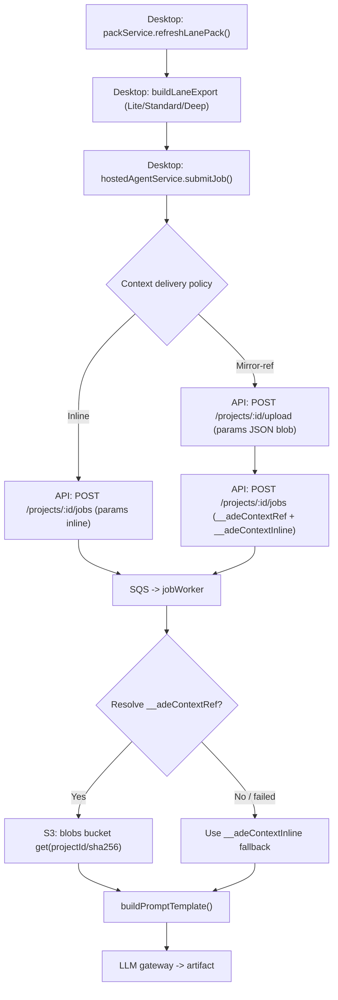
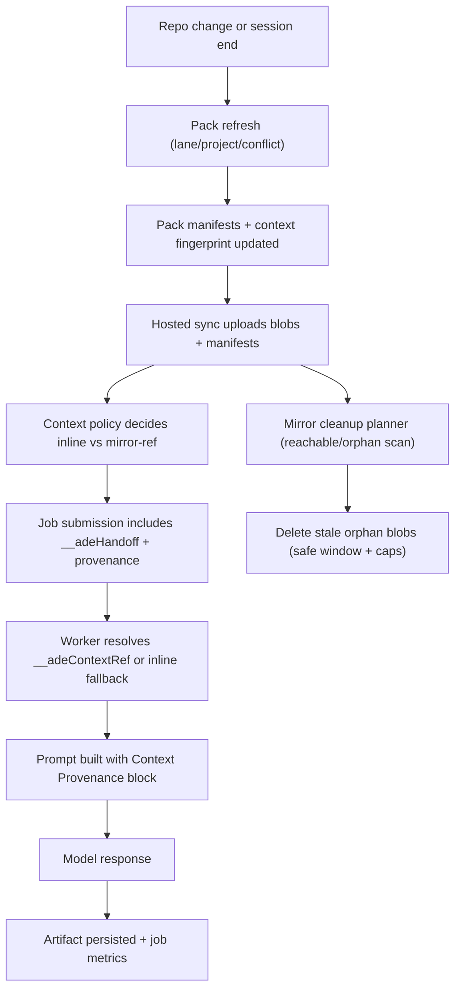

# Context Contract v2 (backward compatible) — Packs, Exports, Markers, Graphs, Manifests, And Deltas

> Last updated: 2026-02-15

This document is the **authoritative contract** for ADE context artifacts used by:

- long-running, parallel “orchestrator mode” workflows
- spawning new agents with clean context windows
- Hosted / self-hosted Hosted gateway and BYOK LLM jobs
- Guest-mode, deterministic-only workflows (no AI providers)

The contract prioritizes **reviewability** (diffable, structured artifacts) and **bounded context** (token-budgeted exports), rather than raw “dump everything” prompts.

---

## Goals

- **Stable parsing**: Packs and exports have stable headers and stable section markers.
- **Diff-friendly**: Context artifacts are structured, concise, and avoid transcript slabs by default.
- **Budgeted exports**: Orchestrators consume `Lite`/`Standard` exports by default. `Deep` is explicit and on-demand.
- **Provider-neutral Hosted**: Hosted is a remote gateway and may be self-hosted by setting `providers.hosted.apiBaseUrl` in `.ade/local.yaml`. No AWS assumptions.
- **Guest mode useful**: Packs, versions, events, diffs, and exports are all usable without any AI provider.
- **Explainable handoffs**: Every hosted job submission records whether context was delivered inline vs by mirror-ref, with reason codes and explicit fallbacks.

Non-goals:

- Orchestrator UI / agent runner implementation (out of scope here).
- Full “pack dump” exports by default (intentionally avoided).

---

## Hosted Job Context Delivery (Inline vs Mirror Ref)

ADE has two distinct context paths:

1. **Bounded export (`packBody`)**: a token-budgeted export generated on desktop and sent inline as part of a job request.
2. **Hosted mirror**: content-addressed blobs (repo files, packs, transcripts) plus manifests uploaded to the hosted backend.

Historically, hosted jobs always used inline `packBody`. Mirror sync existed for future/advanced hosted use, but packs/transcripts were not discoverable because they were uploaded as orphaned blobs with no manifest mapping.

### Current Policy (Stable + Backward Compatible)

Hosted jobs may be submitted with either:

- **Inline params** (default): `params` contains `packBody` and other context fields.
- **Mirror-ref params** (for large/conflict jobs or when user prefers): `params` contains:
  - `__adeContextRef` (sha256 reference to the canonical JSON params stored in the mirror blob bucket)
  - `__adeContextInline` (a reduced inline fallback payload)

Workers resolve `__adeContextRef` before building prompts. If resolution fails, they fall back to `__adeContextInline`.

Reason codes are surfaced via desktop events (`narrative_requested`, etc.) and via hosted job submission metadata.

### Data Path Diagram



### Why This Exists

- Keeps hosted job payloads compact and deterministic.
- Allows richer context delivery without silently depending on mirror freshness.
- Preserves backward compatibility for existing export consumers (exports/markers unchanged).

## Pack Keys

`packKey` is the stable identifier for a pack scope.

### Required `packKey` patterns

- Project pack:
  - `project`
- Lane pack:
  - `lane:<laneId>`
- Feature pack:
  - `feature:<featureKey>`
- Plan pack:
  - `plan:<laneId>`
- Conflict pack:
  - `conflict:<laneId>:<peerKey>`
  - `peerKey` is either:
    - a peer lane id (e.g. `lane-2`)
    - or the base ref (e.g. `main`) for lane-vs-base conflict context

Notes:

- `laneId` is the ADE lane UUID / stable id, not the lane name or branch ref.
- `featureKey` is a user-defined tag (e.g. an issue key) used to aggregate lanes.

---

## Machine-Readable Header (Schema `ade.context.v1`)

Every pack and export must contain a machine-readable header as a **JSON code fence** at the top of the markdown:

```json
{
  "schema": "ade.context.v1",
  "contractVersion": 2,
  "projectId": "proj_local_...",
  "packKey": "lane:lane-123",
  "packType": "lane",
  "exportLevel": "standard",
  "laneId": "lane-123",
  "peerKey": null,
  "baseRef": "main",
  "headSha": "abc123...",
  "deterministicUpdatedAt": "2026-02-14T00:00:00.000Z",
  "narrativeUpdatedAt": "2026-02-14T00:00:00.000Z",
  "versionId": "ver-...",
  "versionNumber": 42,
  "contentHash": "sha256...",
  "providerMode": "hosted",
  "graph": {
    "schema": "ade.packGraph.v1",
    "relations": [
      {
        "relationType": "depends_on",
        "targetPackKey": "project",
        "targetPackType": "project",
        "rationale": "Lane export depends on project context."
      }
    ]
  },
  "dependencyState": {
    "requiredMerges": [],
    "blockedByLanes": [],
    "mergeReadiness": "unknown"
  },
  "conflictState": {
    "status": "unknown",
    "lastPredictedAt": null,
    "overlappingFileCount": 0,
    "peerConflictCount": 0
  },
  "omissions": [
    {
      "sectionId": "narrative",
      "reason": "omitted_by_level",
      "recommendedLevel": "deep"
    }
  ],
  "exportedAt": "2026-02-14T00:00:01.000Z",
  "apiBaseUrl": "https://hosted.example.com",
  "remoteProjectId": "proj_..."
}
```

### Required header fields

- Identity:
  - `schema` (must be `ade.context.v1`)
  - `packKey`
  - `packType` (`project` | `lane` | `conflict` | `feature` | `plan`)
  - `exportLevel` (exports only: `lite` | `standard` | `deep`)
- Scope:
  - `laneId` (nullable)
  - `peerKey` (nullable)
- Git snapshot:
  - `baseRef` (nullable)
  - `headSha` (nullable)
- Time:
  - `deterministicUpdatedAt` (nullable)
  - `narrativeUpdatedAt` (nullable)
- Version metadata:
  - `versionId` (nullable)
  - `versionNumber` (nullable)
  - `contentHash` (nullable)
- Provider:
  - `providerMode` (`guest` | `hosted` | `byok` | `cli`)
- Hosted gateway diagnostics (safe metadata only):
  - `apiBaseUrl` (nullable)
  - `remoteProjectId` (nullable)

Notes:

- Packs rendered before the version is created may have `versionId/versionNumber/contentHash = null`. Consumers should treat the header as a contract for **presence of keys**, not necessarily non-null values.
- Exports returned over IPC include the authoritative version metadata.
- Secrets must never appear in headers.
- `contractVersion` is advisory (monotonic). Do not hard-gate parsing on it.

### Optional (but recommended) header fields

- Graph envelope:
  - `graph.schema` must be `ade.packGraph.v1`
  - `graph.relations[]` use `relationType`:
    - `depends_on` | `parent_of` | `blocked_by` | `blocks` | `shares_base` | `merges_into`
  - Each relation should include a stable `targetPackKey` and may include:
    - `targetLaneId`, `targetBranch`, `targetHeadCommit`, `targetVersionId`
- Machine-readable state:
  - `dependencyState` (required merges / blocked-by / merge readiness)
  - `conflictState` (prediction freshness + coverage + unresolved counts)
- Export omissions:
  - `omissions[]` enumerates omitted/truncated sections and why (`omitted_by_level` | `truncated_section` | `budget_clipped` | `data_unavailable`)

---

## Stable Section Markers

Markers are stable HTML comments used to preserve user-editable content across deterministic refreshes and to enable safe section replacement without truncation.

### Current stable markers

- Intent:
  - `<!-- ADE_INTENT_START -->`
  - `<!-- ADE_INTENT_END -->`
- Todos:
  - `<!-- ADE_TODOS_START -->`
  - `<!-- ADE_TODOS_END -->`
- Narrative:
  - `<!-- ADE_NARRATIVE_START -->`
  - `<!-- ADE_NARRATIVE_END -->`
- Task spec (orchestrator-critical):
  - `<!-- ADE_TASK_SPEC_START -->`
  - `<!-- ADE_TASK_SPEC_END -->`

### Rules

- Deterministic pack refresh must **preserve** content between markers.
- Narrative updates must use marker-based replacement (`ADE_NARRATIVE_*`) and must not truncate or delete content outside the narrative region.
- If a pack is missing markers (legacy packs), the next refresh must **upgrade in-place** by inserting markers rather than breaking compatibility.

---

## Task Spec Section (Lane Packs + Lane Exports)

Lane packs and lane exports must include a durable, user/orchestrator-editable `Task Spec` section bounded by `ADE_TASK_SPEC_START/END`.

The task spec should cover, at minimum:

- Problem statement
- Scope / non-goals
- Acceptance criteria (checklist)
- Constraints / conventions
- Dependencies (parent lane, required merges)

This section is a primary input for orchestrators and should be prioritized above narrative text.

---

## Export Levels

Exports are bounded views of packs designed for consumption by LLM jobs and orchestrators.

### Levels

---

## v3 Addendum — Hosted Hybrid Context + Conflict Integrity + Mirror Cleanup

> Last updated: 2026-02-16

This addendum documents the production-hardening behavior added in contract version 3.

### End-to-end backend flow



### Deterministic source selection rules

1. `inline` is used only when payload is small and safe.
2. Conflict jobs (`ProposeConflictResolution`, `ConflictResolution`) force `mirror` unless ref path is impossible.
3. Mirror-ref submit/fetch failures degrade to `inline_fallback` with explicit warning fields.
4. Every hosted job includes `reasonCode` and `contextSource` in `__adeHandoff`.
5. Prompts always include context provenance, staleness signals, and selected file-set summary.

### Why mirror is not full-repo-by-default

- ADE intentionally sends bounded, scoped context.
- Full-repo payloads are expensive, noisy, and less deterministic.
- Mirror is a storage/transport path for bounded context artifacts and selected blobs, not a blind full checkout.

### Fallback behavior contract

- Submit side:
  - mirror path can include `__adeContextRef` + reduced `__adeContextInline`.
- Worker side:
  - if ref resolves: `contextSource=mirror`.
  - if ref fails: `contextSource=inline_fallback`, warnings include retrieval failure.
- Result metadata:
  - includes source, reason code, warnings, and confidence level.

### Scenario matrix

| Scenario | Delivery | Expected behavior |
|---|---|---|
| New lane with active session | inline or mirror (policy) | Fresh pack exports, deterministic handoff, explicit reason code |
| Conflict-heavy lane | mirror preferred/forced | Conflict context includes `relevantFilesForConflict` and `fileContexts` |
| Stale mirror | mirror + stale warning or inline fallback | Staleness surfaced in handoff + UI, no hidden failure |
| No mirror / upload failure | inline_fallback | Job still submitted; warning and fallback telemetry recorded |
| Periodic delta handoff | bounded delta + exports | Deterministic ordering, optional omission metadata preserved |

- `Lite`
  - Default for spawning new agents and quick context.
  - Strictly bounded; focuses on task spec, intent, key deltas, and blockers.
- `Standard`
  - Default for Hosted/BYOK narrative generation and most orchestrator steps.
  - Includes broader summaries (sessions table, validation, errors) while staying bounded.
- `Deep`
  - Explicit and on-demand.
  - Includes additional low-signal sections (e.g. narrative text) within a larger budget.

### Budget guidance (approximate)

Budgets are enforced via a lightweight heuristic (`~4 chars/token`), then clipped as a safety net.

- Lane exports:
  - Lite: ~800 tokens max
  - Standard: ~2800 tokens max
  - Deep: ~8000 tokens max (bounded, on-demand)

Other pack types have similar tiered budgets, but lane exports are the primary orchestrator substrate.

### Lane export required content (all levels)

- Header fence (`ade.context.v1`)
- `## Task Spec` section with markers
- `## Intent` section with markers
- `## Conflict Risk Summary` (bounded)
- `## What Changed` (bounded)
- `## Validation` (bounded)
- `## Errors & Issues` (bounded, ANSI-stripped, deduped)
- `## Sessions` (summary table only; avoid transcript dumps)
- `## Next Steps` / blockers (actionable checklist)
- `## Notes / Todos` (optional; bounded; marker-preserving)

`Deep` may additionally include:

- `## Narrative (Deep)` with narrative markers (bounded)

---

## Conflict Prediction Summary Packs (Deterministic, No AI Required)

Conflict prediction summaries are stored on disk for each lane:

- `.ade/packs/conflicts/predictions/<laneId>.json`

This file is deterministic and must remain useful in Guest mode.

---

## Competitor Notes (Mapped to ADE Decisions)

Sources:

- [Entire blog](https://entire.io/blog)
- [Entire CLI](https://github.com/entireio/cli)
- [OneContext](https://github.com/TheAgentContextLab/OneContext)

Findings and concrete ADE decisions:

- Entire CLI stores agent session metadata on a separate git branch (`entire/checkpoints/v1`) and links it to commits, enabling rewind/resume and audit trails.
  - ADE already provides immutable pack versions + checkpoints + append-only pack events; this change improves hosted handoffs by adding explicit delivery-mode reason codes and mirror-ref fallback behavior so the cloud path remains audit-friendly.
- OneContext positions a unified, agent-self-managed context layer with trajectory recording and cross-agent continuation.
  - ADE’s approach remains deterministic-first: stable pack headers/markers + bounded exports + compact delta digests. This change makes hosted delivery explicit and deterministic (inline vs mirror-ref) rather than implicit/opaque.

It should include (at minimum):

- `laneId`
- `status` (lane-level conflict status summary)
- `overlaps` (peer overlap summaries)
- `matrix` (lane-vs-peer risk summaries relevant to the lane)
- `generatedAt`
- Partial-coverage metadata when not computing a full matrix:
  - `truncated: true`
  - `strategy: "prefilter-overlap" | "full" | ...`
  - `pairwisePairsComputed`
  - `pairwisePairsTotal`

Lane exports must surface a **concise conflict risk summary** derived from this file (status + top risky peers + last prediction time + coverage info when truncated).

---

## Manifests (Lane + Project Exports)

Lane exports and project exports include a normalized, machine-readable manifest section:

- `## Manifest` (JSON code fence)
- Lane export manifest schema: `ade.manifest.lane.v1`
- Project export manifest schema: `ade.manifest.project.v1`

The manifest is intended to be:

- compact and stable (null-safe defaults; no inference-only assumptions)
- dependency-rich (lane lineage, merge readiness, conflict touchpoints)
- useful for cross-session handoff without requiring full pack body reads

---

## Conflict Lineage (Conflict Exports)

Conflict exports may include a provenance section:

- `## Conflict Lineage` (JSON code fence)
- schema: `ade.conflictLineage.v1`

This captures:

- prediction freshness (`predictionAt`, `lastRecomputedAt`, `stalePolicy`)
- coverage metadata (`pairwisePairsComputed/Total`, `strategy`, `truncated`)
- conflict touchpoints (`openConflictSummaries`, unresolved resolution state when available)

---

## Orchestrator Delta Feed

Orchestrators must keep context windows clean by consuming changes incrementally rather than reloading full packs.

### Recommended consumption loop

1. Track a cursor:
   - `sinceIso` timestamp from the last checkpoint / last export consumed
2. Preferred: Read a compact delta digest since cursor:
   - `ade.packs.getDeltaDigest({ packKey, sinceVersionId? | sinceTimestamp, minimumImportance })`
   - Example response (abridged):

```json
{
  "packKey": "lane:lane-123",
  "packType": "lane",
  "since": {
    "sinceVersionId": "ver-old",
    "sinceTimestamp": "2026-02-15T19:00:00.000Z",
    "baselineVersionId": "ver-old",
    "baselineVersionNumber": 12,
    "baselineCreatedAt": "2026-02-15T19:00:00.000Z"
  },
  "newVersion": {
    "packKey": "lane:lane-123",
    "packType": "lane",
    "versionId": "ver-new",
    "versionNumber": 13,
    "contentHash": "sha256...",
    "updatedAt": "2026-02-15T19:10:00.000Z"
  },
  "changedSections": [{ "sectionId": "task_spec", "changeType": "modified" }],
  "highImpactEvents": [{ "eventType": "narrative_update", "payload": { "importance": "high" } }],
  "blockers": [{ "kind": "merge", "summary": "Blocked by parent lane ..."}],
  "conflicts": { "status": "conflict-predicted", "lastPredictedAt": "..." },
  "decisionState": { "recommendedExportLevel": "standard", "reasons": ["..."] },
  "handoffSummary": "..."
}
```
3. Fallback (lower-level): Read new pack events since cursor:
   - `ade.packs.listEventsSince({ packKey, sinceIso, limit })`
4. If events/digest imply material change:
   - fetch head version:
     - `ade.packs.getHeadVersion({ packKey })`
   - diff against last-seen version:
     - `ade.packs.diffVersions({ fromId, toId })`
5. For bounded context to send to an agent:
   - `ade.packs.getLaneExport({ laneId, level: "lite" | "standard" | "deep" })`
   - `ade.packs.getProjectExport({ level })`
   - `ade.packs.getConflictExport({ laneId, peerLaneId?, level })`

Rule: **Agents consume exports**; packs/versions are used for auditability and diffs, not as default prompt payloads.

---

## Optional: Git-Native Sharing (Design Note)

For multi-machine handoffs without Hosted, ADE can optionally provide a git-native sharing mechanism:

- A dedicated “pack branch” storing export artifacts:
  - `refs/ade/exports/<projectId>`
- Commits contain only:
  - `exports/<packKey>/<exportLevel>.md`
  - optional `checkpoints/<id>.json` (small metadata only)
- Commit trailers link back to local pack metadata:
  - `ADE-PackKey: lane:lane-123`
  - `ADE-VersionId: ver-...`
  - `ADE-CheckpointId: chk-...`

This is intentionally **optional** and should never replace local `.ade/` durable state. It exists to enable “Entire-style” context sharing in organizations that prohibit Hosted usage.

---

## 2026-02-16 Addendum — Context Docs + External Resolver Metadata

Contract version is now `4` (additive only).

New optional schemas:

- `ade.contextDocStatus.v1`
- `ade.contextDocRun.v1`
- `ade.conflictExternalRun.v1`

New optional hosted telemetry envelope:

- `ade.hostedNarrativeTiming.v1`
  - `submitDurationMs`
  - `queueWaitMs`
  - `pollDurationMs`
  - `artifactFetchMs`
  - `totalDurationMs`
  - `timeoutMs`
  - `timeoutReason`

Compatibility guarantees:

- Existing pack/export/event/checkpoint consumers remain valid.
- Legacy fields and IPC channels remain unchanged.
- New fields are additive and optional.

