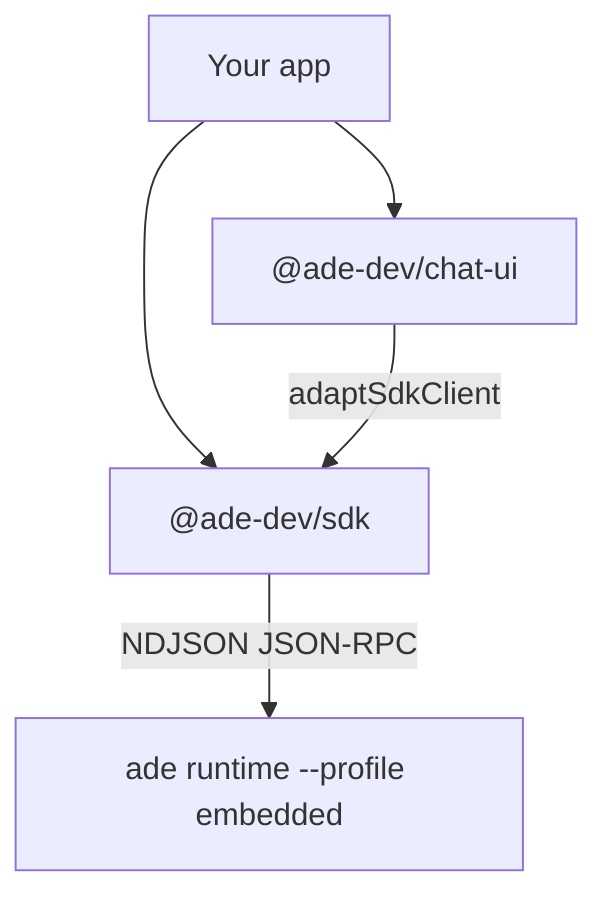

The ADE SDK is how a **third-party app** embeds ADE chat. Your process owns a slim ADE runtime as a child, talks to it over JSON-RPC, and presents chat as durable named threads. The runtime is a guest: isolated home, sync off, no machine-brain authority. It dies with your process.

This is not ADE desktop, ADE Code, or personal chats in the ADE app. Those stay first-party. Use the SDK when *your* product needs an agent chat sidecar.

<CardGroup cols={2}>
  <Card title="Install" icon="download" href="/sdk/install">
    `npm install @ade-dev/sdk` — Node 22, then a 10-line client.
  </Card>
  <Card title="Quickstart" icon="rocket" href="/sdk/quickstart">
    Open a thread, send a message, resume by key after a restart.
  </Card>
  <Card title="MCP servers" icon="plug" href="/sdk/mcp">
    Inject your tools. Strict mode is enforced only on Claude — read the honesty table.
  </Card>
  <Card title="Chat UI" icon="comments" href="/sdk/chat-ui">
    React components that render the conversation for *your* users.
  </Card>
</CardGroup>

## Packages

| Package | What it is |
|---|---|
| [`@ade-dev/sdk`](https://www.npmjs.com/package/@ade-dev/sdk) | Node / Electron-main client. Spawns and owns the sidecar. Zero runtime dependencies. |
| [`@ade-dev/chat-ui`](https://www.npmjs.com/package/@ade-dev/chat-ui) | React components. React is a peer; the SDK is an optional peer used for types. No lanes, projects, or worktrees in any prop. |

License: AGPL-3.0-only.

## How it fits

The client downloads (or you pin) an `ade` binary, spawns `ade runtime run --socket <path> --profile embedded`, and exposes `threads.open(key)`. Reopening the same key after a restart continues the conversation. [`doctor()`](/sdk/reference#doctor) reports the SDK version, the runtime version, the socket, and provider auth.

Provider logins are **not** stored under the sidecar home. Claude / Codex / Cursor credentials stay in those tools' own config homes. If the machine user can already run that provider in a terminal, the sidecar can too.

## What this is not

- Not a hosted ADE cloud API. The sidecar runs on the same machine as your app.
- Not ADE desktop IPC. The SDK speaks the machine JSON-RPC surface.
- Not a way to drive lanes, PRs, or the Work tab from a third-party renderer.

## Next

<Columns cols={2}>
  <Card title="Install" href="/sdk/install" icon="download" horizontal>
    Node 22, npm, Electron main, pinning a binary.
  </Card>
  <Card title="Threads" href="/sdk/threads" icon="comments" horizontal>
    Send, steer, interrupt, switch models, export.
  </Card>
</Columns>
