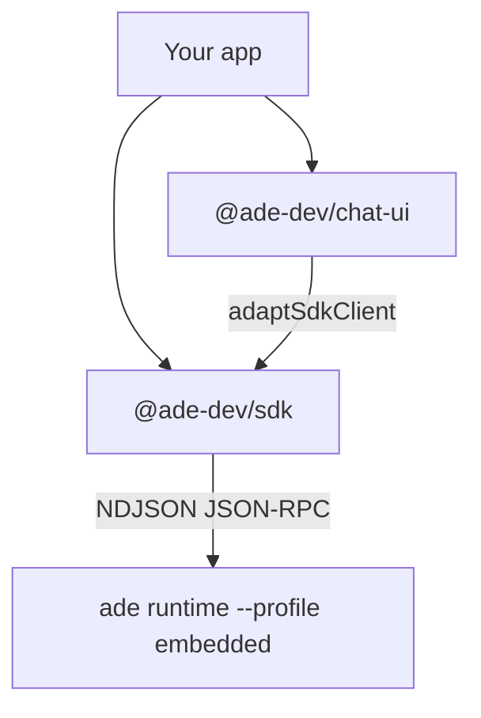

The ADE SDK is how a **third-party app** embeds ADE chat. Your process owns a slim ADE runtime as a child, talks to it over JSON-RPC, and presents chat as durable named threads. The runtime is a guest: isolated home, sync off, no machine-brain authority. It dies with your process.

This is not ADE desktop, ADE Code, or personal chats in the ADE app. Those stay first-party. Use the SDK when *your* product needs an agent chat sidecar.

<CardGroup cols={2}>
  <Card title="Install" icon="download" href="/sdk/install">
    `npm install @ade-dev/sdk` — Node 22, then a 10-line client.
  </Card>
  <Card title="Quickstart" icon="rocket" href="/sdk/quickstart">
    Open a thread, send a message, resume by key after a restart.
  </Card>
  <Card title="MCP servers" icon="plug" href="/sdk/mcp">
    Inject your tools. Strict mode is enforced only on Claude — read the honesty table.
  </Card>
  <Card title="Chat UI" icon="comments" href="/sdk/chat-ui">
    React components that render the conversation for *your* users.
  </Card>
</CardGroup>

## Packages

| Package | What it is |
|---|---|
| [`@ade-dev/sdk`](https://www.npmjs.com/package/@ade-dev/sdk) | Node / Electron-main client. Spawns and owns the sidecar. Zero runtime dependencies. |
| [`@ade-dev/chat-ui`](https://www.npmjs.com/package/@ade-dev/chat-ui) | React components. React is a peer; the SDK is an optional peer used for types. No lanes, projects, or worktrees in any prop. |

Both packages are MIT. The runtime binary and ADE itself are AGPL-3.0-only, and an embedding exception lets a proprietary app ship an unmodified runtime binary. See [License](/sdk/license) for the per-artifact table and the exact conditions.

## How it fits

```mermaid
flowchart TB
  Host["Your app"]
  Sdk["@ade-dev/sdk"]
  Ui["@ade-dev/chat-ui"]
  Runtime["ade runtime --profile embedded"]

  Host --> Sdk
  Host --> Ui
  Ui -->|"adaptSdkClient"| Sdk
  Sdk -->|"NDJSON JSON-RPC"| Runtime
```

The client downloads (or you pin) an `ade` binary, spawns `ade runtime run --socket <path> --profile embedded`, and exposes `threads.open(key)`. Reopening the same key after a restart continues the conversation. [`doctor()`](/sdk/reference#doctor) reports the SDK version, the runtime version, the socket, and provider auth.

Provider logins are **not** stored under the sidecar home. Claude / Codex / Cursor credentials stay in those tools' own config homes. If the machine user can already run that provider in a terminal, the sidecar can too.

## What's new in 0.3

`@ade-dev/sdk` 0.3.0 and `@ade-dev/chat-ui` 0.3.0 release together. SDK 0.3.0 supports runtime `>=1.2.81 <2.0.0`. See [Version compatibility](/sdk/runtime#version-compatibility).

- **Thread lifecycle.** `threads.delete`, `threads.archive`, `threads.unarchive`, and `thread.update()` for a rename, reasoning effort or fast mode. `ThreadSummary` and the thread carry `title`, the resolved model with its display name, and `updatedAt`. See [Threads](/sdk/threads#list-rename-archive-delete).
- **Attachments.** `type` (`"file"` or `"image"`, inferred when absent), so images reach the model as images. `hydrate: false` sends the path only. `steer()` takes attachments. See [Attachments](/sdk/threads#attachments).
- **Paged history.** `thread.historyPage()`. See [History](/sdk/threads#history).
- **Credentials that change.** MCP header values are no longer stored. `refresh.mcpServers`, `thread.updateMcpServers()` and the `mcpHeaders` callback supply current tokens. See [MCP servers](/sdk/mcp#credentials-that-change).
- **Codex MCP approvals.** The permission policy now judges Codex MCP tool calls, and `approve()` answers them. `approvalTimeoutMs` lets the SDK decline an approval that nobody answers. See [Permissions](/sdk/permissions#codex-mcp-tool-calls).
- **Runtime exits.** `client.on("exit" | "transport" | "restart")`, a synthetic error status on each live thread, and opt-in `autoRestart`. See [Runtime](/sdk/runtime#when-the-runtime-exits).
- **Electron bridge.** The renderer no longer configures threads: an `openOptions` hook in main decides, or only four fields cross. `allowModel`, `threads.list` and the lifecycle calls over IPC, a client getter, `@ade-dev/sdk/electron/global`, and a copy-paste sandboxed preload. See [Electron](/sdk/electron).
- **Packaging.** `resolvePackagedRuntime()` and `doctor().runtime.source: "packaged"`. See [Bundling](/sdk/bundling#inside-a-packaged-app).
- **Chat UI.** Composer rail slots and controlled attachments on `<AdeChat>`, a windowed transcript, tool identity and tool-result slots. See [Chat UI](/sdk/chat-ui).

### Breaking changes

- The Electron bridge drops every renderer `threads.open` option except `provider`, `model`, `title` and `reasoningEffort`, unless you set `openOptions`. See [What a renderer may send](/sdk/electron#what-a-renderer-may-send-to-threadsopen).
- When the runtime lost a session, the recreate uses the stored record first, not the call's options. See [Threads](/sdk/threads#when-the-runtime-lost-the-session).
- `setModel()` returns `displayName` and `capabilities` beside `modelId`, `provider` and `model`. A test that compares the whole result with `toEqual` must change.

`thread.retry()` and `thread.editLast()` are not in 0.3. See [Retry and edit](/sdk/threads#retry-and-edit).

## What this is not

- Not a hosted ADE cloud API. The sidecar runs on the same machine as your app.
- Not ADE desktop IPC. The SDK speaks the machine JSON-RPC surface.
- Not a way to drive lanes, PRs, or the Work tab from a third-party renderer.

## Next

<Columns cols={2}>
  <Card title="Install" href="/sdk/install" icon="download" horizontal>
    Node 22, npm, Electron main, pinning a binary.
  </Card>
  <Card title="Threads" href="/sdk/threads" icon="comments" horizontal>
    Send, steer, interrupt, switch models, export.
  </Card>
</Columns>
